# Mikeprogrammer973/tzMail

## Primeiros passos e uso básico/Inicialização SMTP e primeiro fluxo funcional

# Primeiros passos e uso básico - Inicialização SMTP e primeiro fluxo funcional

## Visão geral

Este fluxo mostra o caminho mínimo para sair da configuração SMTP e disparar o primeiro email funcional com `tzMail`. O ponto de partida é , onde `dotenv.config()` carrega as credenciais do ambiente, `SMTP_CONFIG` é montado com `IEmailConfig`, e `EmailFactory.initialize()` cria a instância única que passa a coordenar envio, templates e anexos.

Na prática, o usuário do pacote monta o `SMTP_CONFIG`, obtém `TemplateService` a partir de `EmailFactory`, cria um template com `ThemeType` e `ITemplateConfig`, e envia o email por `emailFactory.sendEmail()`. Quando `template` é informado e `html` não existe, o HTML final é gerado por `TemplateService` e `TemplateBuilder`, e o envio real ocorre via Nodemailer no `EmailService`.

## Arquitetura do fluxo mínimo

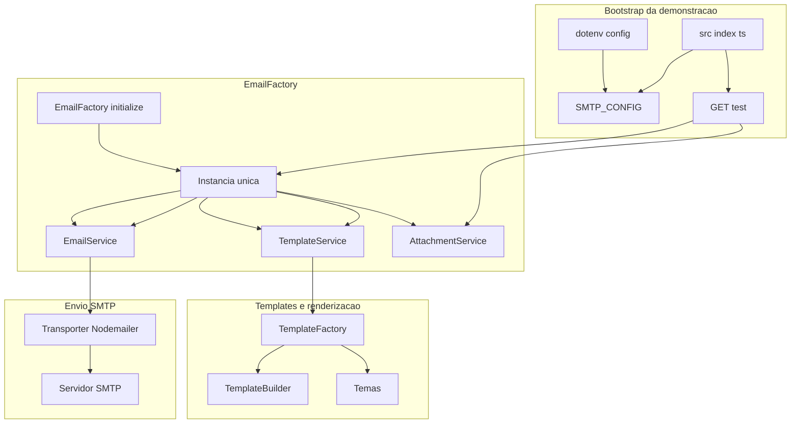
```mermaid
flowchart TB
    subgraph Boot [Bootstrap da demonstracao]
        Dotenv[dotenv config]
        Index[src index ts]
        Config[SMTP_CONFIG]
        Route[GET test]
        Dotenv --> Config
        Index --> Config
        Index --> Route
    end

    subgraph Factory [EmailFactory]
        FactoryInit[EmailFactory initialize]
        FactoryInstance[Instancia unica]
        EmailSvc[EmailService]
        TemplateSvc[TemplateService]
        AttachSvc[AttachmentService]
        FactoryInit --> FactoryInstance
        FactoryInstance --> EmailSvc
        FactoryInstance --> TemplateSvc
        FactoryInstance --> AttachSvc
    end

    subgraph Templating [Templates e renderizacao]
        TemplateFactory[TemplateFactory]
        TemplateBuilder[TemplateBuilder]
        ThemeSet[Temas]
        TemplateSvc --> TemplateFactory
        TemplateFactory --> ThemeSet
        TemplateFactory --> TemplateBuilder
    end

    subgraph SMTP [Envio SMTP]
        Nodemailer[Transporter Nodemailer]
        SMTPServer[Servidor SMTP]
        EmailSvc --> Nodemailer
        Nodemailer --> SMTPServer
    end

    Route --> AttachSvc
    Route --> FactoryInstance
    FactoryInstance --> TemplateSvc
    FactoryInstance --> EmailSvc
```

## Configuração SMTP mínima com `IEmailConfig`

### `IEmailConfig`

EmailFactory.initialize() é idempotente: a primeira chamada cria a instância e as chamadas seguintes retornam a mesma instância já configurada. Isso faz com que o SMTP_CONFIG definido no bootstrap seja o ponto único de inicialização do transporte SMTP.

*`src/core/interfaces/email.interface.ts`*

`IEmailConfig` define tudo o que `EmailFactory` precisa para montar o `transporter` do Nodemailer e repassar o remetente padrão para `EmailService`.

| Propriedade | Tipo | Descrição |
| --- | --- | --- |
| `host` | `string` | Host SMTP usado por `nodemailer.createTransport`. |
| `port` | `number` | Porta do servidor SMTP. |
| `secure` | `boolean` | Indica uso de conexão segura no transporte. |
| `auth.user` | `string` | Usuário SMTP lido do ambiente em . |
| `auth.pass` | `string` | Senha SMTP lida do ambiente em . |
| `defaultFrom?` | `string` | Remetente padrão aplicado por `EmailService` quando `options.from` não é informado. |


### Bootstrap do SMTP em 

*`src/index.ts`*

O exemplo de demonstração monta o objeto SMTP com credenciais vindas de variáveis de ambiente e um `defaultFrom` fixo.

```ts
dotenv.config();

const SMTP_CONFIG = {
  host: 'smtp.gmail.com',
  port: 587,
  secure: false,
  auth: {
    user: process.env.SMTP_USER!,
    pass: process.env.SMTP_PASS!
  },
  defaultFrom: 'LyraX Corp <lyrax.com@gmail.com>'
};

const emailFactory = EmailFactory.initialize(SMTP_CONFIG);
```

As credenciais `SMTP_USER` e `SMTP_PASS` são lidas antes da criação da fábrica. O valor de `defaultFrom` é repassado para `EmailService`, que o usa como remetente quando `options.from` não é enviado em `sendEmail()`.

### Relação entre `EmailFactory`, `TemplateService` e `EmailService`

- `EmailFactory` é a fachada de entrada do fluxo.
- `EmailFactory.initialize()` cria:- `EmailService`, com o `transporter` do Nodemailer e `defaultFrom`.
- `TemplateService`, com as opções de template.
- `AttachmentService`, para anexos.
- `EmailFactory.getTemplateService()` expõe `TemplateService` para criação e renderização de templates.
- `EmailFactory.sendEmail()` delega o envio para `EmailService.send()`.
- `EmailService.send()` resolve `html` diretamente ou renderiza `options.template` quando `html` não foi informado.

## Contratos de email e anexo

### `IEmailOptions`

*`src/core/interfaces/email.interface.ts`*

`IEmailOptions` representa os dados de envio recebidos por `EmailService.send()` e por `EmailFactory.sendEmail()`.

| Propriedade | Tipo | Descrição |
| --- | --- | --- |
| `to` | `string` | `string[]` | Destinatário único ou lista de destinatários. |
| `subject` | `string` | Assunto do email. |
| `from?` | `string` | Remetente opcional que sobrescreve `defaultFrom`. |
| `cc?` | `string` | `string[]` | Cópia carbono opcional. |
| `bcc?` | `string` | `string[]` | Cópia oculta opcional. |
| `attachments?` | `IAttachment[]` | Lista de anexos em formato Nodemailer. |
| `template?` | `ITemplate` | Template a ser renderizado quando `html` não existir. |
| `text?` | `string` | Corpo textual opcional. |
| `html?` | `string` | HTML final; tem prioridade sobre `template`. |


### `IAttachment`

*`src/core/interfaces/email.interface.ts`*

`IAttachment` é o formato usado em `attachments` por `EmailService.send()` e pelas saídas de `AttachmentService`.

| Propriedade | Tipo | Descrição |
| --- | --- | --- |
| `filename` | `string` | Nome exibido do arquivo anexado. |
| `content?` | `string` | Buffer | Conteúdo em memória do anexo. |
| `path?` | `string` | Caminho local do arquivo anexado. |
| `contentType?` | `string` | MIME type opcional. |
| `cid?` | `string` | Content ID para uso em imagens embutidas. |


### `EmailService`

*`src/services/email.service.ts`*

`EmailService` encapsula o envio real e monta `mailOptions` a partir de `IEmailOptions`.

#### Propriedades

| Propriedade | Tipo | Descrição |
| --- | --- | --- |
| `transporter` | `Transporter` | Instância Nodemailer usada em `sendMail()`. |
| `defaultFrom` | `string` | `undefined` | Remetente padrão aplicado quando `options.from` não existe. |


#### Dependências do construtor

| Tipo | Descrição |
| --- | --- |
| `Transporter` | Transporte Nodemailer criado por `EmailFactory`. |
| `string` | `defaultFrom` opcional recebido de `IEmailConfig`. |


#### Métodos públicos

| Método | Descrição |
| --- | --- |
| `send` | Monta `mailOptions`, renderiza `template` quando necessário e chama `transporter.sendMail()`. |


#### Comportamento do envio

- `from` usa `options.from` quando existe; caso contrário, usa `defaultFrom`.
- `to` aceita `string[]` e converte para uma string separada por vírgula.
- `html` tem prioridade absoluta.
- Quando `html` não é informado e `template` existe, `template.render(options)` gera o HTML.
- `attachments`, `cc`, `bcc`, `subject` e `text` são repassados ao `transporter`.

#### Resultado retornado

- Sucesso: `{ success: true, messageId, response }`
- Falha: `{ success: false, error }`

### `AttachmentService`

*`src/services/attachment.service.ts`*

`AttachmentService` transforma arquivos locais ou buffers em `IAttachment` prontos para Nodemailer.

#### Propriedades

Não há campos de instância declarados.

#### Dependências do construtor

Não possui construtor explícito.

#### Métodos públicos

| Método | Descrição |
| --- | --- |
| `addFromPath` | Valida um caminho local e retorna um `IAttachment` com `path`. |
| `addFromBuffer` | Retorna um `IAttachment` com `content` a partir de um `Buffer`. |
| `addFromUrl` | Lança erro de método não implementado. |


#### Comportamento de `addFromPath`

addFromUrl() sempre lança Error('Method not implemented yet'). O fluxo de demonstração que usa anexos só funciona com addFromPath() ou addFromBuffer().

- Faz `fs.promises.stat(filePath)`.
- Exige que o caminho seja um arquivo.
- Usa `path.basename(filePath)` quando `options.filename` não é informado.
- Retorna `path`, `contentType` e `cid` quando informados.

## Contratos e renderização de template

### `ITemplate`

*`src/core/interfaces/template.interface.ts`*

`ITemplate` representa o objeto de template criado por `TemplateFactory` e consumido por `EmailService`.

| Propriedade | Tipo | Descrição |
| --- | --- | --- |
| `name` | `string` | Nome do template, como `modern_light`. |
| `theme` | `ThemeType` | Tema associado ao template. |
| `variant` | `'light'`  | `'dark'` | Variação visual do template. |
| `config` | `ITemplateConfig` | Configuração estrutural do template. |


#### Métodos

| Método | Descrição |
| --- | --- |
| `render` | Gera o HTML final a partir dos dados recebidos. |


### `ITemplateConfig`

*`src/core/interfaces/template.interface.ts`*

| Propriedade | Tipo | Descrição |
| --- | --- | --- |
| `header?` | `IHeaderConfig` | Configuração do cabeçalho. |
| `body?` | `IBodyConfig` | Configuração do corpo. |
| `footer?` | `IFooterConfig` | Configuração do rodapé. |
| `layout?` | `'full'`  `'minimal'` | Layout geral do email. |
| `spacing?` | `'compact'` `'normal'` `'relaxed'` | Espaçamento global. |
| `borderRadius?` | `'none'` `'small'`  `'medium'`  `'large'` | Raio de borda do container. |


### `IBodyConfig`

*`src/core/interfaces/template.interface.ts`*

| Propriedade | Tipo | Descrição |
| --- | --- | --- |
| `title?` | `string` | Título principal do corpo. |
| `message?` | `string` | Mensagem principal do corpo. |
| `content?` | `string` | HTML do corpo quando já pronto. |
| `buttonText?` | `string` | Texto do botão. |
| `buttonUrl?` | `string` | URL do botão. |
| `buttonVariant?` | `'primary'`  `'secondary'`  `'success'`   `'danger'` | Variante visual do botão. |
| `alignment?` | `'left'`  `'center'`  `'right'` | Alinhamento do conteúdo. |
| `backgroundColor?` | `string` | Cor de fundo do bloco. |
| `textColor?` | `string` | Cor do texto do bloco. |
| `fontSize?` | `number` | Tamanho base da fonte em pixels. |


### `IHeaderConfig`

*`src/core/interfaces/template.interface.ts`*

| Propriedade | Tipo | Descrição |
| --- | --- | --- |
| `show` | `boolean` | Define se o cabeçalho será renderizado. |
| `logo?` | `{ type: 'text'  'image'; text?; imageUrl?; alt?; size? }` | Dados do logo textual ou em imagem. |
| `backgroundColor?` | `string` | Cor de fundo do cabeçalho. |
| `textColor?` | `string` | Cor do texto do cabeçalho. |


### `IFooterConfig`

*`src/core/interfaces/template.interface.ts`*

| Propriedade | Tipo | Descrição |
| --- | --- | --- |
| `show` | `boolean` | Define se o rodapé será renderizado. |
| `links?` | `Array<{ text: string; url: string }>` | Links do rodapé. |
| `socialLinks?` | `Array<{ platform: 'facebook'  'twitter'   'linkedin'   'github'; url: string }>` | Links sociais com ícones. |
| `copyrightText?` | `string` | Texto de copyright. |
| `unsubscribeText?` | `string` | Texto do link de cancelamento. |
| `backgroundColor?` | `string` | Cor de fundo do rodapé. |
| `textColor?` | `string` | Cor do texto do rodapé. |


### `TemplateFactory`

*`src/factories/template-factory.ts`*

`TemplateFactory` transforma `ThemeType`, variante e configuração em um `ITemplate` com `render()`.

#### Propriedades

| Propriedade | Tipo | Descrição |
| --- | --- | --- |
| `themes` | `Map<ThemeType, ITheme>` | Catálogo estático de temas disponíveis. |


#### Métodos públicos

| Método | Descrição |
| --- | --- |
| `createTemplate` | Cria um template com `name`, `theme`, `variant`, `config` e `render()`. |
| `getTheme` | Recupera a instância do tema pelo `ThemeType`. |
| `listThemes` | Lista os temas disponíveis. |
| `getThemeInfo` | Retorna nome, descrição e features do tema. |


#### Como `createTemplate` monta o HTML

- Lê `data.template.config.body`.
- Usa `body.content` quando existe.
- Caso contrário, monta um bloco padrão com:- `title` ou `Hello!`
- `message` ou `This is an email generated with tzMail.`
- Usa `TemplateBuilder` para montar:- cabeçalho com `buildHeader()`
- corpo com `buildBody()`
- botão opcional com `buildButton()`
- rodapé com `buildFooter()`
- HTML final com `build()`

### `TemplateBuilder`

*`src/templates/base/template-builder.ts`*

`TemplateBuilder` constrói a estrutura HTML final e aplica variações específicas de tema nas seções de header, body, button e footer.

#### Propriedades

| Propriedade | Tipo | Descrição |
| --- | --- | --- |
| `template` | `string` | HTML acumulado durante a construção. |
| `theme` | `ITheme` | Tema ativo na renderização. |
| `config` | `ITemplateConfig` | Configuração do template. |
| `variant` | `'light'`  `'dark'` | Variante de cor usada na renderização. |


#### Dependências do construtor

| Tipo | Descrição |
| --- | --- |
| `ITheme` | Tema concreto, como `ModernTheme` ou `MinimalTheme`. |
| `ITemplateConfig` | Configuração de header, body, footer e layout. |
| `'light'` `'dark'` | Variante do template. |


#### Métodos públicos

| Método | Descrição |
| --- | --- |
| `buildHeader` | Adiciona o bloco de cabeçalho ao HTML. |
| `buildBody` | Adiciona o bloco principal do corpo ao HTML. |
| `buildButton` | Adiciona o botão de CTA ao HTML. |
| `buildFooter` | Adiciona o rodapé ao HTML. |
| `build` | Finaliza o documento HTML completo. |


#### Comportamento relevante

- `buildHeader()` retorna cedo quando `config.header.show` é falso.
- `buildBody()` ajusta estilos e processa conteúdo conforme o tema.
- `buildButton()` usa `primary` ou `secondary` e aplica estilos específicos por tema.
- `buildFooter()` inclui `links`, `socialLinks`, `copyrightText` e `unsubscribeText`.
- `build()` define o container central e o `<html>` completo.

### `TemplateService`

*`src/services/template.service.ts`*

`TemplateService` é a camada central de criação, cache, histórico, renderização e pré-visualização de templates.

#### Tipos internos

##### `TemplateCache`

*`src/services/template.service.ts`*

| Propriedade | Tipo | Descrição |
| --- | --- | --- |
| `template` | `ITemplate` | Template armazenado no cache. |
| `createdAt` | `Date` | Data de criação do cache entry. |
| `expiresAt` | `Date` | Data de expiração. |
| `hits` | `number` | Quantidade de acessos ao cache. |


##### `TemplateOptions`

*`src/services/template.service.ts`*

| Propriedade | Tipo | Descrição |
| --- | --- | --- |
| `cache?` | `boolean` | Ativa ou desativa o cache. |
| `cacheTTL?` | `number` | TTL em segundos. |
| `validateConfig?` | `boolean` | Ativa validação da configuração. |
| `minify?` | `boolean` | Ativa minificação do HTML. |
| `preview?` | `boolean` | Marca o render como pré-visualização. |


#### Propriedades

| Propriedade | Tipo | Descrição |
| --- | --- | --- |
| `templateCache` | `Map<string, TemplateCache>` | Cache in-memory por template. |
| `defaultTTL` | `number` | TTL padrão em segundos. |
| `templateHistory` | `Map<string, ITemplate[]>` | Histórico de versões por template. |
| `options` | `TemplateOptions` | Configuração global do serviço. |


#### Dependências do construtor

| Tipo | Descrição |
| --- | --- |
| `TemplateOptions` | Opções de cache, validação, minificação e preview. |


#### Métodos públicos

| Método | Descrição |
| --- | --- |
| `createTemplate` | Cria ou reaproveita um template no cache. |
| `cloneTemplate` | Clona um template com modificações parciais. |
| `renderTemplate` | Renderiza um template e adiciona metadados `_meta`. |
| `previewTemplate` | Cria e renderiza um template sem persistir no cache. |
| `getThemeInfo` | Retorna informações detalhadas de tema e configuração padrão. |
| `listThemes` | Lista os `ThemeType` disponíveis. |
| `getTemplateStats` | Retorna métricas do cache e do histórico. |
| `clearCache` | Remove cache globalmente ou por tema. |
| `getTemplateHistory` | Retorna o histórico de versões de um template. |
| `restoreTemplateVersion` | Reconstrói uma versão anterior. |
| `preloadTemplates` | Pré-carrega templates no cache. |
| `exportTemplate` | Exporta o template para JSON. |
| `importTemplate` | Importa um template a partir de JSON. |
| `generateExampleTemplate` | Gera um template de demonstração. |
| `isValidTemplate` | Valida a estrutura de um objeto template. |
| `getTemplateDetails` | Retorna template atual, histórico, cache e uso. |


#### Fluxo de estado e cache

- `createTemplate()` gera um `templateId` com `themeType`, `variant` e hash do JSON da config.
- Se o cache estiver ativo e existir entrada válida, incrementa `hits` e retorna o template cacheado.
- Se não houver cache, cria o template por `TemplateFactory.createTemplate()`.
- O template é enriquecido com métodos dinâmicos:- `getVersion()`
- `getId()`
- `clone()`
- O histórico mantém as últimas 10 versões por `templateId`.
- `cleanExpiredCache()` remove entradas vencidas a cada hora via `setInterval()`.

#### Validação de configuração

`validateTemplateConfig()` agrega erros e lança uma única exceção quando encontra problemas em:

- logo de imagem sem `imageUrl`
- logo textual sem `text`
- links de footer sem `text` ou `url`
- `layout` fora de `full` ou `minimal`
- `spacing` fora de `compact`, `normal` ou `relaxed`
- `borderRadius` fora de `none`, `small`, `medium` ou `large`

#### Metadados adicionados no render

`renderTemplate()` injeta `_meta` no payload:

- `isPreview`
- `renderDate`
- `templateName`
- `theme`
- `variant`

### `ThemeType`

*`src/core/enums/theme.enum.ts`*

`ThemeType` define os temas usados em `TemplateFactory` e `TemplateService`.

Valores: `SYSTEM`, `MONOKAI`, `MODERN`, `CORPORATE`, `MINIMAL`.

### `TemplatePart`

*`src/core/enums/template-part.enum.ts`*

`TemplatePart` descreve as partes estruturais do email renderizado.

Valores: `HEADER`, `BODY`, `FOOTER`, `BUTTON`.

## Temas disponíveis

### `ITheme`

*`src/templates/themes/theme.interface.ts`*

| Propriedade | Tipo | Descrição |
| --- | --- | --- |
| `id` | `ThemeType` | Identificador do tema. |
| `name` | `string` | Nome humano do tema. |
| `light` | `IThemeColors` | Paleta para variante clara. |
| `dark` | `IThemeColors` | Paleta para variante escura. |
| `typography` | `ITypography` | Tipografia do tema. |
| `spacing` | `ISpacing` | Escala de espaçamento do tema. |


### `IThemeColors`

*`src/templates/themes/theme.interface.ts`*

| Propriedade | Tipo | Descrição |
| --- | --- | --- |
| `primary` | `string` | Cor principal. |
| `secondary` | `string` | Cor secundária. |
| `background` | `string` | Cor de fundo. |
| `text` | `string` | Cor de texto principal. |
| `textMuted` | `string` | Cor de texto secundário. |
| `border` | `string` | Cor de borda. |
| `success` | `string` | Cor de sucesso. |
| `error` | `string` | Cor de erro. |
| `warning` | `string` | Cor de aviso. |


### `ITypography`

*`src/templates/themes/theme.interface.ts`*

| Propriedade | Tipo | Descrição |
| --- | --- | --- |
| `fontFamily` | `string` | Família tipográfica base. |
| `fontSizes` | `{ small: string; medium: string; large: string; xlarge: string }` | Escala de tamanhos. |
| `fontWeights` | `{ normal: number; medium: number; bold: number }` | Pesos tipográficos. |


### `ISpacing`

*`src/templates/themes/theme.interface.ts`*

| Propriedade | Tipo | Descrição |
| --- | --- | --- |
| `xs` | `string` | Espaçamento extra pequeno. |
| `sm` | `string` | Espaçamento pequeno. |
| `md` | `string` | Espaçamento médio. |
| `lg` | `string` | Espaçamento grande. |
| `xl` | `string` | Espaçamento extra grande. |


### `SystemTheme`

*`src/templates/themes/system.theme.ts`*

#### Propriedades

| Propriedade | Tipo | Descrição |
| --- | --- | --- |
| `id` | `ThemeType` | Valor `SYSTEM`. |
| `name` | `string` | Nome `System`. |
| `light` | `{ primary; secondary; background; text; textMuted; border; success; error; warning }` | Paleta clara. |
| `dark` | `{ primary; secondary; background; text; textMuted; border; success; error; warning }` | Paleta escura. |
| `typography` | `{ fontFamily; fontSizes; fontWeights }` | Tipografia base do tema. |
| `spacing` | `{ xs; sm; md; lg; xl }` | Escala de espaçamento. |


### `MonokaiTheme`

*`src/templates/themes/monokai.theme.ts`*

#### Propriedades

| Propriedade | Tipo | Descrição |
| --- | --- | --- |
| `id` | `ThemeType` | Valor `MONOKAI`. |
| `name` | `string` | Nome `Monokai`. |
| `light` | `IThemeColors` | Paleta clara com acentos fortes. |
| `dark` | `IThemeColors` | Paleta escura Monokai. |
| `typography` | `ITypography` | Tipografia monoespaçada. |
| `spacing` | `ISpacing` | Escala compacta. |
| `codeHighlight` | `{ comment; keyword; string; number; function; variable }` | Cores de destaque para blocos de código. |
| `borderStyle` | `{ radius: string; width: string; style: string }` | Estilo de borda do tema. |
| `effects` | `{ glow; shadow; transition }` | Efeitos visuais do tema. |


### `ModernTheme`

*`src/templates/themes/modern.theme.ts`*

#### Propriedades

| Propriedade | Tipo | Descrição |
| --- | --- | --- |
| `id` | `ThemeType` | Valor `MODERN`. |
| `name` | `string` | Nome `Modern`. |
| `light` | `IThemeColors` | Paleta clara contemporânea. |
| `dark` | `IThemeColors` | Paleta escura contemporânea. |
| `typography` | `ITypography` | Tipografia moderna. |
| `spacing` | `ISpacing` | Escala de espaçamento. |
| `gradients` | `{ primary; secondary; accent; dark; light }` | Gradientes usados pelo builder. |
| `borderStyle` | `{ radius: { small; medium; large; full }; width: string; style: string }` | Raio e borda do tema. |
| `glassmorphism` | `{ light; dark; blur }` | Cores e blur para efeito glass. |
| `animations` | `{ hover; fade; slide }` | Transições do tema. |


### `CorporateTheme`

*`src/templates/themes/corporate.theme.ts`*

#### Propriedades

| Propriedade | Tipo | Descrição |
| --- | --- | --- |
| `id` | `ThemeType` | Valor `CORPORATE`. |
| `name` | `string` | Nome `Corporate`. |
| `light` | `IThemeColors` | Paleta clara corporativa. |
| `dark` | `IThemeColors` | Paleta escura corporativa. |
| `typography` | `ITypography` | Tipografia serifada. |
| `spacing` | `ISpacing` | Escala de espaçamento. |
| `corporateColors` | `{ gold; silver; bronze; navy; charcoal; ivory }` | Paleta de apoio corporativa. |
| `borderStyle` | `{ radius: { small; medium; large; pill }; width: { thin; medium; thick }; style: string }` | Bordas do tema. |
| `elevation` | `{ shadow; card; modal; hover }` | Sombras e elevação. |
| `branding` | `{ logoSize; letterSpacing; textTransform }` | Regras de marca. |
| `layout` | `{ maxWidth; contentWidth; sidebarWidth; headerHeight; footerHeight }` | Medidas de layout. |


### `MinimalTheme`

*`src/templates/themes/minimal.theme.ts`*

#### Propriedades

| Propriedade | Tipo | Descrição |
| --- | --- | --- |
| `id` | `ThemeType` | Valor `MINIMAL`. |
| `name` | `string` | Nome `Minimal`. |
| `light` | `IThemeColors` | Paleta clara minimalista. |
| `dark` | `IThemeColors` | Paleta escura minimalista. |
| `typography` | `ITypography` | Tipografia sem serifa. |
| `spacing` | `ISpacing` | Escala expandida. |
| `minimalColors` | `{ white; black; gray100; gray200; gray300; gray400; gray500; gray600; gray700; gray800; gray900 }` | Paleta neutra. |
| `borderStyle` | `{ radius: { none; small; medium; large; full }; width: { thin; medium }; style: string }` | Bordas minimalistas. |
| `effects` | `{ shadow; transition; opacity }` | Efeitos suaves e opacidade. |
| `layout` | `{ maxWidth; contentWidth; spacingMultiplier; lineHeight; paragraphSpacing }` | Regras de layout. |
| `designSystem` | `{ grid; breakpoints; zIndex }` | Grid e breakpoints do tema. |


## Fábrica de email e inicialização do fluxo

### `EmailFactory`

*`src/factories/email-factory.ts`*

`EmailFactory` centraliza a criação do transporte SMTP, o serviço de email, o serviço de templates e o serviço de anexos. A classe funciona como singleton global do pacote.

#### Propriedades

| Propriedade | Tipo | Descrição |
| --- | --- | --- |
| `instance` | `EmailFactory` `undefined` | Instância única mantida pela fábrica. |
| `emailService` | `EmailService` | Serviço de envio usado por `sendEmail()`. |
| `templateService` | `TemplateService` | Serviço de criação e renderização de templates. |
| `attachmentService` | `AttachmentService` | Serviço de anexos criado junto com a fábrica. |


#### Dependências do construtor

| Tipo | Descrição |
| --- | --- |
| `IEmailConfig` | Configuração SMTP e `defaultFrom`. |
| `any` | `templateOptions` repassado para `TemplateService`. |


#### Métodos públicos

| Método | Descrição |
| --- | --- |
| `initialize` | Cria a instância única com SMTP e serviços internos. |
| `getInstance` | Retorna a instância criada ou lança erro se não houver inicialização. |
| `sendEmail` | Encaminha o envio para `EmailService.send()`. |
| `getTemplateService` | Expõe a instância de `TemplateService`. |
| `getAttachmentService` | Expõe a instância de `AttachmentService`. |
| `previewTemplate` | Delegada para `TemplateService.previewTemplate()`. |
| `getThemeInfo` | Delegada para `TemplateService.getThemeInfo()`. |
| `listThemes` | Delegada para `TemplateService.listThemes()`. |
| `getTemplateStats` | Delegada para `TemplateService.getTemplateStats()`. |


#### Relação de uso no bootstrap

1. `EmailFactory.initialize(SMTP_CONFIG)` cria o `transporter` com `nodemailer.createTransport(config)`.
2. O `EmailService` recebe o `transporter` e `config.defaultFrom`.
3. O `TemplateService` é criado com `templateOptions` quando fornecidas.
4. O `AttachmentService` fica disponível para montagem de anexos.
5. A aplicação recupera `templateService` com `getTemplateService()` e gera os templates usados no primeiro envio.

#### Nota sobre reconfiguração

## Fluxo funcional do primeiro email

### Funções de demonstração em 

A fábrica não recria o transporte após a primeira inicialização. Isso significa que mudanças em SMTP_CONFIG só têm efeito antes da primeira chamada de initialize().

*`src/index.ts`*

Estas funções mostram como a fábrica é consumida no exemplo de servidor Express.

| Função | Descrição |
| --- | --- |
| `sendWelcomeEmail` | Envia um email com `modernTemplate` e assunto de boas-vindas. |
| `sendTechNewsletter` | Envia uma newsletter técnica com `monokaiTemplate`. |
| `sendCorporateReport` | Envia um relatório corporativo com `corporateTemplate`. |
| `sendMinimalNewsletter` | Envia uma newsletter minimalista com anexo vindo de `AttachmentService.addFromPath()`. |


### Fluxo mínimo usado no exemplo

1. `dotenv.config()` carrega `SMTP_USER` e `SMTP_PASS`.
2. `SMTP_CONFIG` é montado com `host`, `port`, `secure`, `auth.user`, `auth.pass` e `defaultFrom`.
3. `EmailFactory.initialize(SMTP_CONFIG)` cria a fábrica.
4. `emailFactory.getTemplateService()` expõe o serviço de templates.
5. `templateService.createTemplate(...)` monta um template com tema e configuração.
6. `emailFactory.sendEmail({ to, subject, template })` envia a mensagem.
7. `EmailService.send()` resolve `from` com `defaultFrom`, renderiza o template e chama o `transporter`.
8. O resultado retorna como JSON.

### Exemplo mínimo de envio

```ts
const templateService = emailFactory.getTemplateService();

const modernTemplate = templateService.createTemplate(
  ThemeType.MODERN,
  'light',
  {
    header: {
      show: true,
      logo: {
        type: 'image',
        imageUrl: 'https://talkspace-ten.vercel.app/_next/image?url=%2Flogo%2Ftalkspace-banner.png&w=640&q=75',
        size: 'large'
      }
    },
    body: {
      title: 'Bem-vindo ao LyraX!',
      message: 'Estamos felizes em tê-lo conosco.',
      buttonText: 'Começar Agora',
      buttonUrl: 'https://meuapp.com/get-started',
      buttonVariant: 'primary',
      alignment: 'center',
      fontSize: 16
    },
    footer: {
      show: true,
      copyrightText: '© 2024 Meu App'
    },
    layout: 'full',
    spacing: 'normal',
    borderRadius: 'medium'
  }
);

await emailFactory.sendEmail({
  to: 'destinatario@exemplo.com',
  subject: 'Bem-vindo ao Meu App!',
  template: modernTemplate
});
```

### Fluxo com anexo no exemplo

`sendMinimalNewsletter()` cria um `AttachmentService` localmente, chama `addFromPath('uploads/PHOTO.jpg')` e injeta o retorno em `attachments`. O envio segue o mesmo caminho do email comum, mas com o anexo repassado para Nodemailer.

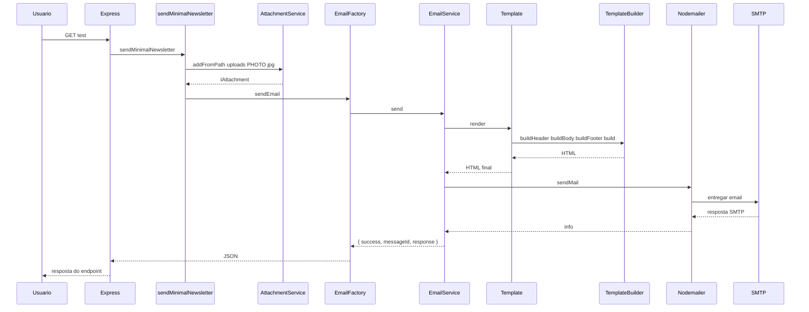
```mermaid
sequenceDiagram
    participant U as Usuario
    participant E as Express
    participant S as sendMinimalNewsletter
    participant A as AttachmentService
    participant F as EmailFactory
    participant M as EmailService
    participant T as Template
    participant B as TemplateBuilder
    participant N as Nodemailer
    participant Smtp as SMTP

    U->>E: GET test
    E->>S: sendMinimalNewsletter
    S->>A: addFromPath uploads PHOTO jpg
    A-->>S: IAttachment
    S->>F: sendEmail
    F->>M: send
    M->>T: render
    T->>B: buildHeader buildBody buildFooter build
    B-->>T: HTML
    T-->>M: HTML final
    M->>N: sendMail
    N->>Smtp: entregar email
    Smtp-->>N: resposta SMTP
    N-->>M: info
    M-->>F: { success, messageId, response }
    F-->>E: JSON
    E-->>U: resposta do endpoint
```

## Servidor de demonstração e ponto de entrada

### Endpoint de teste

#### Executar envio de teste

*`src/index.ts`*

```api
{
    "title": "Executar envio de teste",
    "description": "Dispara o fluxo de demonstra\u00e7\u00e3o que cria um anexo a partir de uploads/PHOTO.jpg, envia um email com o tema Minimal em modo dark e retorna o resultado do envio em JSON.",
    "method": "GET",
    "baseUrl": "<DemoServerBaseUrl>",
    "endpoint": "/test",
    "headers": [],
    "queryParams": [],
    "pathParams": [],
    "bodyType": "none",
    "requestBody": "",
    "formData": [],
    "rawBody": "",
    "responses": {
        "200": {
            "description": "Resultado retornado diretamente por res.json(result).",
            "body": "{\n    \"success\": true,\n    \"messageId\": \"5f8a1d3c4b2a@example.com\",\n    \"response\": \"250 2.0.0 OK\"\n}"
        }
    }
}
```

### Comportamento real do endpoint

- O endpoint é `GET /test`.
- Ele chama `sendMinimalNewsletter('antiquesclub007@gmail.com')`.
- O retorno de `emailFactory.sendEmail()` é enviado diretamente com `res.json(result)`.
- Não há middleware de autenticação nem validação adicional além dos middlewares globais `express.json()` e `express.urlencoded()` montados no bootstrap.

### Inicialização do servidor

sendMinimalNewsletter() não possui try/catch. Se addFromPath('uploads/PHOTO.jpg') falhar ou se o envio SMTP lançar exceção antes de retornar, a requisição deixa de responder com o objeto de sucesso e a exceção sobe para o fluxo do Express.

 também define:

- `PORT = 3001`
- `app.use(express.json())`
- `app.use(express.urlencoded({ extended: true }))`
- `app.listen(PORT, ...)` com banner de inicialização no console

## Estado, cache e tratamento de erros

### Estado de inicialização

- `EmailFactory` mantém estado global por meio de `private static instance`.
- `TemplateService` mantém estado em memória por `templateCache` e `templateHistory`.
- `TemplateService` agenda limpeza automática com `setInterval(..., 3600000)`.

### Cache de templates

| Elemento | Valor |
| --- | --- |
| Chave do cache | `${themeType}_${variant}_${hash}` |
| Dado armazenado | `ITemplate` enriquecido |
| Contador de uso | `hits` |
| Expiração | `expiresAt` calculado em segundos e convertido para milissegundos |
| Limpeza automática | `cleanExpiredCache()` a cada hora |
| Limpeza manual | `clearCache()` |
| Histórico | Últimas 10 versões por `templateId` |


### Tratamento de erros por componente

- `EmailFactory.getInstance()` lança erro se `initialize()` ainda não foi chamado.
- `TemplateFactory.createTemplate()` lança erro quando o tema não existe no mapa `themes`.
- `TemplateService.validateTemplateConfig()` lança um único erro com todos os problemas encontrados.
- `TemplateService.renderTemplate()` captura falhas e relança com contexto: `Failed to render template: ...`
- `EmailService.send()` nunca lança erro diretamente; retorna `success: false` com o objeto de erro.
- `AttachmentService.addFromPath()` lança erro se o caminho não for arquivo.
- `AttachmentService.addFromUrl()` lança erro fixo de método não implementado.

## Dependências e integração

### Dependências externas

- `express`
- `nodemailer`
- `dotenv`
- `fs`
- `path`

### Entradas de ambiente usadas no bootstrap

- `SMTP_USER`
- `SMTP_PASS`

### Integrações internas

-  consome `EmailFactory` e `TemplateService`.
- `EmailFactory` instancia `EmailService`, `TemplateService` e `AttachmentService`.
- `TemplateService` depende de `TemplateFactory`.
- `TemplateFactory` depende das classes de tema e de `TemplateBuilder`.
- `EmailService` depende do `Transporter` do Nodemailer.
- `AttachmentService` é usado tanto no exemplo de anexo quanto como serviço exposto pela fábrica.

## Considerações de teste

- Validar que `EmailFactory.initialize()` foi chamado antes de qualquer `getInstance()`.
- Verificar se `SMTP_USER` e `SMTP_PASS` estão definidos antes do bootstrap.
- Confirmar que `defaultFrom` aparece no envelope do email quando `options.from` não é enviado.
- Testar `sendEmail()` com:- `template` apenas
- `html` apenas
- `template` e `html` juntos
- `attachments` com arquivo válido
- Confirmar que `addFromPath()` falha para diretório ou caminho inexistente.
- Confirmar que `GET /test` retorna JSON com o formato devolvido por `sendEmail()`.

## Referência rápida das classes-chave

| Class | Responsibility |
| --- | --- |
| `email-factory.ts` | Centraliza a inicialização SMTP e expõe `EmailService`, `TemplateService` e `AttachmentService`. |
| `email.service.ts` | Constrói `mailOptions` e envia emails via Nodemailer. |
| `template.service.ts` | Cria, renderiza, cacheia e versiona templates. |
| `template-factory.ts` | Transforma tema e configuração em um `ITemplate` renderizável. |
| `template-builder.ts` | Monta o HTML final do email com header, body, button e footer. |
| `attachment.service.ts` | Converte arquivos e buffers em anexos Nodemailer. |
| `system.theme.ts` | Define o tema base `SYSTEM`. |
| `monokai.theme.ts` | Define o tema `MONOKAI` com destaque de código. |
| `modern.theme.ts` | Define o tema `MODERN` com gradientes e glassmorphism. |
| `corporate.theme.ts` | Define o tema `CORPORATE` com linguagem visual executiva. |
| `minimal.theme.ts` | Define o tema `MINIMAL` com layout enxuto e neutro. |


---

## Gerenciamento de Templates/Temas concretos: System, Monokai, Modern, Corporate e Minimal

# Gerenciamento de Templates - Temas concretos

## Visão geral

Este recorte concentra os cinco temas concretos do mecanismo de templates de email do projeto: `System`, `Monokai`, `Modern`, `Corporate` e `Minimal`. Eles formam a camada visual base que define cores, tipografia, espaçamento e extensões temáticas usadas na composição final do HTML.

O fluxo visível no código parte do contrato `ITheme`, passa pelo registro de temas em `TemplateFactory` e chega à montagem visual em `TemplateBuilder`. Na prática, o tema selecionado determina como cabeçalho, corpo, botão e rodapé são estilizados, além de habilitar comportamentos especiais como realce de código, gradientes, glassmorphism, branding corporativo e layout minimalista.

### Comparação rápida dos temas

| Tema | Paleta visual | Tipografia | Espaçamento | Extensões específicas |
| --- | --- | --- | --- | --- |
| `System` | Azul padrão e neutros claros/escuros | Sans system default | Compacto a normal | Nenhuma extensão extra |
| `Monokai` | Paleta técnica com magenta, verde e roxo | Monospace | Compacto | `codeHighlight`, `effects`, `borderStyle` |
| `Modern` | Neutros com azul e gradientes | Inter com suporte a UI moderna | Médio a relaxado | `gradients`, `glassmorphism`, `animations`, `borderStyle` |
| `Corporate` | Azul executivo com dourado e tons institucionais | Serifada | Médio | `corporateColors`, `branding`, `elevation`, `layout`, `borderStyle` |
| `Minimal` | Preto, branco e cinzas | Inter limpa | Generoso | `minimalColors`, `effects`, `layout`, `designSystem`, `borderStyle` |


## Arquitetura de composição dos temas

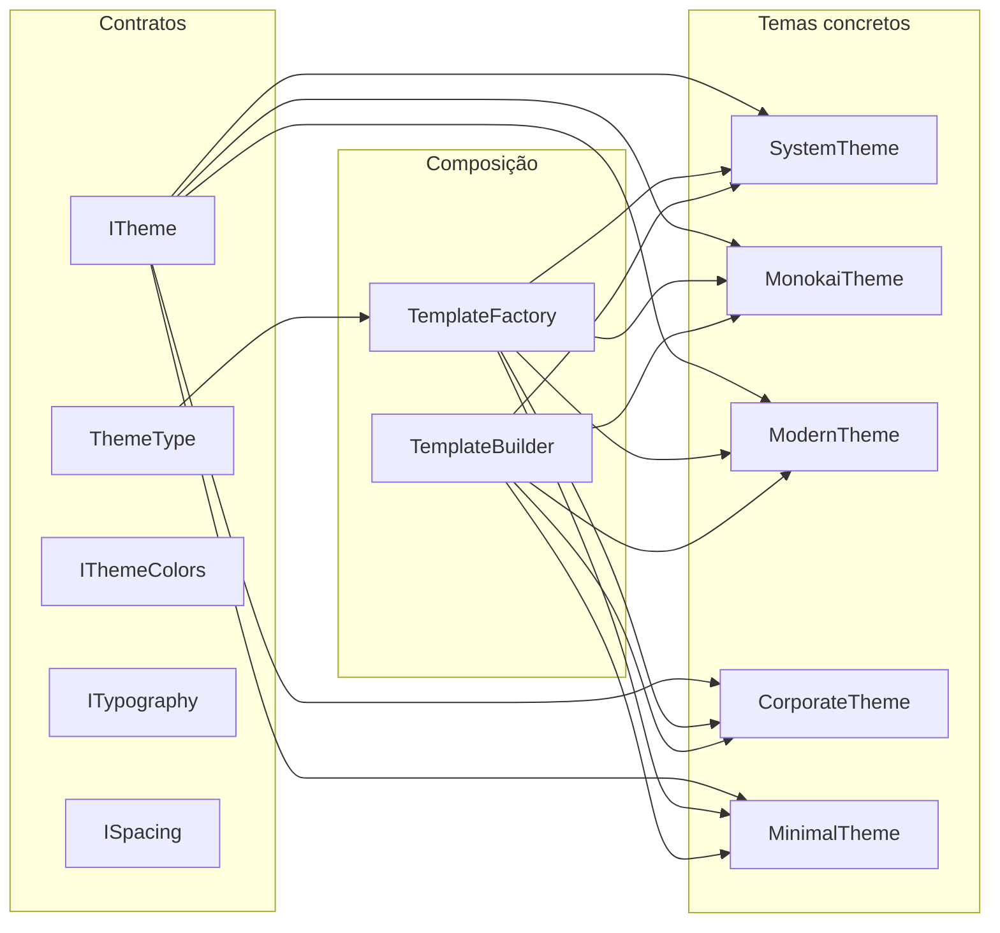
```mermaid
flowchart LR
    subgraph Contratos[Contratos]
        ThemeType[ThemeType]
        ITheme[ITheme]
        IThemeColors[IThemeColors]
        ITypography[ITypography]
        ISpacing[ISpacing]
    end

    subgraph TemasConcretos[Temas concretos]
        SystemTheme[SystemTheme]
        MonokaiTheme[MonokaiTheme]
        ModernTheme[ModernTheme]
        CorporateTheme[CorporateTheme]
        MinimalTheme[MinimalTheme]
    end

    subgraph Composicao[Composição]
        TemplateFactory[TemplateFactory]
        TemplateBuilder[TemplateBuilder]
    end

    ThemeType --> TemplateFactory
    ITheme --> SystemTheme
    ITheme --> MonokaiTheme
    ITheme --> ModernTheme
    ITheme --> CorporateTheme
    ITheme --> MinimalTheme

    TemplateFactory --> SystemTheme
    TemplateFactory --> MonokaiTheme
    TemplateFactory --> ModernTheme
    TemplateFactory --> CorporateTheme
    TemplateFactory --> MinimalTheme

    TemplateBuilder --> SystemTheme
    TemplateBuilder --> MonokaiTheme
    TemplateBuilder --> ModernTheme
    TemplateBuilder --> CorporateTheme
    TemplateBuilder --> MinimalTheme
```

O contrato `ITheme` padroniza os tokens visuais obrigatórios. `TemplateFactory` mantém a instância concreta em um `Map<ThemeType, ITheme>`, enquanto `TemplateBuilder` lê esses tokens e monta as variações de HTML conforme `variant` e `theme.id`.

## Contratos compartilhados

### `theme.interface.ts`

*`src/templates/themes/theme.interface.ts`*

#### `ITheme`

| Propriedade | Tipo | Descrição |
| --- | --- | --- |
| `id` | `ThemeType` | Identificador do tema |
| `name` | `string` | Nome legível do tema |
| `light` | `IThemeColors` | Paleta para modo claro |
| `dark` | `IThemeColors` | Paleta para modo escuro |
| `typography` | `ITypography` | Sistema tipográfico do tema |
| `spacing` | `ISpacing` | Escala de espaçamento do tema |


#### `IThemeColors`

| Propriedade | Tipo |
| --- | --- |
| `primary` | `string` |
| `secondary` | `string` |
| `background` | `string` |
| `text` | `string` |
| `textMuted` | `string` |
| `border` | `string` |
| `success` | `string` |
| `error` | `string` |
| `warning` | `string` |


#### `ITypography`

| Propriedade | Tipo |
| --- | --- |
| `fontFamily` | `string` |
| `fontSizes.small` | `string` |
| `fontSizes.medium` | `string` |
| `fontSizes.large` | `string` |
| `fontSizes.xlarge` | `string` |
| `fontWeights.normal` | `number` |
| `fontWeights.medium` | `number` |
| `fontWeights.bold` | `number` |


#### `ISpacing`

| Propriedade | Tipo |
| --- | --- |
| `xs` | `string` |
| `sm` | `string` |
| `md` | `string` |
| `lg` | `string` |
| `xl` | `string` |


#### `ThemeType`

Valores definidos: `system`, `monokai`, `modern`, `corporate`, `minimal`.

### `TemplateFactory`

*`src/factories/template-factory.ts`*

A fábrica registra os cinco temas concretos em um `Map<ThemeType, ITheme>` e materializa um `ITemplate` com `name`, `theme`, `variant`, `config` e `render`.

#### Métodos públicos

| Método | Descrição |
| --- | --- |
| `createTemplate` | Resolve o tema pelo `ThemeType`, cria um `ITemplate` e associa o `render` à montagem via `TemplateBuilder` |
| `getTheme` | Retorna a instância concreta do tema para um `ThemeType` |
| `listThemes` | Lista os temas registrados no mapa interno |
| `getThemeInfo` | Expõe nome, descrição e lista de recursos do tema |


#### Metadados de tema expostos por `getThemeInfo`

| Tema | Nome | Descrição | Recursos |
| --- | --- | --- | --- |
| `SYSTEM` | `System` | Tema limpo e profissional com cores adaptativas | Design minimalista, alta acessibilidade, compatibilidade total |
| `MONOKAI` | `Monokai` | Inspirado no tema de código, ideal para conteúdo técnico | Cores vibrantes, destaque de sintaxe, efeitos glow |
| `MODERN` | `Modern` | Design contemporâneo com gradientes e efeitos modernos | Gradientes elegantes, glassmorphism, animações suaves |
| `CORPORATE` | `Corporate` | Design profissional e elegante para empresas | Tipografia serifada, detalhes em dourado, layout estruturado |
| `MINIMAL` | `Minimal` | Design clean e focado no conteúdo | Sem distrações, espaçamento generoso, tipografia limpa |


### `TemplateBuilder`

*`src/templates/base/template-builder.ts`*

O `TemplateBuilder` consome o tema concreto em cada etapa da composição do email. Ele aplica estilos de cabeçalho, corpo, botão, rodapé e container final com ramificações específicas para `monokai`, `modern`, `corporate` e `minimal`.

#### Propriedades

| Propriedade | Tipo | Descrição |
| --- | --- | --- |
| `template` | `string` | HTML acumulado durante a construção |
| `theme` | `ITheme` | Tema concreto usado na renderização |
| `config` | `ITemplateConfig` | Configuração visual do template |
| `variant` | `'light'` `'dark'` | Variante visual ativa |


#### Métodos públicos

| Método | Descrição |
| --- | --- |
| `buildHeader` | Monta o cabeçalho e aplica ajustes específicos por tema |
| `buildBody` | Monta o corpo do email e processa conteúdo especial por tema |
| `buildButton` | Monta o botão de CTA com variações visuais por tema |
| `buildFooter` | Monta o rodapé com links, redes sociais e texto institucional |
| `build` | Finaliza o HTML completo do template |


#### Extensões específicas aplicadas por tema

| Tema | Propriedades consumidas | Efeito gerado |
| --- | --- | --- |
| `System` | `light`, `dark`, `typography`, `spacing` | Estilo base com bordas e espaçamentos padrão |
| `Monokai` | `codeHighlight`, `effects`, `borderStyle` | Realce de código, brilho, transições e borda técnica |
| `Modern` | `gradients`, `glassmorphism`, `animations`, `borderStyle` | Botões com gradiente, blur e cantos arredondados |
| `Corporate` | `corporateColors`, `branding`, `elevation`, `borderStyle` | Dourado institucional, caixa com sombra e tipografia serifada |
| `Minimal` | `layout`, `designSystem`, `effects`, `borderStyle` | Layout centralizado, conteúdo arejado e aparência sem distrações |


#### Helpers internos relevantes

| Método | Função |
| --- | --- |
| `buildLogo` | Renderiza logo em texto ou imagem com ajustes por tema |
| `formatCorporateContent` | Adiciona estilos corporativos a `blockquote` e `highlight` |
| `formatMinimalContent` | Simplifica títulos e parágrafos para o tema minimalista |
| `highlightCode` | Converte blocos `<code>` em `<pre>` com estilização Monokai |
| `applySyntaxHighlighting` | Aplica coloração por palavra-chave, string, número e função |
| `buildFooterLinks` | Monta links do rodapé com variações por tema |
| `buildSocialLinks` | Monta ícones sociais a partir de URLs fixas |
| `getSocialIcon` | Resolve o ícone do serviço social pela plataforma |


## Fluxo de criação e renderização de um tema

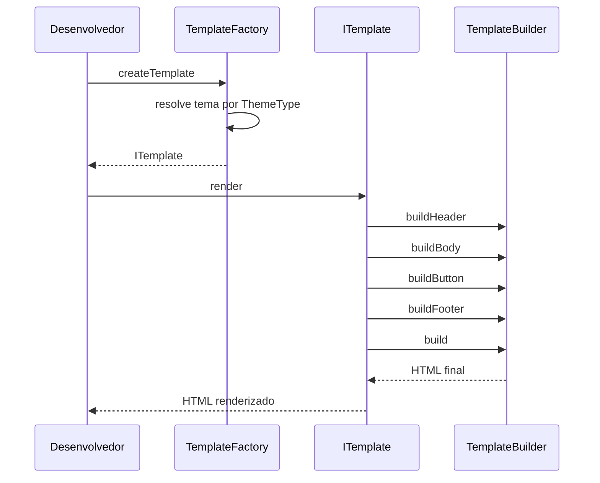
```mermaid
sequenceDiagram
    participant Dev as Desenvolvedor
    participant TemplateFactory as TemplateFactory
    participant ITemplate as ITemplate
    participant TemplateBuilder as TemplateBuilder

    Dev->>TemplateFactory: createTemplate
    TemplateFactory->>TemplateFactory: resolve tema por ThemeType
    TemplateFactory-->>Dev: ITemplate
    Dev->>ITemplate: render
    ITemplate->>TemplateBuilder: buildHeader
    ITemplate->>TemplateBuilder: buildBody
    ITemplate->>TemplateBuilder: buildButton
    ITemplate->>TemplateBuilder: buildFooter
    ITemplate->>TemplateBuilder: build
    TemplateBuilder-->>ITemplate: HTML final
    ITemplate-->>Dev: HTML renderizado
```

Os blocos de estilo criados em buildButton, buildFooterLinks e trechos similares incluem &:hover dentro de atributos style. O HTML inline gerado por build() preserva esse texto, mas pseudo-classes não são interpretadas como CSS ativo no markup final.

Esse fluxo é o mesmo para os cinco temas concretos; o que muda é o conjunto de tokens expostos pelo tema e as ramificações internas que `TemplateBuilder` ativa com base em `theme.id`.

## Temas concretos

### `SystemTheme`

*`src/templates/themes/system.theme.ts`*

Tema base com visual neutro e suporte direto a modos claro e escuro. Ele usa azul como cor primária e neutros para texto, borda e superfícies, com tipografia sans-serif do sistema.

#### Propriedades

| Propriedade | Tipo |
| --- | --- |
| `id` | `ThemeType.SYSTEM` |
| `name` | `string` |
| `light` | `IThemeColors` |
| `dark` | `IThemeColors` |
| `typography` | `ITypography` |
| `spacing` | `ISpacing` |


#### Paleta

| Token | Light | Dark |
| --- | --- | --- |
| `primary` | `#3b82f6` | `#3b82f6` |
| `secondary` | `#6b7280` | `#9ca3af` |
| `background` | `#ffffff` | `#111827` |
| `text` | `#111827` | `#f9fafb` |
| `textMuted` | `#6b7280` | `#9ca3af` |
| `border` | `#e5e7eb` | `#374151` |
| `success` | `#10b981` | `#10b981` |
| `error` | `#ef4444` | `#ef4444` |
| `warning` | `#f59e0b` | `#f59e0b` |


#### Tipografia

| Propriedade | Valor |
| --- | --- |
| `fontFamily` | `-apple-system, BlinkMacSystemFont, "Segoe UI", Roboto, Helvetica, Arial, sans-serif` |
| `fontSizes.small` | `12px` |
| `fontSizes.medium` | `14px` |
| `fontSizes.large` | `16px` |
| `fontSizes.xlarge` | `20px` |
| `fontWeights.normal` | `400` |
| `fontWeights.medium` | `500` |
| `fontWeights.bold` | `700` |


#### Espaçamento

| Propriedade | Valor |
| --- | --- |
| `xs` | `4px` |
| `sm` | `8px` |
| `md` | `16px` |
| `lg` | `24px` |
| `xl` | `32px` |


#### Leitura visual

- Cabeçalho e rodapé usam os tokens base de fundo, borda e texto.
- Não há propriedades extras além do contrato `ITheme`.
- A aplicação em `TemplateBuilder` segue o caminho padrão, sem ramificações visuais adicionais.

### `MonokaiTheme`

*`src/templates/themes/monokai.theme.ts`*

Tema voltado para conteúdo técnico, com identidade inspirada em editores de código. A paleta mantém magenta e verde como destaques, e o tema adiciona realce semântico para blocos de código.

#### Propriedades

| Propriedade | Tipo |
| --- | --- |
| `id` | `ThemeType.MONOKAI` |
| `name` | `string` |
| `light` | `IThemeColors` |
| `dark` | `IThemeColors` |
| `typography` | `ITypography` |
| `spacing` | `ISpacing` |
| `codeHighlight` | `{ comment: string; keyword: string; string: string; number: string; function: string; variable: string }` |
| `borderStyle` | `{ radius: string; width: string; style: string }` |
| `effects` | `{ glow: string; shadow: string; transition: string }` |


#### Paleta

| Token | Light | Dark |
| --- | --- | --- |
| `primary` | `#f92672` | `#f92672` |
| `secondary` | `#a6e22e` | `#a6e22e` |
| `background` | `#f9f9f9` | `#272822` |
| `text` | `#272822` | `#f8f8f2` |
| `textMuted` | `#75715e` | `#75715e` |
| `border` | `#e5e5e5` | `#3e3d32` |
| `success` | `#a6e22e` | `#a6e22e` |
| `error` | `#f92672` | `#f92672` |
| `warning` | `#fd971f` | `#fd971f` |


#### Tipografia

| Propriedade | Valor |
| --- | --- |
| `fontFamily` | `SF Mono, Monaco, Inconsolata, Fira Code, monospace` |
| `fontSizes.small` | `12px` |
| `fontSizes.medium` | `14px` |
| `fontSizes.large` | `16px` |
| `fontSizes.xlarge` | `20px` |
| `fontWeights.normal` | `400` |
| `fontWeights.medium` | `500` |
| `fontWeights.bold` | `700` |


#### Espaçamento

| Propriedade | Valor |
| --- | --- |
| `xs` | `4px` |
| `sm` | `8px` |
| `md` | `16px` |
| `lg` | `24px` |
| `xl` | `32px` |


#### Extensões específicas

##### `codeHighlight`

| Token | Cor |
| --- | --- |
| `comment` | `#75715e` |
| `keyword` | `#f92672` |
| `string` | `#e6db74` |
| `number` | `#ae81ff` |
| `function` | `#a6e22e` |
| `variable` | `#fd971f` |


##### `borderStyle`

| Propriedade | Valor |
| --- | --- |
| `radius` | `4px` |
| `width` | `2px` |
| `style` | `solid` |


##### `effects`

| Propriedade | Valor |
| --- | --- |
| `glow` | `0 0 10px rgba(249, 38, 114, 0.3)` |
| `shadow` | `0 4px 6px rgba(0, 0, 0, 0.1)` |
| `transition` | `all 0.3s ease` |


#### Leitura visual

- `TemplateBuilder.highlightCode` usa `codeHighlight` para colorir keywords, strings, números e nomes de função.
- O cabeçalho e os botões recebem brilho e transição via `effects`.
- O layout privilegia blocos com borda técnica e acento visual marcante.

### `ModernTheme`

*`src/templates/themes/modern.theme.ts`*

Tema contemporâneo com uso de gradientes, blur e transições suaves. O conjunto de tokens foi desenhado para dar mais profundidade visual a botões, contêineres e cabeçalhos.

#### Propriedades

| Propriedade | Tipo |
| --- | --- |
| `id` | `ThemeType.MODERN` |
| `name` | `string` |
| `light` | `IThemeColors` |
| `dark` | `IThemeColors` |
| `typography` | `ITypography` |
| `spacing` | `ISpacing` |
| `gradients` | `{ primary: string; secondary: string; accent: string; dark: string; light: string }` |
| `borderStyle` | `{ radius: { small: string; medium: string; large: string; full: string }; width: string; style: string }` |
| `glassmorphism` | `{ light: string; dark: string; blur: string }` |
| `animations` | `{ hover: string; fade: string; slide: string }` |


#### Paleta

| Token | Light | Dark |
| --- | --- | --- |
| `primary` | `#0f172a` | `#38bdf8` |
| `secondary` | `#64748b` | `#94a3b8` |
| `background` | `#ffffff` | `#0f172a` |
| `text` | `#0f172a` | `#f1f5f9` |
| `textMuted` | `#64748b` | `#94a3b8` |
| `border` | `#e2e8f0` | `#1e293b` |
| `success` | `#10b981` | `#34d399` |
| `error` | `#ef4444` | `#f87171` |
| `warning` | `#f59e0b` | `#fbbf24` |


#### Tipografia

| Propriedade | Valor |
| --- | --- |
| `fontFamily` | `Inter, SF Pro Display, Segoe UI, system-ui, sans-serif` |
| `fontSizes.small` | `13px` |
| `fontSizes.medium` | `15px` |
| `fontSizes.large` | `17px` |
| `fontSizes.xlarge` | `24px` |
| `fontWeights.normal` | `400` |
| `fontWeights.medium` | `500` |
| `fontWeights.bold` | `600` |


#### Espaçamento

| Propriedade | Valor |
| --- | --- |
| `xs` | `6px` |
| `sm` | `12px` |
| `md` | `20px` |
| `lg` | `32px` |
| `xl` | `48px` |


#### Extensões específicas

##### `gradients`

| Token | Valor |
| --- | --- |
| `primary` | `linear-gradient(135deg, #0f172a 0%, #1e293b 100%)` |
| `secondary` | `linear-gradient(135deg, #64748b 0%, #94a3b8 100%)` |
| `accent` | `linear-gradient(135deg, #38bdf8 0%, #0f172a 100%)` |
| `dark` | `linear-gradient(135deg, #0f172a 0%, #020617 100%)` |
| `light` | `linear-gradient(135deg, #f8fafc 0%, #ffffff 100%)` |


##### `borderStyle`

| Propriedade | Valor |
| --- | --- |
| `radius.small` | `8px` |
| `radius.medium` | `12px` |
| `radius.large` | `16px` |
| `radius.full` | `9999px` |
| `width` | `1px` |
| `style` | `solid` |


##### `glassmorphism`

| Propriedade | Valor |
| --- | --- |
| `light` | `rgba(255, 255, 255, 0.8)` |
| `dark` | `rgba(15, 23, 42, 0.8)` |
| `blur` | `12px` |


##### `animations`

| Propriedade | Valor |
| --- | --- |
| `hover` | `transform 0.2s ease, box-shadow 0.2s ease` |
| `fade` | `opacity 0.3s ease` |
| `slide` | `transform 0.3s cubic-bezier(0.4, 0, 0.2, 1)` |


#### Leitura visual

- `TemplateBuilder` usa `gradients.primary` no botão principal e no texto do logo.
- `glassmorphism.blur` entra no cabeçalho e no rodapé para criar profundidade.
- `animations.hover` é aplicado a botões e links de navegação do tema.

### `CorporateTheme`

*`src/templates/themes/corporate.theme.ts`*

Tema voltado para comunicação empresarial, com base serifada, tons institucionais e acentos dourados. O tema expande o contrato base com tokens de marca, elevação e layout.

#### Propriedades

| Propriedade | Tipo |
| --- | --- |
| `id` | `ThemeType.CORPORATE` |
| `name` | `string` |
| `light` | `IThemeColors` |
| `dark` | `IThemeColors` |
| `typography` | `ITypography` |
| `spacing` | `ISpacing` |
| `corporateColors` | `{ gold: string; silver: string; bronze: string; navy: string; charcoal: string; ivory: string }` |
| `borderStyle` | `{ radius: { small: string; medium: string; large: string; pill: string }; width: { thin: string; medium: string; thick: string }; style: string }` |
| `elevation` | `{ shadow: string; card: string; modal: string; hover: string }` |
| `branding` | `{ logoSize: { small: string; medium: string; large: string }; letterSpacing: { tight: string; normal: string; wide: string; wider: string }; textTransform: { uppercase: string; lowercase: string; capitalize: string; normal: string } }` |
| `layout` | `{ maxWidth: string; contentWidth: string; sidebarWidth: string; headerHeight: string; footerHeight: string }` |


#### Paleta

| Token | Light | Dark |
| --- | --- | --- |
| `primary` | `#1e40af` | `#3b82f6` |
| `secondary` | `#334155` | `#64748b` |
| `background` | `#ffffff` | `#0f172a` |
| `text` | `#0f172a` | `#f1f5f9` |
| `textMuted` | `#475569` | `#94a3b8` |
| `border` | `#e2e8f0` | `#1e293b` |
| `success` | `#059669` | `#10b981` |
| `error` | `#dc2626` | `#ef4444` |
| `warning` | `#d97706` | `#f59e0b` |


#### Tipografia

| Propriedade | Valor |
| --- | --- |
| `fontFamily` | `"Playfair Display", "Georgia", "Times New Roman", serif` |
| `fontSizes.small` | `12px` |
| `fontSizes.medium` | `14px` |
| `fontSizes.large` | `16px` |
| `fontSizes.xlarge` | `24px` |
| `fontWeights.normal` | `400` |
| `fontWeights.medium` | `500` |
| `fontWeights.bold` | `700` |


#### Espaçamento

| Propriedade | Valor |
| --- | --- |
| `xs` | `4px` |
| `sm` | `8px` |
| `md` | `16px` |
| `lg` | `24px` |
| `xl` | `32px` |


#### Extensões específicas

##### `corporateColors`

| Token | Valor |
| --- | --- |
| `gold` | `#d4af37` |
| `silver` | `#c0c0c0` |
| `bronze` | `#cd7f32` |
| `navy` | `#0a2540` |
| `charcoal` | `#36454f` |
| `ivory` | `#fffff0` |


##### `borderStyle`

| Propriedade | Valor |
| --- | --- |
| `radius.small` | `2px` |
| `radius.medium` | `4px` |
| `radius.large` | `8px` |
| `radius.pill` | `20px` |
| `width.thin` | `1px` |
| `width.medium` | `2px` |
| `width.thick` | `3px` |
| `style` | `solid` |


##### `elevation`

| Propriedade | Valor |
| --- | --- |
| `shadow` | `0 1px 3px rgba(0, 0, 0, 0.08), 0 1px 2px rgba(0, 0, 0, 0.04)` |
| `card` | `0 4px 6px -1px rgba(0, 0, 0, 0.1), 0 2px 4px -1px rgba(0, 0, 0, 0.06)` |
| `modal` | `0 20px 25px -5px rgba(0, 0, 0, 0.1), 0 10px 10px -5px rgba(0, 0, 0, 0.02)` |
| `hover` | `0 10px 15px -3px rgba(0, 0, 0, 0.1), 0 4px 6px -2px rgba(0, 0, 0, 0.05)` |


##### `branding`

| Propriedade | Valor |
| --- | --- |
| `logoSize.small` | `32px` |
| `logoSize.medium` | `48px` |
| `logoSize.large` | `64px` |
| `letterSpacing.tight` | `-0.5px` |
| `letterSpacing.normal` | `0px` |
| `letterSpacing.wide` | `0.5px` |
| `letterSpacing.wider` | `1px` |
| `textTransform.uppercase` | `uppercase` |
| `textTransform.lowercase` | `lowercase` |
| `textTransform.capitalize` | `capitalize` |
| `textTransform.normal` | `none` |


##### `layout`

| Propriedade | Valor |
| --- | --- |
| `maxWidth` | `600px` |
| `contentWidth` | `560px` |
| `sidebarWidth` | `200px` |
| `headerHeight` | `80px` |
| `footerHeight` | `120px` |


#### Leitura visual

- O cabeçalho recebe dourado corporativo, `uppercase` e tracking mais largo.
- `buildBody` adiciona borda lateral dourada e sombra de cartão.
- O rodapé usa fonte menor, `letterSpacing.normal` e borda superior mais forte.

### `MinimalTheme`

*`src/templates/themes/minimal.theme.ts`*

Tema orientado ao conteúdo, com menos elementos decorativos e maior respiro entre blocos. A superfície visual é reduzida ao essencial, com um sistema de layout e design próprio.

#### Propriedades

| Propriedade | Tipo |
| --- | --- |
| `id` | `ThemeType.MINIMAL` |
| `name` | `string` |
| `light` | `IThemeColors` |
| `dark` | `IThemeColors` |
| `typography` | `ITypography` |
| `spacing` | `ISpacing` |
| `minimalColors` | `{ white: string; black: string; gray100: string; gray200: string; gray300: string; gray400: string; gray500: string; gray600: string; gray700: string; gray800: string; gray900: string }` |
| `borderStyle` | `{ radius: { none: string; small: string; medium: string; large: string; full: string }; width: { thin: string; medium: string }; style: string }` |
| `effects` | `{ shadow: string; transition: string; opacity: { hover: string; disabled: string } }` |
| `layout` | `{ maxWidth: string; contentWidth: string; spacingMultiplier: number; lineHeight: number; paragraphSpacing: string }` |
| `designSystem` | `{ grid: { columns: number; gutter: string; margin: string }; breakpoints: { mobile: string; tablet: string; desktop: string }; zIndex: { base: number; overlay: number; modal: number } }` |


#### Paleta

| Token | Light | Dark |
| --- | --- | --- |
| `primary` | `#000000` | `#ffffff` |
| `secondary` | `#404040` | `#a3a3a3` |
| `background` | `#ffffff` | `#000000` |
| `text` | `#111111` | `#ffffff` |
| `textMuted` | `#666666` | `#737373` |
| `border` | `#e5e5e5` | `#262626` |
| `success` | `#22c55e` | `#22c55e` |
| `error` | `#ef4444` | `#ef4444` |
| `warning` | `#f97316` | `#f97316` |


#### Tipografia

| Propriedade | Valor |
| --- | --- |
| `fontFamily` | `Inter, -apple-system, BlinkMacSystemFont, Segoe UI, sans-serif` |
| `fontSizes.small` | `13px` |
| `fontSizes.medium` | `15px` |
| `fontSizes.large` | `17px` |
| `fontSizes.xlarge` | `21px` |
| `fontWeights.normal` | `400` |
| `fontWeights.medium` | `500` |
| `fontWeights.bold` | `600` |


#### Espaçamento

| Propriedade | Valor |
| --- | --- |
| `xs` | `8px` |
| `sm` | `16px` |
| `md` | `24px` |
| `lg` | `32px` |
| `xl` | `48px` |


#### Extensões específicas

##### `minimalColors`

| Token | Valor |
| --- | --- |
| `white` | `#ffffff` |
| `black` | `#000000` |
| `gray100` | `#f5f5f5` |
| `gray200` | `#e5e5e5` |
| `gray300` | `#d4d4d4` |
| `gray400` | `#a3a3a3` |
| `gray500` | `#737373` |
| `gray600` | `#525252` |
| `gray700` | `#404040` |
| `gray800` | `#262626` |
| `gray900` | `#171717` |


##### `borderStyle`

| Propriedade | Valor |
| --- | --- |
| `radius.none` | `0px` |
| `radius.small` | `2px` |
| `radius.medium` | `4px` |
| `radius.large` | `8px` |
| `radius.full` | `9999px` |
| `width.thin` | `1px` |
| `width.medium` | `2px` |
| `style` | `solid` |


##### `effects`

| Propriedade | Valor |
| --- | --- |
| `shadow` | `none` |
| `transition` | `all 0.2s ease` |
| `opacity.hover` | `0.7` |
| `opacity.disabled` | `0.5` |


##### `layout`

| Propriedade | Valor |
| --- | --- |
| `maxWidth` | `640px` |
| `contentWidth` | `560px` |
| `spacingMultiplier` | `1.5` |
| `lineHeight` | `1.6` |
| `paragraphSpacing` | `1.5em` |


##### `designSystem`

| Bloco | Propriedade | Valor |
| --- | --- | --- |
| `grid` | `columns` | `12` |
| `grid` | `gutter` | `20px` |
| `grid` | `margin` | `20px` |
| `breakpoints` | `mobile` | `480px` |
| `breakpoints` | `tablet` | `768px` |
| `breakpoints` | `desktop` | `1024px` |
| `zIndex` | `base` | `1` |
| `zIndex` | `overlay` | `10` |
| `zIndex` | `modal` | `100` |


#### Leitura visual

- `buildBody` centraliza o conteúdo em `contentWidth` e amplia o respiro lateral.
- `build` ajusta a largura máxima para `640px` e remove bordas no contêiner final.
- O sistema `designSystem` formaliza grid, breakpoints e camadas visuais para uso do tema.

## Referência rápida das decisões por tema

| Tema | Cabeçalho | Corpo | Botão | Rodapé |
| --- | --- | --- | --- | --- |
| `SystemTheme` | Borda simples e cores base | Texto e fundo do contrato padrão | Botão padrão | Links e textos padrão |
| `MonokaiTheme` | Borda técnica, sombra e transição | `codeHighlight` e borda lateral magenta | Borda magenta e glow | Borda superior destacada |
| `ModernTheme` | Blur e borda suave | Margem e raio moderados | Gradiente e sombra leve | Glassmorphism e radius |
| `CorporateTheme` | Dourado, uppercase e tracking | Borda lateral dourada e sombra de cartão | Letras em uppercase e hover com elevação | Borda superior dourada |
| `MinimalTheme` | Borda fina e peso tipográfico contido | Max width e layout centralizado | Botão contornado e sem preenchimento | Rodapé enxuto e espaçado |


## Key Classes Reference

| Class | Responsibility |
| --- | --- |
| `theme.interface.ts` | Define o contrato comum `ITheme` e os tokens de cor, tipografia e espaçamento |
| `system.theme.ts` | Implementa o tema base com paleta neutra e tipografia do sistema |
| `monokai.theme.ts` | Implementa o tema técnico com realce de código e efeitos visuais |
| `modern.theme.ts` | Implementa o tema contemporâneo com gradientes, blur e animações |
| `corporate.theme.ts` | Implementa o tema corporativo com branding, dourado e layout executivo |
| `minimal.theme.ts` | Implementa o tema minimalista com layout enxuto e design system próprio |
| `template-factory.ts` | Registra e instancia os temas concretos por `ThemeType` |
| `template-builder.ts` | Aplica os tokens dos temas na construção final do HTML do email |


---

## Primeiros passos e uso básico/Instalação, scripts de execução e artefatos publicados

# Primeiros passos e uso básico

*`package.json`, `tsconfig.json`, `src/index.ts`, `dist/index.js`, `dist/index.d.ts`*

## Visão geral

A biblioteca é publicada como um pacote TypeScript centrado em **Node.js + SMTP/Nodemailer**, com artefatos prontos para consumo em `dist/`. O objetivo prático do primeiro uso é simples: instalar as dependências, compilar o projeto e consumir o ponto de entrada publicado sem depender do código-fonte em `src/`.

O pacote declara `next` e `nodemailer` em `peerDependencies`, então o projeto que instala a biblioteca precisa resolver essas dependências por conta própria. Isso é relevante tanto para consumidores quanto para contribuidores, porque a saída compilada e os tipos publicados são o contrato real do pacote.

## Arquitetura de publicação

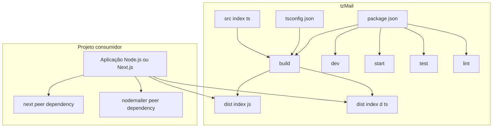
```mermaid
flowchart TB
    subgraph Repo [tzMail]
        Pkg[package json]
        TsConfig[tsconfig json]
        SrcIndex[src index ts]
        Build[build]
        Dev[dev]
        Start[start]
        Test[test]
        Lint[lint]
        DistJS[dist index js]
        DistDTS[dist index d ts]
    end

    subgraph Consumer [Projeto consumidor]
        App[Aplicação Node.js ou Next.js]
        NextDep[next peer dependency]
        NodemailerDep[nodemailer peer dependency]
    end

    Pkg --> Build
    Pkg --> Dev
    Pkg --> Start
    Pkg --> Test
    Pkg --> Lint

    TsConfig --> Build
    SrcIndex --> Build

    Build --> DistJS
    Build --> DistDTS

    App --> DistJS
    App --> DistDTS
    App --> NextDep
    App --> NodemailerDep
```

## Instalação


```bash
npm install tzmail
```

---

## Gerenciamento de Templates/Catálogo de temas e seleção por metadados

# Gerenciamento de Templates - Catálogo de temas e seleção por metadados

## Visão geral

Esta parte do projeto concentra o registro dos temas visuais disponíveis e a descoberta guiada por metadados para que a escolha do template seja feita antes da renderização. O fluxo começa em `TemplateFactory`, que mantém o catálogo concreto de temas, e continua em `TemplateService`, que expõe uma visão pronta para consumo com nome amigável, descrição, recursos, variantes suportadas e configuração padrão por tema.

Na prática, esse catálogo permite que a aplicação apresente opções visuais coerentes ao usuário, sem exigir que ele conheça os detalhes internos de cada tema. O resultado é uma seleção mais previsível de `ThemeType`, `variant` e `ITemplateConfig`, com defaults específicos que orientam a composição correta do email.

## Arquitetura do catálogo de temas

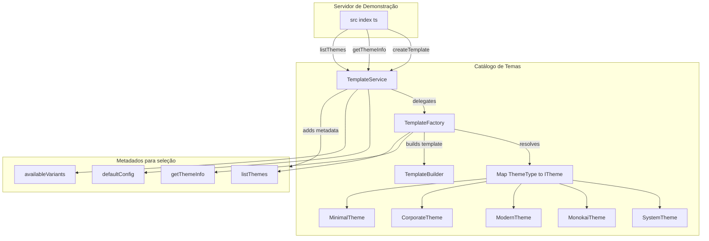
```mermaid
flowchart TB
    subgraph DemoApp [Servidor de Demonstração]
        Demo[src index ts]
    end

    subgraph Catalog [Catálogo de Temas]
        Service[TemplateService]
        Factory[TemplateFactory]
        Registry[Map ThemeType to ITheme]
        SystemTheme[SystemTheme]
        MonokaiTheme[MonokaiTheme]
        ModernTheme[ModernTheme]
        CorporateTheme[CorporateTheme]
        MinimalTheme[MinimalTheme]
        Builder[TemplateBuilder]
    end

    subgraph Metadata [Metadados para seleção]
        ThemeInfo[getThemeInfo]
        ThemeList[listThemes]
        DefaultConfig[defaultConfig]
        Variants[availableVariants]
    end

    Demo -->|createTemplate| Service
    Demo -->|getThemeInfo| Service
    Demo -->|listThemes| Service

    Service -->|delegates| Factory
    Service -->|adds metadata| Metadata

    Factory -->|resolves| Registry
    Registry --> SystemTheme
    Registry --> MonokaiTheme
    Registry --> ModernTheme
    Registry --> CorporateTheme
    Registry --> MinimalTheme
    Factory -->|builds template| Builder

    Factory --> ThemeInfo
    Factory --> ThemeList
    Service --> DefaultConfig
    Service --> Variants
```

## Componentes principais

### TemplateFactory

*`src/factories/template-factory.ts`*

`TemplateFactory` é o registro estático do catálogo de temas. Ela associa cada `ThemeType` a uma instância concreta de `ITheme`, resolve o tema solicitado, lista os temas cadastrados e produz o objeto de template usado pelo restante do fluxo.

#### Propriedades

| Propriedade | Tipo | Descrição |
| --- | --- | --- |
| `themes` | `Map<ThemeType, ITheme>` | Catálogo estático com `SystemTheme`, `MonokaiTheme`, `ModernTheme`, `CorporateTheme` e `MinimalTheme`. |


#### Métodos públicos

| Método | Descrição |
| --- | --- |
| `createTemplate` | Resolve o tema pelo `ThemeType`, valida a existência no catálogo e retorna um `ITemplate` com `name`, `theme`, `variant`, `config` e `render`. |
| `getTheme` | Retorna a instância concreta de `ITheme` associada ao `ThemeType` solicitado. |
| `listThemes` | Retorna a lista de `ThemeType` atualmente registrados no catálogo. |
| `getThemeInfo` | Retorna metadados estáticos do tema: `name`, `description` e `features`. |


#### Registro de temas

A ordem de `listThemes()` segue a ordem de inserção do `Map`:

- `system`
- `monokai`
- `modern`
- `corporate`
- `minimal`

#### Como o template é montado

`createTemplate` produz um objeto com:

- `name`: `${themeType}_${variant}`
- `theme`: o valor de `ThemeType`
- `variant`: `light` ou `dark`
- `config`: `ITemplateConfig`
- `render(data)`: função assíncrona que instancia `TemplateBuilder` e compõe o HTML final

createTemplate lança Error('Theme ${themeType} not found') quando o ThemeType não está registrado no Map.

---

### TemplateService

*`src/services/template.service.ts`*

`TemplateService` é a fachada de uso principal para descoberta, criação, clonagem, pré-visualização, cache, histórico e exportação/importação de templates. É aqui que o catálogo da `TemplateFactory` ganha metadados adicionais para orientar a escolha visual correta.

#### Propriedades

| Propriedade | Tipo | Descrição |
| --- | --- | --- |
| `templateCache` | `Map<string, TemplateCache>` | Cache em memória dos templates criados. A chave é o identificador derivado de tema, variante e configuração. |
| `defaultTTL` | `number` | TTL padrão em segundos para entradas do cache. |
| `templateHistory` | `Map<string, ITemplate[]>` | Histórico de versões por identificador de template. |
| `options` | `TemplateOptions` | Opções efetivas da instância, mescladas com os padrões do construtor. |


#### Dependências do construtor

| Type | Description |
| --- | --- |
| `TemplateOptions` | Configuração inicial da instância para cache, TTL, validação, minificação e modo de preview. |


#### Métodos públicos

| Método | Descrição |
| --- | --- |
| `createTemplate` | Valida a configuração, calcula o identificador do template, reutiliza cache quando aplicável, cria o template pela `TemplateFactory` e adiciona extensões de metadados. |
| `cloneTemplate` | Cria um novo template a partir de um template existente aplicando `modifications` por spread superficial em `config`. |
| `renderTemplate` | Injeta metadados de renderização em `_meta`, renderiza o template, minifica o HTML e encapsula erros com mensagem contextual. |
| `previewTemplate` | Cria um template sem cache e renderiza em modo de pré-visualização. |
| `getThemeInfo` | Combina os metadados estáticos do tema com `availableVariants` e `defaultConfig`. |
| `listThemes` | Expõe a lista de `ThemeType` do catálogo. |
| `getTemplateStats` | Consolida estatísticas de uso: total de templates, cache, hits, distribuição por tema e taxa de acerto. |
| `clearCache` | Limpa todo o cache ou apenas as entradas de um `ThemeType`. |
| `getTemplateHistory` | Retorna o histórico de versões de um template por `templateId`. |
| `restoreTemplateVersion` | Restaura uma versão anterior a partir do histórico. |
| `preloadTemplates` | Pré-carrega vários templates em paralelo para popular o cache. |
| `exportTemplate` | Serializa um template em JSON com `name`, `theme`, `variant`, `config`, `exportedAt` e `version`. |
| `importTemplate` | Reconstrói um template a partir de JSON validando campos obrigatórios. |
| `generateExampleTemplate` | Gera um template demonstrativo com defaults coerentes com o tema e a variante. |
| `isValidTemplate` | Valida a forma estrutural de um objeto candidato a template. |
| `getTemplateDetails` | Retorna detalhes consolidados de cache, histórico e uso para um `templateId`. |


#### Extensões adicionadas ao template criado

O objeto retornado por `createTemplate` é enriquecido em runtime com estes métodos:

| Método adicionado | Descrição |
| --- | --- |
| `getVersion` | Retorna o número de versões registradas no histórico daquele `templateId`. |
| `getId` | Retorna o identificador gerado para o template. |
| `clone` | Cria uma nova versão do template com modificações parciais de configuração. |


#### Regras de validação aplicadas por `createTemplate`

A validação é executada quando `validateConfig` está ativo nas opções da instância ou da chamada:

- `header.logo.type === 'image'` exige `imageUrl`
- `header.logo.type === 'text'` exige `text`
- `footer.links` exige `text` e `url` em cada item
- `layout` aceita `full` ou `minimal`
- `spacing` aceita `compact`, `normal` ou `relaxed`
- `borderRadius` aceita `none`, `small`, `medium` ou `large`

#### Configuração padrão do serviço

`TemplateOptions` aceita:

| Propriedade | Tipo | Descrição |
| --- | --- | --- |
| `cache?` | `boolean` | Liga ou desliga o cache de templates. |
| `cacheTTL?` | `number` | TTL em segundos para as entradas do cache. |
| `validateConfig?` | `boolean` | Ativa a validação da configuração do template. |
| `minify?` | `boolean` | Ativa a minificação do HTML final. |
| `preview?` | `boolean` | Marca a renderização como prévia. |


Os valores aplicados pelo construtor são:

- `cache: true`
- `cacheTTL: 3600`
- `validateConfig: true`
- `minify: true`
- `preview: false`

---

### TemplateCache

*`src/services/template.service.ts`*

Interface interna usada pelo cache em memória.

| Propriedade | Tipo | Descrição |
| --- | --- | --- |
| `template` | `ITemplate` | Template armazenado no cache. |
| `createdAt` | `Date` | Data de criação da entrada. |
| `expiresAt` | `Date` | Momento em que a entrada expira. |
| `hits` | `number` | Contador de acessos ao template em cache. |


---

### ThemeType

*`src/core/enums/theme.enum.ts`*

Enumeração do catálogo de temas.

Valores: `system`, `monokai`, `modern`, `corporate`, `minimal`.

---

### ITheme

*`src/templates/themes/theme.interface.ts`*

Contrato implementado pelos temas concretos registrados no catálogo.

| Propriedade | Tipo | Descrição |
| --- | --- | --- |
| `id` | `ThemeType` | Identificador do tema. |
| `name` | `string` | Nome legível do tema. |
| `light` | `IThemeColors` | Paleta para variante clara. |
| `dark` | `IThemeColors` | Paleta para variante escura. |
| `typography` | `ITypography` | Tipografia base do tema. |
| `spacing` | `ISpacing` | Sistema de espaçamento do tema. |


### IThemeColors

*`src/templates/themes/theme.interface.ts`*

| Propriedade | Tipo | Descrição |
| --- | --- | --- |
| `primary` | `string` | Cor primária do tema. |
| `secondary` | `string` | Cor secundária do tema. |
| `background` | `string` | Cor de fundo. |
| `text` | `string` | Cor principal do texto. |
| `textMuted` | `string` | Cor para texto secundário ou suavizado. |
| `border` | `string` | Cor de bordas. |
| `success` | `string` | Cor de sucesso. |
| `error` | `string` | Cor de erro. |
| `warning` | `string` | Cor de aviso. |


### ITypography

*`src/templates/themes/theme.interface.ts`*

| Propriedade | Tipo | Descrição |
| --- | --- | --- |
| `fontFamily` | `string` | Família tipográfica base. |
| `fontSizes.small` | `string` | Tamanho pequeno. |
| `fontSizes.medium` | `string` | Tamanho médio. |
| `fontSizes.large` | `string` | Tamanho grande. |
| `fontSizes.xlarge` | `string` | Tamanho extra grande. |
| `fontWeights.normal` | `number` | Peso normal. |
| `fontWeights.medium` | `number` | Peso médio. |
| `fontWeights.bold` | `number` | Peso negrito. |


### ISpacing

*`src/templates/themes/theme.interface.ts`*

| Propriedade | Tipo | Descrição |
| --- | --- | --- |
| `xs` | `string` | Espaçamento extra pequeno. |
| `sm` | `string` | Espaçamento pequeno. |
| `md` | `string` | Espaçamento médio. |
| `lg` | `string` | Espaçamento grande. |
| `xl` | `string` | Espaçamento extra grande. |


---

### ITemplate

*`src/core/interfaces/template.interface.ts`*

Contrato do objeto retornado por `TemplateFactory.createTemplate` e `TemplateService.createTemplate`.

| Propriedade | Tipo | Descrição |
| --- | --- | --- |
| `name` | `string` | Nome do template, gerado como `${themeType}_${variant}`. |
| `theme` | `ThemeType` | Tema associado ao template. |
| `variant` | `'light` `'dark'` | Variante visual aplicada. |
| `config` | `ITemplateConfig` | Configuração estrutural do template. |
| `render` | `(data: any) => Promise<string>` | Função assíncrona que produz o HTML final. |


### ITemplateConfig

*`src/core/interfaces/template.interface.ts`*

| Propriedade | Tipo | Descrição |
| --- | --- | --- |
| `header?` | `IHeaderConfig` | Configuração do cabeçalho. |
| `body?` | `IBodyConfig` | Configuração do conteúdo principal. |
| `footer?` | `IFooterConfig` | Configuração do rodapé. |
| `layout?` | `'full'` `'minimal'` | Layout do email. |
| `spacing?` | `'compact'` `'normal'`  `'relaxed'` | Densidade visual. |
| `borderRadius?` | `'none'`  `'small` `'medium'`  `'large'` | Raio de borda aplicado ao layout. |


### IHeaderConfig

*`src/core/interfaces/template.interface.ts`*

| Propriedade | Tipo | Descrição |
| --- | --- | --- |
| `show` | `boolean` | Controla a exibição do cabeçalho. |
| `logo?` | `{ type: 'text' 'image'; text?: string; imageUrl?: string; alt?: string; size?: 'small' 'medium' 'large' }` | Configuração do logo. |
| `backgroundColor?` | `string` | Cor de fundo do cabeçalho. |
| `textColor?` | `string` | Cor do texto do cabeçalho. |


### IBodyConfig

*`src/core/interfaces/template.interface.ts`*

| Propriedade | Tipo | Descrição |
| --- | --- | --- |
| `title?` | `string` | Título exibido no corpo. |
| `message?` | `string` | Mensagem principal. |
| `content?` | `string` | Conteúdo HTML bruto, quando fornecido. |
| `buttonText?` | `string` | Texto do botão principal. |
| `buttonUrl?` | `string` | URL do botão principal. |
| `buttonVariant?` | `'primary'` `'secondary'` `'success'`  `'danger'` | Variante visual do botão. |
| `alignment?` | `'left'` `center'` `'right'` | Alinhamento do conteúdo. |
| `backgroundColor?` | `string` | Cor de fundo do corpo. |
| `textColor?` | `string` | Cor do texto do corpo. |
| `fontSize?` | `number` | Tamanho base da fonte. |


### IFooterConfig

*`src/core/interfaces/template.interface.ts`*

| Propriedade | Tipo | Descrição |
| --- | --- | --- |
| `show` | `boolean` | Controla a exibição do rodapé. |
| `links?` | `Array<{ text: string; url: string }>` | Links institucionais ou de navegação. |
| `socialLinks?` | `Array<{ platform: 'facebook' 'twitter' 'linkedin' 'github'; url: string }>` | Links sociais com ícones. |
| `copyrightText?` | `string` | Texto de copyright. |
| `unsubscribeText?` | `string` | Texto do link de descadastro. |
| `backgroundColor?` | `string` | Cor de fundo do rodapé. |
| `textColor?` | `string` | Cor do texto do rodapé. |


## Catálogo de temas e metadados

### Temas registrados

`TemplateFactory.listThemes()` expõe os temas registrados no `Map` estático e retorna:

- `system`
- `monokai`
- `modern`
- `corporate`
- `minimal`

### Metadados retornados por `TemplateFactory.getThemeInfo`

| `ThemeType` | `name` | `description` | `features` |
| --- | --- | --- | --- |
| `system` | `System` | `Tema limpo e profissional com cores adaptativas` | `Design minimalista`, `Alta acessibilidade`, `Compatibilidade total` |
| `monokai` | `Monokai` | `Inspirado no famoso tema de código, ideal para conteúdo técnico` | `Cores vibrantes`, `Destaque de sintaxe`, `Efeitos glow` |
| `modern` | `Modern` | `Design contemporâneo com gradientes e efeitos modernos` | `Gradientes elegantes`, `Glassmorphism`, `Animações suaves` |
| `corporate` | `Corporate` | `Design profissional e elegante para empresas` | `Tipografia serifada`, `Detalhes em dourado`, `Layout estruturado` |
| `minimal` | `Minimal` | `Design clean e focado no conteúdo` | `Sem distrações`, `Espaçamento generoso`, `Tipografia limpa` |


### Metadados extras adicionados por `TemplateService.getThemeInfo`

`TemplateService.getThemeInfo(themeType)` retorna:

| Campo | Descrição |
| --- | --- |
| `name` | Nome amigável do tema. |
| `description` | Descrição curta para exibição em catálogo. |
| `features` | Lista de características destacadas. |
| `availableVariants` | Sempre `light` e `dark`. |
| `defaultConfig` | Configuração padrão sugerida para o tema. |


### Variantes suportadas

Todas as entradas do catálogo expõem:

- `light`
- `dark`

### Configuração padrão por tema

`TemplateService.getDefaultConfigForTheme` parte de uma base comum:

| Campo | Valor base |
| --- | --- |
| `header.show` | `true` |
| `header.logo.type` | `text` |
| `header.logo.text` | `MyApp` |
| `header.logo.size` | `medium` |
| `footer.show` | `true` |
| `footer.copyrightText` | `© {ano atual} MyApp. All rights reserved.` |
| `layout` | `full` |
| `spacing` | `normal` |
| `borderRadius` | `medium` |


Ajustes específicos por tema:

| Tema | `borderRadius` | `spacing` | Observação |
| --- | --- | --- | --- |
| `system` | `medium` | `normal` | Usa a base comum. |
| `monokai` | `small` | `normal` | Ajuste mais contido. |
| `modern` | `large` | `relaxed` | Visual mais espaçado. |
| `corporate` | `small` | `normal` | Mantém formalidade visual. |
| `minimal` | `none` | `relaxed` | Reduz a ornamentação. |


## Fluxo de descoberta e seleção

### Descoberta de temas

1. A interface chama `TemplateService.listThemes()`.
2. O serviço delega para `TemplateFactory.listThemes()`.
3. A lista de `ThemeType` é usada para popular cards, dropdowns ou etapas de seleção.

### Resolução de metadados

1. A UI chama `TemplateService.getThemeInfo(themeType)`.
2. `TemplateService` busca o texto de apresentação com `TemplateFactory.getThemeInfo(themeType)`.
3. O serviço busca a instância concreta com `TemplateFactory.getTheme(themeType)`.
4. O resultado é enriquecido com `availableVariants` e `defaultConfig`.
5. A interface pode usar esses dados para orientar a escolha do layout e pré-preencher controles.

### Criação do template selecionado

1. O usuário escolhe `ThemeType`, `variant` e configurações.
2. `TemplateService.createTemplate()` valida `ITemplateConfig`.
3. O identificador do template é gerado a partir de tema, variante e JSON da configuração.
4. Se houver cache válido para a mesma combinação, a instância é reutilizada.
5. Caso contrário, `TemplateFactory.createTemplate()` resolve o tema e gera o template.
6. O template é enriquecido com `getVersion`, `getId` e `clone`.
7. O resultado é armazenado em cache e no histórico.

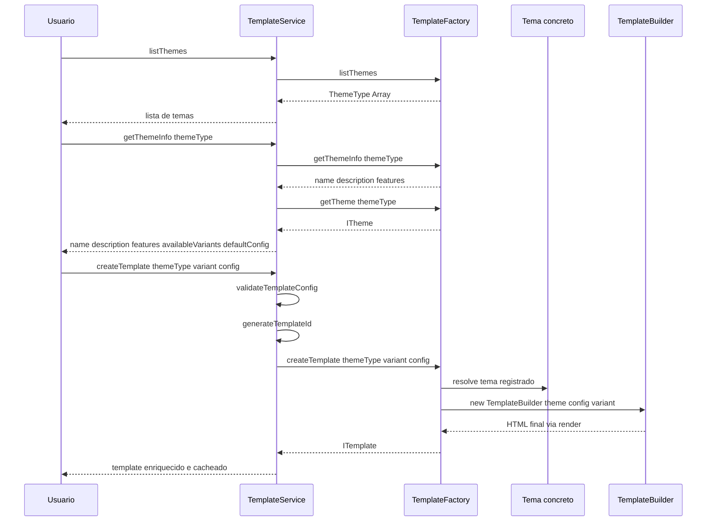
```mermaid
sequenceDiagram
    participant U as Usuario
    participant S as TemplateService
    participant F as TemplateFactory
    participant T as Tema concreto
    participant B as TemplateBuilder

    U->>S: listThemes
    S->>F: listThemes
    F-->>S: ThemeType Array
    S-->>U: lista de temas

    U->>S: getThemeInfo themeType
    S->>F: getThemeInfo themeType
    F-->>S: name description features
    S->>F: getTheme themeType
    F-->>S: ITheme
    S-->>U: name description features availableVariants defaultConfig

    U->>S: createTemplate themeType variant config
    S->>S: validateTemplateConfig
    S->>S: generateTemplateId
    S->>F: createTemplate themeType variant config
    F->>T: resolve tema registrado
    F->>B: new TemplateBuilder theme config variant
    B-->>F: HTML final via render
    F-->>S: ITemplate
    S-->>U: template enriquecido e cacheado
```

## Estado, cache e histórico

### Cache de templates

TemplateFactory.createTemplate lê body a partir de data.template.config.body, mas TemplateService.renderTemplate repassa data sem anexar template. Quando a renderização é feita diretamente por renderTemplate, o corpo usa os fallbacks internos, a menos que o chamador já tenha incluído template em data.

- Chave do cache: `themeType_variant_hash`
- Fonte do hash: `JSON.stringify({ theme, variant, config })`
- Persistência: `Map<string, TemplateCache>`
- TTL padrão: `3600` segundos
- Limpeza automática: `setInterval(..., 3600000)` no construtor

### Regras de uso do cache

- `createTemplate()` reutiliza a entrada quando a chave já existe.
- `previewTemplate()` cria template com `cache: false`.
- `restoreTemplateVersion()` recria a versão restaurada com `cache: false`.
- `clearCache(themeType?)` remove por tema ou apaga tudo.

### Histórico de versões

createTemplate() verifica apenas a presença da chave no Map. A remoção de entradas expiradas acontece pelo limpador periódico, então uma entrada vencida pode continuar sendo usada até a próxima limpeza.

- Cada `templateId` mantém um array em `templateHistory`.
- `addToHistory()` preserva apenas as últimas 10 versões.
- `getTemplateHistory(templateId)` retorna o histórico salvo.
- `restoreTemplateVersion(templateId, versionIndex)` recria uma versão anterior com o mesmo `theme`, `variant` e `config`.

### Estatísticas expostas

`getTemplateStats()` consolida:

- `totalTemplates`
- `cachedTemplates`
- `totalHits`
- `templatesByTheme`
- `cacheHitRate`

`getTemplateDetails(templateId)` retorna:

- `template`
- `history`
- `cacheInfo`
- `usageCount`

## Tratamento de erros

| Origem | Condição | Efeito |
| --- | --- | --- |
| `TemplateFactory.createTemplate` | Tema não encontrado no catálogo | Lança `Error('Theme ${themeType} not found')`. |
| `TemplateService.validateTemplateConfig` | Configuração inválida | Lança `Error('Template configuration validation failed:\n...')`. |
| `TemplateService.renderTemplate` | Falha durante renderização ou minificação | Lança `Error('Failed to render template: ...')`. |
| `TemplateService.importTemplate` | JSON inválido ou campos obrigatórios ausentes | Lança `Error('Failed to import template: ...')`. |
| `TemplateService.restoreTemplateVersion` | Histórico inexistente ou índice fora do intervalo | Retorna `null`. |


## Integração com a demonstração Express

TemplateService.getThemeInfo assume que TemplateFactory.getThemeInfo(themeType) devolve um objeto. Se um valor inválido for passado em tempo de execução, o spread de undefined provoca falha antes de availableVariants e defaultConfig serem montados.

*`src/index.ts`*

A demonstração local usa o catálogo para montar exemplos prontos com temas diferentes e variantes distintas:

- `ThemeType.MODERN` com `light`
- `ThemeType.MONOKAI` com `light`
- `ThemeType.CORPORATE` com `dark`
- `ThemeType.MINIMAL` com `dark`

Ela também expõe um endpoint de teste que envia a newsletter minimalista com anexo local.

#### Executar envio de newsletter minimalista

```api
{
    "title": "Executar envio de newsletter minimalista",
    "description": "Rota de demonstra\u00e7\u00e3o que dispara o envio de email com o template minimalista e um anexo carregado de disco",
    "method": "GET",
    "baseUrl": "<DemoServerBaseUrl>",
    "endpoint": "/test",
    "headers": [],
    "queryParams": [],
    "pathParams": [],
    "bodyType": "none",
    "requestBody": "",
    "formData": [],
    "rawBody": "",
    "responses": {
        "200": {
            "description": "Resultado retornado por sendMinimalNewsletter e repassado pelo res.json",
            "body": "{\n    \"success\": true,\n    \"messageId\": \"abc123def456\",\n    \"response\": \"250 2.0.0 OK queued as 12345\"\n}"
        }
    }
}
```

## Referência rápida dos temas

| Tema | Nome | Melhor uso |
| --- | --- | --- |
| `system` | System | Emails neutros e adaptativos. |
| `monokai` | Monokai | Conteúdo técnico e newsletters para desenvolvedores. |
| `modern` | Modern | Campanhas com estética contemporânea. |
| `corporate` | Corporate | Comunicação institucional e executiva. |
| `minimal` | Minimal | Mensagens focadas em conteúdo e legibilidade. |


## Key Classes Reference

O handler de /test não aplica autenticação nem validação adicional. Ele chama sendMinimalNewsletter('antiquesclub007@gmail.com'), carrega  via AttachmentService.addFromPath e devolve o resultado bruto do envio.

| Class | Responsibility |
| --- | --- |
| `template-factory.ts` | Registra, resolve e instancia os temas concretos do catálogo. |
| `template.service.ts` | Expõe descoberta de temas, metadados, cache, histórico e criação de templates. |
| `theme.enum.ts` | Define os identificadores `ThemeType` aceitos pelo catálogo. |
| `theme.interface.ts` | Define o contrato dos temas e das estruturas visuais associadas. |
| `template.interface.ts` | Define o contrato do template e das configurações estruturais usadas na seleção. |
| `index.ts` | Demonstra o uso dos temas e expõe a rota `/test` do servidor de teste. |


---

## Primeiros passos e uso básico/Servidor de demonstração e exemplos guiados

# Primeiros passos e uso básico - Servidor de demonstração e exemplos guiados

## Visão geral

Este trecho do projeto transforma  em um laboratório executável para ver a biblioteca funcionando em runtime real. O arquivo sobe um servidor Express, carrega variáveis com `dotenv`, inicializa o `EmailFactory` com SMTP, cria templates prontos para uso e expõe uma rota de teste que dispara um envio de email de ponta a ponta.

Para quem está começando, este é o caminho mais rápido para entender como a biblioteca compõe tema, template, anexo e transporte SMTP. Os exemplos `sendWelcomeEmail`, `sendTechNewsletter`, `sendCorporateReport` e `sendMinimalNewsletter` mostram quatro perfis de uso distintos: boas-vindas, newsletter técnica, relatório corporativo e newsletter mínima com anexo.

## Servidor de demonstração em 

*Arquivo: `src/index.ts`*

O arquivo atua em duas funções ao mesmo tempo: é o ponto de entrada do servidor de demonstração e também o barrel de exportação pública do pacote. A sequência visível no código é:

- `dotenv.config()` é executado no topo do módulo.
- O servidor cria `app` com `express()`.
- `PORT` é fixado em `3001`.
- O middleware `express.json()` e `express.urlencoded({ extended: true })` é ativado.
- `SMTP_CONFIG` é montado com `process.env.SMTP_USER` e `process.env.SMTP_PASS`.
- `EmailFactory.initialize(SMTP_CONFIG)` cria a instância única usada no laboratório.
- `templateService` é obtido via `emailFactory.getTemplateService()`.
- Quatro templates de demonstração são criados com `templateService.createTemplate(...)`.
- A rota `GET /test` chama `sendMinimalNewsletter('antiquesclub007@gmail.com')`.
- `app.listen(PORT)` inicia o processo na porta `3001`.

### Exportações públicas do arquivo

O mesmo arquivo também reexporta os símbolos centrais do pacote para consumo a partir da raiz.

| Símbolo | Finalidade |
| --- | --- |
| `EmailFactory` | Fachada principal para configurar SMTP e enviar emails |
| `TemplateFactory` | Criação direta de templates por tema |
| `ITemplate` | Contrato de template renderizável |
| `ITemplateConfig` | Contrato de configuração do template |
| `ThemeType` | Enum de temas |
| `ITheme` | Contrato base dos temas |
| `TemplateService` | Criação, cache, renderização e inspeção de templates |
| `EmailService` | Envio real via Nodemailer |
| `AttachmentService` | Montagem de anexos |
| `TemplateBuilder` | Montagem do HTML final do email |
| `CorporateTheme` | Tema corporativo |
| `MinimalTheme` | Tema minimalista |
| `ModernTheme` | Tema moderno |
| `MonokaiTheme` | Tema técnico estilo editor |
| `SystemTheme` | Tema base do sistema |


### Configuração SMTP usada no laboratório

| Campo | Valor no código | Observação |
| --- | --- | --- |
| `host` | `smtp.gmail.com` | Host SMTP de demonstração |
| `port` | `587` | Porta usada no exemplo |
| `secure` | `false` | Conexão não TLS implícita |
| `auth.user` | `process.env.SMTP_USER!` | Vem do `.env` carregado por `dotenv` |
| `auth.pass` | `process.env.SMTP_PASS!` | Vem do `.env` carregado por `dotenv` |
| `defaultFrom` | `LyraX Corp <lyrax.com@gmail.com>` | Remetente padrão aplicado quando `from` não é informado |


## Fluxo de inicialização do servidor

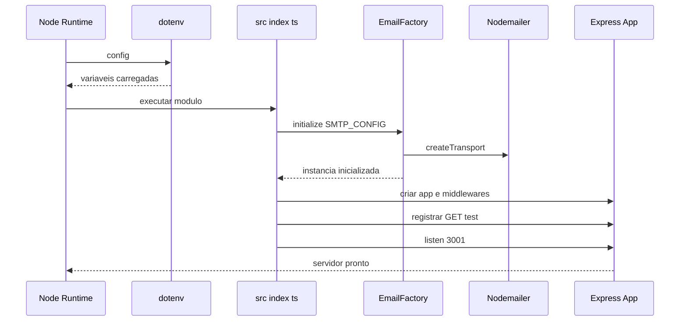
```mermaid
sequenceDiagram
    participant Runtime as Node Runtime
    participant Dotenv as dotenv
    participant Index as src index ts
    participant Factory as EmailFactory
    participant Transport as Nodemailer
    participant ExpressApp as Express App

    Runtime->>Dotenv: config
    Dotenv-->>Runtime: variaveis carregadas
    Runtime->>Index: executar modulo
    Index->>Factory: initialize SMTP_CONFIG
    Factory->>Transport: createTransport
    Factory-->>Index: instancia inicializada
    Index->>ExpressApp: criar app e middlewares
    Index->>ExpressApp: registrar GET test
    Index->>ExpressApp: listen 3001
    ExpressApp-->>Runtime: servidor pronto
```

### O que acontece na inicialização

O laboratório envia emails reais pela configuração SMTP definida em . A rota GET /test não é um simulador: ela dispara o fluxo completo de envio usando o destinatário fixo antiquesclub007@gmail.com.

1. `dotenv.config()` carrega `SMTP_USER` e `SMTP_PASS` antes da criação do `SMTP_CONFIG`.
2. `EmailFactory.initialize(SMTP_CONFIG)` instancia `EmailService`, `TemplateService` e `AttachmentService`.
3. Os templates de demonstração são montados uma vez na subida do processo.
4. O servidor Express começa a escutar na porta `3001`.
5. O console imprime a mensagem de boot com a URL local.

## Endpoint HTTP de demonstração

#### Testar newsletter minimalista

```api
{
    "title": "Testar newsletter minimalista",
    "description": "Dispara o fluxo completo de envio usado no laborat\u00f3rio, chamando sendMinimalNewsletter com destinat\u00e1rio fixo e retornando o resultado bruto do envio",
    "method": "GET",
    "baseUrl": "<DemoServerBaseUrl>",
    "endpoint": "/test",
    "headers": [],
    "queryParams": [],
    "pathParams": [],
    "bodyType": "none",
    "requestBody": "",
    "formData": [],
    "rawBody": "",
    "responses": {
        "200": {
            "description": "Resultado retornado por sendMinimalNewsletter",
            "body": "{\n    \"success\": true,\n    \"messageId\": \"message-id-example\",\n    \"response\": \"250 2.0.0 OK queued as example\"\n}"
        }
    }
}
```

## Exemplos guiados de envio

A rota GET /test chama sendMinimalNewsletter('antiquesclub007@gmail.com') diretamente. O handler não abre um modo de pré-visualização nem faz mock do SMTP; ele usa a implementação real de anexos, template e envio.

Os quatro exemplos abaixo são funções internas do laboratório em . Todas seguem o mesmo padrão geral: log no console, construção de `options` e chamada de `emailFactory.sendEmail(...)`.

| Função | Tema | Variante | Assunto | Particularidade |
| --- | --- | --- | --- | --- |
| `sendWelcomeEmail` | `ThemeType.MODERN` | `light` | `Bem-vindo ao Meu App!` | Usa `modernTemplate` sem anexos |
| `sendTechNewsletter` | `ThemeType.MONOKAI` | `light` | `DevHub Newsletter - Novidades da Semana` | Usa conteúdo com trecho de código em destaque |
| `sendCorporateReport` | `ThemeType.CORPORATE` | `dark` | `Relatório Trimestral - Q4 2024` | Usa `corporateTemplate` em modo escuro |
| `sendMinimalNewsletter` | `ThemeType.MINIMAL` | `dark` | `Pensamentos sobre design` | Usa anexo carregado de  |


### `sendWelcomeEmail`

Envia uma mensagem de boas-vindas usando o tema `MODERN` no modo `light`. O template criado para este caso inclui cabeçalho com logo de imagem, corpo centralizado, botão de ação e rodapé com links e redes sociais.

**Uso interno no laboratório**

- `subject`: `Bem-vindo ao Meu App!`
- `template`: `modernTemplate`
- `to`: parâmetro da função

### `sendTechNewsletter`

Envia a newsletter técnica com o tema `MONOKAI`. O conteúdo do corpo inclui texto multilinha e um bloco `<code>`, que é processado visualmente pelo builder do tema Monokai.

**Uso interno no laboratório**

- `subject`: `DevHub Newsletter - Novidades da Semana`
- `template`: `monokaiTemplate`
- `to`: parâmetro da função

### `sendCorporateReport`

Envia um relatório corporativo usando `ThemeType.CORPORATE` em `dark`. O template foi montado para uso mais formal, com tipografia serifada, destaque dourado e links institucionais no rodapé.

**Uso interno no laboratório**

- `subject`: `Relatório Trimestral - Q4 2024`
- `template`: `corporateTemplate`
- `to`: parâmetro da função

### `sendMinimalNewsletter`

É o exemplo mais completo do laboratório. Além do template minimalista, ele cria um anexo a partir do sistema de arquivos com `AttachmentService.addFromPath('uploads/PHOTO.jpg')`.

**Uso interno no laboratório**

- `subject`: `Pensamentos sobre design`
- `template`: `minimalTemplate`
- `to`: parâmetro da função
- `attachments`: array com o anexo retornado por `addFromPath`

## Componentes centrais usados pelo laboratório

### `EmailFactory`

*Arquivo: `src/factories/email-factory.ts`*

A `EmailFactory` é a fachada de orquestração do envio. Ela centraliza a criação do `transporter` do Nodemailer, instancia o serviço de email, expõe o serviço de templates e entrega o serviço de anexos.

#### Propriedades

| Propriedade | Tipo | Descrição |
| --- | --- | --- |
| `instance` | `EmailFactory` | Instância singleton mantida pela fábrica |
| `emailService` | `EmailService` | Serviço responsável pelo envio efetivo |
| `templateService` | `TemplateService` | Serviço de criação e renderização de templates |
| `attachmentService` | `AttachmentService` | Serviço de montagem de anexos |


#### Dependências do construtor

| Tipo | Descrição |
| --- | --- |
| `IEmailConfig` | Configuração SMTP entregue ao Nodemailer |
| `any` | Opções adicionais repassadas ao `TemplateService` |


#### Métodos públicos

| Método | Descrição |
| --- | --- |
| `initialize` | Cria a instância singleton da fábrica |
| `getInstance` | Retorna a instância já inicializada |
| `sendEmail` | Encaminha o envio para `EmailService.send` |
| `getTemplateService` | Expõe a instância de `TemplateService` |
| `getAttachmentService` | Expõe a instância de `AttachmentService` |
| `previewTemplate` | Renderiza um template em modo de pré-visualização |
| `getThemeInfo` | Consulta informações de um tema |
| `listThemes` | Lista os temas disponíveis |
| `getTemplateStats` | Retorna estatísticas do uso de templates |


#### Fluxo de uso

1. `EmailFactory.initialize(SMTP_CONFIG)` cria o transporter com `nodemailer.createTransport(config)`.
2. O construtor instancia `EmailService`, `TemplateService` e `AttachmentService`.
3. `sendEmail(options)` repassa diretamente o envio para `EmailService.send`.
4. O laboratório usa `getTemplateService()` para criar os templates que alimentam os exemplos.

### `EmailService`

*Arquivo: `src/services/email.service.ts`*

É o serviço que realmente chama `transporter.sendMail(...)`. Ele normaliza destinatários, escolhe o HTML renderizado pelo template e devolve uma resposta estruturada com sucesso ou falha.

#### Propriedades

| Propriedade | Tipo | Descrição |
| --- | --- | --- |
| `transporter` | `Transporter` | Conexão Nodemailer usada para envio |
| `defaultFrom` | `string` | Remetente padrão aplicado quando `options.from` não existe |


#### Dependências do construtor

| Tipo | Descrição |
| --- | --- |
| `Transporter` | Transporte Nodemailer já configurado |
| `string` | Remetente padrão opcional |


#### Métodos públicos

| Método | Descrição |
| --- | --- |
| `send` | Constrói `mailOptions`, renderiza template quando necessário e envia o email |


#### Comportamento de envio

- `from` usa `options.from` quando existe; caso contrário, usa `defaultFrom`.
- `to` aceita string ou array; arrays são unidos por vírgula.
- `html` usa `options.html` quando informado.
- Se `html` não existir e `template` for fornecido, `options.template.render(options)` gera o HTML.
- `attachments` é repassado diretamente ao Nodemailer.
- O retorno é um objeto com `success`, `messageId` e `response` em caso de êxito, ou `success: false` com `error` quando o transporte falha.

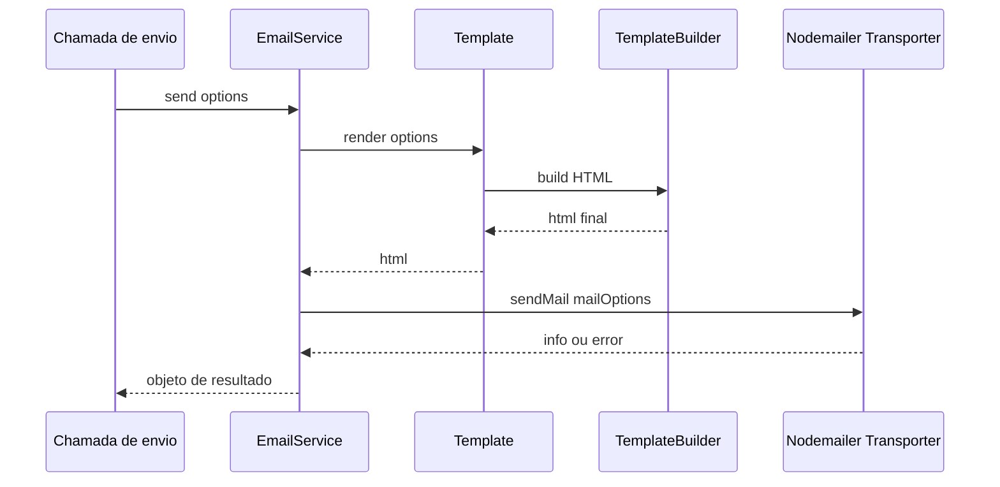
```mermaid
sequenceDiagram
    participant Caller as Chamada de envio
    participant EmailService as EmailService
    participant Template as Template
    participant Builder as TemplateBuilder
    participant Nodemailer as Nodemailer Transporter

    Caller->>EmailService: send options
    EmailService->>Template: render options
    Template->>Builder: build HTML
    Builder-->>Template: html final
    Template-->>EmailService: html
    EmailService->>Nodemailer: sendMail mailOptions
    Nodemailer-->>EmailService: info ou error
    EmailService-->>Caller: objeto de resultado
```

### `TemplateService`

*Arquivo: `src/services/template.service.ts`*

É o centro de composição dos templates. O serviço valida a configuração, gera um identificador estável para cache, cria o template por tema, adiciona histórico e fornece estatísticas de uso.

#### Propriedades

| Propriedade | Tipo | Descrição |
| --- | --- | --- |
| `templateCache` | `Map<string, TemplateCache>` | Cache em memória dos templates gerados |
| `defaultTTL` | `number` | TTL padrão em segundos |
| `templateHistory` | `Map<string, ITemplate[]>` | Histórico de versões dos templates |
| `options` | `TemplateOptions` | Configurações de comportamento do serviço |


#### Estrutura interna de cache

| Propriedade | Tipo | Descrição |
| --- | --- | --- |
| `template` | `ITemplate` | Template armazenado no cache |
| `createdAt` | `Date` | Data de criação no cache |
| `expiresAt` | `Date` | Data de expiração |
| `hits` | `number` | Quantidade de acessos |


#### Opções do construtor

| Tipo | Descrição |
| --- | --- |
| `cache?: boolean` | Liga ou desliga cache |
| `cacheTTL?: number` | TTL do cache em segundos |
| `validateConfig?: boolean` | Valida a configuração antes de criar o template |
| `minify?: boolean` | Minifica o HTML no render |
| `preview?: boolean` | Marca renderização como pré-visualização |


#### Métodos públicos

| Método | Descrição |
| --- | --- |
| `createTemplate` | Cria ou recupera um template em cache |
| `cloneTemplate` | Cria uma nova versão a partir de um template existente |
| `renderTemplate` | Renderiza um template com dados e metadados |
| `previewTemplate` | Cria e renderiza em modo de prévia |
| `getThemeInfo` | Retorna dados do tema e configuração padrão |
| `listThemes` | Lista todos os temas |
| `getTemplateStats` | Retorna métricas de cache e histórico |
| `clearCache` | Remove o cache total ou por tema |
| `getTemplateHistory` | Retorna versões armazenadas de um template |
| `restoreTemplateVersion` | Recria uma versão anterior |
| `preloadTemplates` | Pré-carrega múltiplos templates no cache |
| `exportTemplate` | Serializa template em JSON |
| `importTemplate` | Reconstrói template a partir de JSON |
| `generateExampleTemplate` | Cria um template de exemplo pronto |
| `isValidTemplate` | Valida a estrutura de um template |
| `getTemplateDetails` | Retorna detalhes, histórico e cache de um template |


#### Validações aplicadas por `validateTemplateConfig`

- `header.logo.imageUrl` é obrigatório quando `logo.type === 'image'`.
- `header.logo.text` é obrigatório quando `logo.type === 'text'`.
- `footer.links` deve conter pares `text` e `url`.
- `layout` aceita apenas `full` ou `minimal`.
- `spacing` aceita apenas `compact`, `normal` ou `relaxed`.
- `borderRadius` aceita apenas `none`, `small`, `medium` ou `large`.

#### Fluxo de `createTemplate`

1. Valida a configuração quando a validação está ativa.
2. Gera um ID com `generateTemplateId(themeType, variant, config)`.
3. Consulta o cache com a chave gerada.
4. Se houver cache válido, incrementa `hits` e retorna o template armazenado.
5. Se não houver cache, chama `TemplateFactory.createTemplate(...)`.
6. Enriquece o template com `getVersion`, `getId` e `clone`.
7. Armazena a versão no cache quando o cache está habilitado.
8. Adiciona o template ao histórico, mantendo no máximo 10 versões.

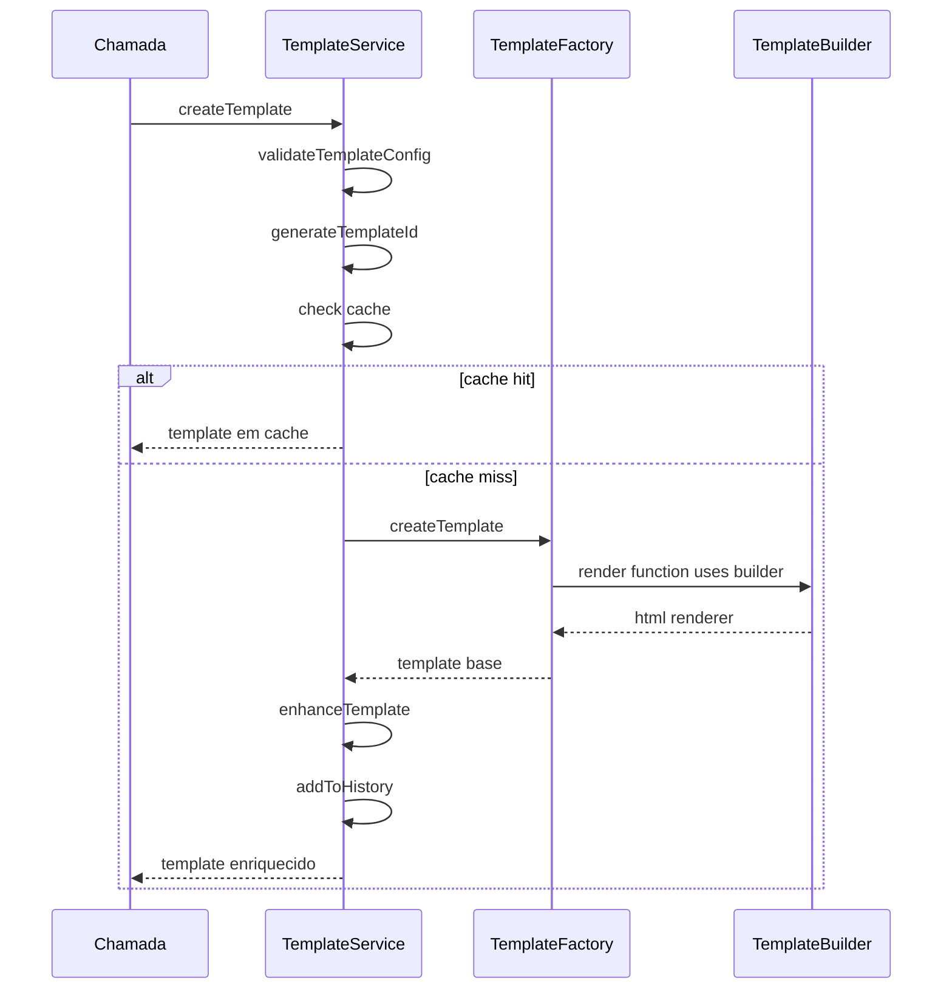
```mermaid
sequenceDiagram
    participant Caller as Chamada
    participant TemplateService as TemplateService
    participant TemplateFactory as TemplateFactory
    participant Builder as TemplateBuilder

    Caller->>TemplateService: createTemplate
    TemplateService->>TemplateService: validateTemplateConfig
    TemplateService->>TemplateService: generateTemplateId
    TemplateService->>TemplateService: check cache
    alt cache hit
        TemplateService-->>Caller: template em cache
    else cache miss
        TemplateService->>TemplateFactory: createTemplate
        TemplateFactory->>Builder: render function uses builder
        Builder-->>TemplateFactory: html renderer
        TemplateFactory-->>TemplateService: template base
        TemplateService->>TemplateService: enhanceTemplate
        TemplateService->>TemplateService: addToHistory
        TemplateService-->>Caller: template enriquecido
    end
```

### Cache de templates em memória

O cache é gerenciado inteiramente dentro de `TemplateService`. Ele usa duas estruturas:

- `templateCache` para armazenar o template ativo com TTL e contagem de uso.
- `templateHistory` para guardar as versões produzidas por `createTemplate`.

#### Chave de cache

A chave é gerada em `generateTemplateId(...)` a partir de:

- `themeType`
- `variant`
- `config`

O conteúdo é serializado com `JSON.stringify(...)` e convertido em um hash simples, resultando no formato:

```text
{themeType}_{variant}_{hashAbsoluto}
```

#### Invalidação

- `clearCache(themeType?)` limpa o cache inteiro ou apenas os templates do tema informado.
- `cleanExpiredCache()` remove entradas expiradas.
- `setInterval(..., 3600000)` executa a limpeza automática a cada hora.
- `restoreTemplateVersion(...)` recria uma versão anterior sem reaproveitar a versão original do cache.

#### Métricas retornadas por `getTemplateStats`

| Campo | Origem |
| --- | --- |
| `totalTemplates` | Tamanho de `templateHistory` |
| `cachedTemplates` | Tamanho de `templateCache` |
| `totalHits` | Soma dos `hits` de todas as entradas |
| `templatesByTheme` | Contagem por `ThemeType` |
| `cacheHitRate` | `totalHits / cachedTemplates * 100` |


### `TemplateFactory`

*Arquivo: `src/factories/template-factory.ts`*

A fábrica liga o `ThemeType` ao tema concreto e devolve um objeto de template com função `render`. É aqui que o laboratório transforma a configuração em HTML.

#### Propriedades

| Propriedade | Tipo | Descrição |
| --- | --- | --- |
| `themes` | `Map<ThemeType, ITheme>` | Registro dos temas disponíveis |


#### Métodos públicos

| Método | Descrição |
| --- | --- |
| `createTemplate` | Cria o template baseado em tema, variante e configuração |
| `getTheme` | Retorna a implementação concreta do tema |
| `listThemes` | Lista as chaves do mapa de temas |
| `getThemeInfo` | Retorna nome, descrição e recursos do tema |


#### O que `createTemplate` devolve

O objeto de template retornado contém:

| Propriedade | Tipo | Descrição |
| --- | --- | --- |
| `name` | `string` | Nome no formato `{themeType}_{variant}` |
| `theme` | `ThemeType` | Tema selecionado |
| `variant` | `'light' | 'dark'` | Variante visual |
| `config` | `ITemplateConfig` | Configuração recebida |
| `render` | `(data: any) => Promise<string>` | Função assíncrona que gera o HTML |


#### Comportamento do `render`

- Usa `TemplateBuilder` com tema, config e variante.
- Lê `data.template.config.body`.
- Monta um corpo padrão quando `body.content` não existe.
- Chama `buildHeader(data.headerContent)`.
- Chama `buildBody(bodyContent)`.
- Só chama `buildButton(...)` quando `buttonText` e `buttonUrl` existem.
- Finaliza com `buildFooter()` e `build()`.

### `TemplateBuilder`

*Arquivo: `src/templates/base/template-builder.ts`*

É o construtor de HTML usado por cada template. Ele aplica variações visuais com base no tema, organiza cabeçalho, corpo, botão e rodapé, e gera a estrutura HTML completa do email.

#### Propriedades

| Propriedade | Tipo | Descrição |
| --- | --- | --- |
| `template` | `string` | HTML acumulado durante a montagem |
| `theme` | `ITheme` | Tema concreto usado na renderização |
| `config` | `ITemplateConfig` | Configuração do template |
| `variant` | `'light'` `'dark'` | Variante usada para escolher paleta |


#### Dependências do construtor

| Tipo | Descrição |
| --- | --- |
| `ITheme` | Tema concreto com cores, tipografia e espaçamento |
| `ITemplateConfig` | Configuração do layout e das seções |
| `'light`  `'dark'` | Variante visual |


#### Métodos públicos

| Método | Descrição |
| --- | --- |
| `buildHeader` | Monta o cabeçalho e o logo |
| `buildBody` | Monta o corpo do email |
| `buildButton` | Monta o botão de chamada para ação |
| `buildFooter` | Monta o rodapé |
| `build` | Fecha o HTML completo do email |


#### Observações de renderização

- O cabeçalho é omitido quando `config.header.show` é falso.
- O corpo processa HTML específico por tema.
- O botão só aparece quando o texto e a URL são informados na configuração.
- O rodapé pode incluir links, ícones sociais, copyright e unsubscribe.
- `build()` encapsula tudo em uma página HTML completa com `meta charset`, `viewport` e regra responsiva para telas pequenas.

### `AttachmentService`

*Arquivo: `src/services/attachment.service.ts`*

É o serviço usado para preparar anexos compatíveis com Nodemailer. No laboratório, ele é exercitado diretamente por `sendMinimalNewsletter`.

#### Propriedades

Não há propriedades de instância declaradas.

#### Métodos públicos

| Método | Descrição |
| --- | --- |
| `addFromPath` | Cria um anexo a partir de um arquivo no sistema |
| `addFromBuffer` | Cria um anexo a partir de um `Buffer` em memória |
| `addFromUrl` | Método declarado, mas lança erro de implementação |


#### Comportamento de `addFromPath`

1. Executa `fs.promises.stat(filePath)`.
2. Verifica se o caminho é um arquivo.
3. Lança `Error` se não for arquivo válido.
4. Retorna um objeto com:- `filename`
- `path`
- `contentType`
- `cid`

#### Comportamento de `addFromBuffer`

Retorna um anexo com:

- `filename`
- `content` com o buffer recebido
- `contentType`
- `cid`

#### Comportamento de `addFromUrl`

O método existe, mas lança:

```text
Method not implemented yet
```

## Contratos e modelos usados pelo laboratório

### `ThemeType`

*Arquivo: `src/core/enums/theme.enum.ts`*

Valores disponíveis: `system`, `monokai`, `modern`, `corporate`, `minimal`.

### `ITheme`

*Arquivo: `src/templates/themes/theme.interface.ts`*

#### Propriedades

| Propriedade | Tipo | Descrição |
| --- | --- | --- |
| `id` | `ThemeType` | Identificador do tema |
| `name` | `string` | Nome legível do tema |
| `light` | `IThemeColors` | Paleta para variante clara |
| `dark` | `IThemeColors` | Paleta para variante escura |
| `typography` | `ITypography` | Tipografia base |
| `spacing` | `ISpacing` | Escala de espaçamento |


### `IThemeColors`

*Arquivo: `src/templates/themes/theme.interface.ts`*

| Propriedade | Tipo |
| --- | --- |
| `primary` | `string` |
| `secondary` | `string` |
| `background` | `string` |
| `text` | `string` |
| `textMuted` | `string` |
| `border` | `string` |
| `success` | `string` |
| `error` | `string` |
| `warning` | `string` |


### `ITypography`

*Arquivo: `src/templates/themes/theme.interface.ts`*

| Propriedade | Tipo |
| --- | --- |
| `fontFamily` | `string` |
| `fontSizes.small` | `string` |
| `fontSizes.medium` | `string` |
| `fontSizes.large` | `string` |
| `fontSizes.xlarge` | `string` |
| `fontWeights.normal` | `number` |
| `fontWeights.medium` | `number` |
| `fontWeights.bold` | `number` |


### `ISpacing`

*Arquivo: `src/templates/themes/theme.interface.ts`*

| Propriedade | Tipo |
| --- | --- |
| `xs` | `string` |
| `sm` | `string` |
| `md` | `string` |
| `lg` | `string` |
| `xl` | `string` |


### `IEmailConfig`

*Arquivo: `src/core/interfaces/email.interface.ts`*

| Propriedade | Tipo | Descrição |
| --- | --- | --- |
| `host` | `string` | Host SMTP |
| `port` | `number` | Porta SMTP |
| `secure` | `boolean` | Modo seguro do transporte |
| `auth.user` | `string` | Usuário SMTP |
| `auth.pass` | `string` | Senha SMTP |
| `defaultFrom?` | `string` | Remetente padrão |


### `IEmailOptions`

*Arquivo: `src/core/interfaces/email.interface.ts`*

| Propriedade | Tipo | Descrição |
| --- | --- | --- |
| `to` | `string`  `string[]` | Destinatário ou lista de destinatários |
| `subject` | `string` | Assunto do email |
| `from?` | `string` | Remetente explícito |
| `cc?` | `string` `string[]` | Cópia |
| `bcc?` | `string` `string[]` | Cópia oculta |
| `attachments?` | `IAttachment[]` | Anexos |
| `template?` | `ITemplate` | Template usado para gerar HTML |
| `text?` | `string` | Corpo em texto puro |
| `html?` | `string` | Corpo em HTML |


### `IAttachment`

*Arquivo: `src/core/interfaces/email.interface.ts`*

| Propriedade | Tipo | Descrição |
| --- | --- | --- |
| `filename` | `string` | Nome do arquivo anexado |
| `content?` | `string` | Buffer` | Conteúdo em memória |
| `path?` | `string` | Caminho local do arquivo |
| `contentType?` | `string` | MIME type |
| `cid?` | `string` | Content ID para inline |


### `ITemplate`

*Arquivo: `src/core/interfaces/template.interface.ts`*

| Propriedade | Tipo | Descrição |
| --- | --- | --- |
| `name` | `string` | Nome do template |
| `theme` | `ThemeType` | Tema selecionado |
| `variant` | `'light'` `'dark'` | Variante visual |
| `config` | `ITemplateConfig` | Configuração aplicada |
| `render` | `(data: any) => Promise<string>` | Função de renderização |


### `ITemplateConfig`

*Arquivo: `src/core/interfaces/template.interface.ts`*

| Propriedade | Tipo | Descrição |
| --- | --- | --- |
| `header?` | `IHeaderConfig` | Configuração do cabeçalho |
| `body?` | `IBodyConfig` | Configuração do corpo |
| `footer?` | `IFooterConfig` | Configuração do rodapé |
| `layout?` | `'full'` `'minimal'` | Tipo de layout |
| `spacing?` | `'compact'` `'normal'` `'relaxed'` | Densidade do espaçamento |
| `borderRadius?` | `'none'` `'small'` `'medium'` `'large'` | Raio de borda do card |


### `IHeaderConfig`

*Arquivo: `src/core/interfaces/template.interface.ts`*

| Propriedade | Tipo | Descrição |
| --- | --- | --- |
| `show` | `boolean` | Controla exibição do cabeçalho |
| `logo?` | `{ type: 'text' 'image'; text?: string; imageUrl?: string; alt?: string; size?: 'small' 'medium'  'large' }` | Dados do logo |
| `backgroundColor?` | `string` | Cor de fundo |
| `textColor?` | `string` | Cor do texto |


### `IBodyConfig`

*Arquivo: `src/core/interfaces/template.interface.ts`*

| Propriedade | Tipo | Descrição |
| --- | --- | --- |
| `title?` | `string` | Título principal |
| `message?` | `string` | Mensagem do corpo |
| `content?` | `string` | HTML bruto do conteúdo |
| `buttonText?` | `string` | Texto do botão |
| `buttonUrl?` | `string` | URL do botão |
| `buttonVariant?` | `'primary'` `'secondary'` `'success'` `'danger'` | Variante do botão |
| `alignment?` | `'left'` `center'` `'right'` | Alinhamento do conteúdo |
| `backgroundColor?` | `string` | Cor de fundo do bloco |
| `textColor?` | `string` | Cor do texto |
| `fontSize?` | `number` | Tamanho da fonte |


### `IFooterConfig`

*Arquivo: `src/core/interfaces/template.interface.ts`*

| Propriedade | Tipo | Descrição |
| --- | --- | --- |
| `show` | `boolean` | Controla exibição do rodapé |
| `links?` | `Array<{ text: string; url: string }>` | Links do rodapé |
| `socialLinks?` | `Array<{ platform: 'facebook' 'twitter' 'linkedin' 'github'; url: string }>` | Redes sociais |
| `copyrightText?` | `string` | Texto de copyright |
| `unsubscribeText?` | `string` | Texto de cancelamento |
| `backgroundColor?` | `string` | Cor de fundo |
| `textColor?` | `string` | Cor do texto |


## Temas usados nos exemplos guiados

### `SystemTheme`

*Arquivo: `src/templates/themes/system.theme.ts`*

#### Propriedades

| Propriedade | Tipo | Descrição |
| --- | --- | --- |
| `id` | `ThemeType.SYSTEM` | Identificador do tema |
| `name` | `string` | Nome do tema |
| `light` | `IThemeColors` | Paleta clara |
| `dark` | `IThemeColors` | Paleta escura |
| `typography` | `ITypography` | Tipografia |
| `spacing` | `ISpacing` | Espaçamento |


### `MonokaiTheme`

*Arquivo: `src/templates/themes/monokai.theme.ts`*

#### Propriedades

| Propriedade | Tipo | Descrição |
| --- | --- | --- |
| `id` | `ThemeType.MONOKAI` | Identificador do tema |
| `name` | `string` | Nome do tema |
| `light` | `IThemeColors` | Paleta clara |
| `dark` | `IThemeColors` | Paleta escura |
| `typography` | `ITypography` | Tipografia monospace |
| `spacing` | `ISpacing` | Espaçamento |
| `codeHighlight` | `{ comment: string; keyword: string; string: string; number: string; function: string; variable: string }` | Cores para destaque de código |
| `borderStyle` | `{ radius: string; width: string; style: string }` | Raio e borda do tema |
| `effects` | `{ glow: string; shadow: string; transition: string }` | Efeitos visuais |


### `ModernTheme`

*Arquivo: `src/templates/themes/modern.theme.ts`*

#### Propriedades

| Propriedade | Tipo | Descrição |
| --- | --- | --- |
| `id` | `ThemeType.MODERN` | Identificador do tema |
| `name` | `string` | Nome do tema |
| `light` | `IThemeColors` | Paleta clara |
| `dark` | `IThemeColors` | Paleta escura |
| `typography` | `ITypography` | Tipografia |
| `spacing` | `ISpacing` | Espaçamento |
| `gradients` | `{ primary: string; secondary: string; accent: string; dark: string; light: string }` | Gradientes do tema |
| `borderStyle` | `{ radius: { small: string; medium: string; large: string; full: string }; width: string; style: string }` | Bordas arredondadas |
| `glassmorphism` | `{ light: string; dark: string; blur: string }` | Camada glassmorphism |
| `animations` | `{ hover: string; fade: string; slide: string }` | Transições e animações |


### `CorporateTheme`

*Arquivo: `src/templates/themes/corporate.theme.ts`*

#### Propriedades

| Propriedade | Tipo | Descrição |
| --- | --- | --- |
| `id` | `ThemeType.CORPORATE` | Identificador do tema |
| `name` | `string` | Nome do tema |
| `light` | `IThemeColors` | Paleta clara |
| `dark` | `IThemeColors` | Paleta escura |
| `typography` | `ITypography` | Tipografia serifada |
| `spacing` | `ISpacing` | Espaçamento |
| `corporateColors` | `{ gold: string; silver: string; bronze: string; navy: string; charcoal: string; ivory: string }` | Paleta institucional |
| `borderStyle` | `{ radius: { small: string; medium: string; large: string; pill: string }; width: { thin: string; medium: string; thick: string }; style: string }` | Bordas e espessuras |
| `elevation` | `{ shadow: string; card: string; modal: string; hover: string }` | Sombras |
| `branding` | `{ logoSize: { small: string; medium: string; large: string }; letterSpacing: { tight: string; normal: string; wide: string; wider: string }; textTransform: { uppercase: string; lowercase: string; capitalize: string; normal: string } }` | Regras de branding |
| `layout` | `{ maxWidth: string; contentWidth: string; sidebarWidth: string; headerHeight: string; footerHeight: string }` | Medidas de layout |


### `MinimalTheme`

*Arquivo: `src/templates/themes/minimal.theme.ts`*

#### Propriedades

| Propriedade | Tipo | Descrição |
| --- | --- | --- |
| `id` | `ThemeType.MINIMAL` | Identificador do tema |
| `name` | `string` | Nome do tema |
| `light` | `IThemeColors` | Paleta clara |
| `dark` | `IThemeColors` | Paleta escura |
| `typography` | `ITypography` | Tipografia |
| `spacing` | `ISpacing` | Espaçamento |
| `minimalColors` | `{ white: string; black: string; gray100: string; gray200: string; gray300: string; gray400: string; gray500: string; gray600: string; gray700: string; gray800: string; gray900: string }` | Escala neutra |
| `borderStyle` | `{ radius: { none: string; small: string; medium: string; large: string; full: string }; width: { thin: string; medium: string }; style: string }` | Bordas simples |
| `effects` | `{ shadow: string; transition: string; opacity: { hover: string; disabled: string } }` | Efeitos visuais mínimos |
| `layout` | `{ maxWidth: string; contentWidth: string; spacingMultiplier: number; lineHeight: number; paragraphSpacing: string }` | Regras de layout |
| `designSystem` | `{ grid: { columns: number; gutter: string; margin: string }; breakpoints: { mobile: string; tablet: string; desktop: string }; zIndex: { base: number; overlay: number; modal: number } }` | Sistema de design |


## Fluxo do envio com anexo no laboratório

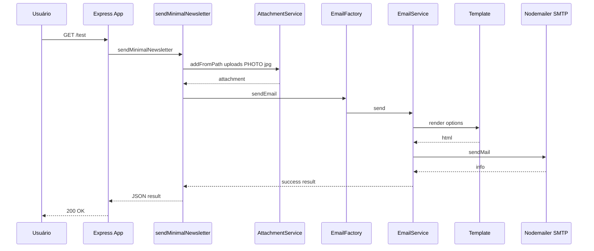
```mermaid
sequenceDiagram
    participant User as Usuário
    participant ExpressApp as Express App
    participant Demo as sendMinimalNewsletter
    participant Attach as AttachmentService
    participant Factory as EmailFactory
    participant Email as EmailService
    participant Template as Template
    participant SMTP as Nodemailer SMTP

    User->>ExpressApp: GET /test
    ExpressApp->>Demo: sendMinimalNewsletter
    Demo->>Attach: addFromPath uploads PHOTO jpg
    Attach-->>Demo: attachment
    Demo->>Factory: sendEmail
    Factory->>Email: send
    Email->>Template: render options
    Template-->>Email: html
    Email->>SMTP: sendMail
    SMTP-->>Email: info
    Email-->>Demo: success result
    Demo-->>ExpressApp: JSON result
    ExpressApp-->>User: 200 OK
```

## Tratamento de erros

| Componente | Condição | Efeito |
| --- | --- | --- |
| `EmailService.send` | `transporter.sendMail(...)` falha | Retorna `{ success: false, error }` |
| `AttachmentService.addFromPath` | O caminho não aponta para arquivo | Lança `Error` |
| `AttachmentService.addFromUrl` | Método chamado | Lança `Error` de não implementação |
| `TemplateService.validateTemplateConfig` | Configuração inválida | Lança `Error` com lista de problemas |
| `TemplateService.renderTemplate` | Falha na renderização | Lança `Error` com contexto |
| `TemplateFactory.createTemplate` | Tema inexistente | Lança `Error` |


## Referência rápida das classes-chave

| Class | Location | Responsibility |
| --- | --- | --- |
|  |  | Servidor de demonstração, bootstrap SMTP e rota `/test` |
| `EmailFactory` | `email-factory.ts` | Fachada de criação e envio |
| `EmailService` | `email.service.ts` | Envio real via Nodemailer |
| `TemplateService` | `template.service.ts` | Criação, cache e renderização de templates |
| `TemplateFactory` | `template-factory.ts` | Criação do template por tema |
| `TemplateBuilder` | `template-builder.ts` | Montagem do HTML final |
| `AttachmentService` | `attachment.service.ts` | Criação de anexos |
| `SystemTheme` | `system.theme.ts` | Tema base adaptativo |
| `MonokaiTheme` | `monokai.theme.ts` | Tema técnico com destaque de código |
| `ModernTheme` | `modern.theme.ts` | Tema moderno com gradientes |
| `CorporateTheme` | `corporate.theme.ts` | Tema corporativo formal |
| `MinimalTheme` | `minimal.theme.ts` | Tema minimalista |
| `theme.interface.ts` | `theme.interface.ts` | Contrato base dos temas |
| `email.interface.ts` | `email.interface.ts` | Contratos de email e anexos |
| `template.interface.ts` | `template.interface.ts` | Contratos de template e configuração |


---

## Gerenciamento de Templates/Builder HTML e composição estrutural do email

# Gerenciamento de Templates - Builder HTML e composição estrutural do email

## Visão Geral

O `TemplateBuilder` é a peça que transforma configuração temática e conteúdo já preparado em um HTML completo de email. Ele concentra a montagem estrutural das quatro regiões principais do template — header, body, button e footer — e aplica variações visuais conforme o tema e o modo `light` ou `dark`.

Na prática, essa classe é usada para gerar emails com composição consistente entre temas como `system`, `monokai`, `modern`, `corporate` e `minimal`, preservando compatibilidade com clientes de email por meio de tabelas aninhadas, estilos inline e um wrapper final com `DOCTYPE`, `meta viewport` e responsividade básica.

## Visão de Arquitetura

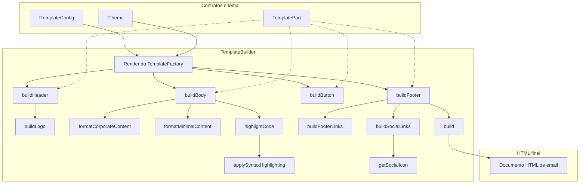
```mermaid
flowchart TB
    subgraph Configuracao [Contratos e tema]
        TP[TemplatePart]
        TI[ITemplateConfig]
        TH[ITheme]
    end

    subgraph Montagem [TemplateBuilder]
        RF[Render do TemplateFactory]
        BH[buildHeader]
        BL[buildLogo]
        BB[buildBody]
        FC[formatCorporateContent]
        FM[formatMinimalContent]
        HC[highlightCode]
        AS[applySyntaxHighlighting]
        BU[buildButton]
        BF[buildFooter]
        BFL[buildFooterLinks]
        BSL[buildSocialLinks]
        GSI[getSocialIcon]
        BD[build]
    end

    subgraph Saida [HTML final]
        HT[Documento HTML de email]
    end

    TI --> RF
    TH --> RF
    RF --> BH
    BH --> BL
    RF --> BB
    BB --> FC
    BB --> FM
    BB --> HC
    HC --> AS
    RF --> BU
    RF --> BF
    BF --> BFL
    BF --> BSL
    BSL --> GSI
    BF --> BD
    BD --> HT

    TP -.-> BH
    TP -.-> BB
    TP -.-> BU
    TP -.-> BF
```

## Estrutura dos Componentes

### TemplatePart

*`src/core/enums/template-part.enum.ts`*

O enum define as partes estruturais semânticas do email e espelha a divisão física aplicada pelo builder.

Valores: `HEADER` = `header`, `BODY` = `body`, `FOOTER` = `footer`, `BUTTON` = `button`.

### Contratos de tema e configuração

#### ITheme

> **Note:** `TemplatePart` nomeia exatamente as mesmas regiões que `TemplateBuilder` monta por métodos dedicados, mas o arquivo  não o importa nem faz despacho baseado nesse enum. A composição é feita por chamadas explícitas de `buildHeader`, `buildBody`, `buildButton`, `buildFooter` e `build()`.

*`src/templates/themes/theme.interface.ts`*

A interface base do tema fornece os tokens consumidos pelo builder para definir cores, tipografia e espaçamento.

| Propriedade | Tipo | Descrição |
| --- | --- | --- |
| `id` | `ThemeType` | Identificador do tema usado nas ramificações internas do builder. |
| `name` | `string` | Nome legível do tema. |
| `light` | `IThemeColors` | Paleta usada quando `variant` é `light`. |
| `dark` | `IThemeColors` | Paleta usada quando `variant` é `dark`. |
| `typography` | `ITypography` | Tokens tipográficos usados em header, body, botões e footer. |
| `spacing` | `ISpacing` | Escala de espaçamento aplicada na composição HTML. |


#### IThemeColors

*`src/templates/themes/theme.interface.ts`*

| Propriedade | Tipo | Descrição |
| --- | --- | --- |
| `primary` | `string` | Cor principal aplicada em títulos, botões e destaques. |
| `secondary` | `string` | Cor secundária para variações de botão e apoio visual. |
| `background` | `string` | Cor de fundo da seção ou do container. |
| `text` | `string` | Cor principal do texto. |
| `textMuted` | `string` | Cor de texto atenuada para rodapé e metadados. |
| `border` | `string` | Cor de borda usada em divisórias e contornos. |
| `success` | `string` | Cor de sucesso disponível para uso temático. |
| `error` | `string` | Cor de erro disponível para uso temático. |
| `warning` | `string` | Cor de alerta disponível para uso temático. |


#### ITypography

*`src/templates/themes/theme.interface.ts`*

| Propriedade | Tipo | Descrição |
| --- | --- | --- |
| `fontFamily` | `string` | Família tipográfica aplicada nos blocos principais. |
| `fontSizes.small` | `string` | Tamanho pequeno. |
| `fontSizes.medium` | `string` | Tamanho médio. |
| `fontSizes.large` | `string` | Tamanho grande. |
| `fontSizes.xlarge` | `string` | Tamanho extra grande, usado no logo textual e títulos. |
| `fontWeights.normal` | `number` | Peso normal. |
| `fontWeights.medium` | `number` | Peso intermediário. |
| `fontWeights.bold` | `number` | Peso negrito. |


#### ISpacing

*`src/templates/themes/theme.interface.ts`*

| Propriedade | Tipo | Descrição |
| --- | --- | --- |
| `xs` | `string` | Espaçamento extra pequeno. |
| `sm` | `string` | Espaçamento pequeno. |
| `md` | `string` | Espaçamento médio. |
| `lg` | `string` | Espaçamento grande. |
| `xl` | `string` | Espaçamento extra grande. |


#### ITemplate

*`src/core/interfaces/template.interface.ts`*

A interface representa o template montável e renderizável consumido por `EmailService`.

| Propriedade | Tipo | Descrição |
| --- | --- | --- |
| `name` | `string` | Nome do template, normalmente derivado de tema e variante. |
| `theme` | `ThemeType` | Tema selecionado. |
| `variant` | `'light' \ | 'dark'` | Variante visual que escolhe a paleta do tema. |
| `config` | `ITemplateConfig` | Configuração estrutural passada ao builder e à fábrica. |
| `render` | `(data: any) => Promise<string>` | Função que produz o HTML final. |


#### ITemplateConfig

*`src/core/interfaces/template.interface.ts`*

| Propriedade | Tipo | Descrição |
| --- | --- | --- |
| `header` | `IHeaderConfig` | Configuração do cabeçalho. |
| `body` | `IBodyConfig` | Configuração do conteúdo principal. |
| `footer` | `IFooterConfig` | Configuração do rodapé. |
| `layout` | `'full' \ | 'minimal'` | Define o layout geral do template. |
| `spacing` | `'compact' \ | 'normal' \ | 'relaxed'` | Define a densidade visual do template. |
| `borderRadius` | `'none' \ | 'small' \ | 'medium' \ | 'large'` | Define o raio de borda estrutural. |


#### IHeaderConfig

*`src/core/interfaces/template.interface.ts`*

| Propriedade | Tipo | Descrição |
| --- | --- | --- |
| `show` | `boolean` | Habilita ou oculta o header. |
| `logo` | `{ type: 'text' \ | 'image'; text?: string; imageUrl?: string; alt?: string; size?: 'small' \ | 'medium' \ | 'large' }` | Define o logotipo textual ou por imagem. |
| `backgroundColor` | `string` | Cor de fundo específica do header. |
| `textColor` | `string` | Cor de texto específica do header. |


#### IBodyConfig

*`src/core/interfaces/template.interface.ts`*

| Propriedade | Tipo | Descrição |
| --- | --- | --- |
| `title` | `string` | Título do conteúdo. |
| `message` | `string` | Mensagem principal do corpo. |
| `content` | `string` | HTML já pronto para renderização direta. |
| `buttonText` | `string` | Rótulo do botão principal. |
| `buttonUrl` | `string` | URL do botão principal. |
| `buttonVariant` | `'primary'` `'secondary'` `'success'`  `'danger'` | Variante visual do botão. |
| `alignment` | `'left'` `'center'` `'right'` | Alinhamento do bloco do corpo. |
| `backgroundColor` | `string` | Cor de fundo do conteúdo. |
| `textColor` | `string` | Cor do texto do conteúdo. |
| `fontSize` | `number` | Tamanho base da fonte em pixels. |


#### IFooterConfig

*`src/core/interfaces/template.interface.ts`*

| Propriedade | Tipo | Descrição |
| --- | --- | --- |
| `show` | `boolean` | Habilita ou oculta o rodapé. |
| `links` | `Array<{ text: string; url: string }>` | Links textuais do rodapé. |
| `socialLinks` | `Array<{ platform: 'facebook' 'twitter' 'linkedin' 'github'; url: string }>` | Ícones sociais com URL de destino. |
| `copyrightText` | `string` | Texto de copyright. |
| `unsubscribeText` | `string` | Texto do link de cancelamento de inscrição. |
| `backgroundColor` | `string` | Cor de fundo do rodapé. |
| `textColor` | `string` | Cor de texto do rodapé. |


## TemplateBuilder

*`src/templates/base/template-builder.ts`*

O `TemplateBuilder` mantém o HTML acumulado em uma string interna e devolve a mesma instância em cada método público, permitindo encadeamento fluente de composição. Ele recebe o tema, a configuração estrutural e a variante visual, e a partir disso decide quais regiões renderizar e quais tokens visuais aplicar.

### Propriedades

| Propriedade | Tipo | Descrição |
| --- | --- | --- |
| `template` | `string` | Buffer interno que acumula os fragmentos HTML construídos pelos métodos. |
| `theme` | `ITheme` | Tema base usado para cores, tipografia e espaçamento. |
| `config` | `ITemplateConfig` | Configuração estrutural do template. |
| `variant` | `'light'` `'dark'` | Seleção da paleta do tema. |


### Dependências do construtor

| Type | Description |
| --- | --- |
| `ITheme` | Fornece as paletas `light` e `dark`, tokens tipográficos e espaçamentos. |
| `ITemplateConfig` | Define quais partes serão exibidas e quais conteúdos serão montados. |
| `'light'` `'dark'` | Seleciona a paleta aplicada durante a montagem HTML. |


### Métodos públicos

| Method | Description |
| --- | --- |
| `buildHeader` | Monta o bloco de header, incluindo logo e conteúdo opcional. |
| `buildBody` | Monta o bloco principal do email e aplica formatações específicas por tema. |
| `buildButton` | Monta o CTA centralizado com variação visual por tema e variante. |
| `buildFooter` | Monta o rodapé com links, redes sociais, copyright e unsubscribe. |
| `build` | Fecha a estrutura final e embrulha o HTML em `DOCTYPE`, `html`, `head` e `body`. |


### Métodos internos

| Method | Description |
| --- | --- |
| `buildLogo` | Renderiza logo textual ou por imagem conforme `config.header.logo`. |
| `formatCorporateContent` | Aplica transformação de `<blockquote>` e `<highlight>` no conteúdo corporativo. |
| `formatMinimalContent` | Reescreve tags de título e parágrafo para uma apresentação minimalista. |
| `highlightCode` | Envolve blocos `<code>` em `<pre>` com estilos Monokai. |
| `applySyntaxHighlighting` | Coloriza palavras-chave, strings, números e nomes de função em trechos de código. |
| `buildFooterLinks` | Gera a fileira de links textuais do rodapé. |
| `buildSocialLinks` | Gera os ícones sociais do rodapé. |
| `getSocialIcon` | Resolve a URL do ícone do serviço social solicitado. |


### Comportamento por etapa de montagem

#### `buildHeader(content?: string)`

- Sai imediatamente quando `this.config.header?.show` é falso ou ausente.
- Seleciona as cores do tema com base em `variant`.
- Ajusta o header conforme o tema:- `corporate`: borda inferior dourada, sombra, uppercase e letter-spacing reforçado.
- `minimal`: borda inferior fina e padding ajustado.
- `modern`: borda inferior, `backdrop-filter` com blur e sombra leve.
- `monokai`: borda inferior em cor primária, sombra e transição.
- demais temas: borda inferior padrão.
- Chama `buildLogo()` e inclui `content` opcional abaixo do logo.
- Usa tabelas com `role="presentation"` para compatibilidade com clientes de email.

#### `buildLogo()`

- Retorna string vazia se `config.header?.logo` não existir.
- Quando `logo.type === 'text'`:- Usa `logo.text` ou fallback literal `Logo`.
- Ajusta tamanho, peso, cor e efeitos por tema.
- `corporate` troca a família tipográfica para serifada e usa dourado.
- `minimal` reduz peso e controla espaçamento entre letras.
- `monokai` aplica `text-shadow`.
- `modern` aplica gradiente com clipping no texto.
- Quando `logo.type === 'image'`:- Define altura por `size`: `small` = `30px`, `medium` = `60px`, `large` = `100px`.
- Usa `logo.imageUrl` como `src` e `logo.alt` ou fallback `Logo` como `alt`.
- Em `modern`, adiciona borda arredondada e transição.
- Em `corporate`, adiciona raio de borda pequeno.

#### `buildBody(content: string)`

- Constrói o bloco central com padding, fundo, cor de texto, fonte e line-height.
- Ajusta o container conforme o tema:- `corporate`: borda lateral dourada, margem vertical e sombra de card.
- `minimal`: largura de conteúdo controlada, padding mais aberto e centralização.
- `modern`: raio médio e margens.
- `monokai`: borda lateral em cor primária.
- Processa o conteúdo antes de inserir:- `corporate`: chama `formatCorporateContent`.
- `minimal`: chama `formatMinimalContent`.
- `monokai` com `<code>`: chama `highlightCode`.
- Envolve o conteúdo em uma tabela externa com fundo branco e padding de 10px.

#### `buildButton(text: string, url: string, variant: 'primary' | 'secondary' = 'primary')`

- Escolhe a cor base do botão entre `primary` e `secondary`.
- Renderiza o CTA em uma tabela centralizada.
- Ajusta o estilo por tema:- `corporate`: raio pequeno, uppercase, letter-spacing amplo e hover com sombra.
- `minimal`: fundo transparente, borda sólida e hover invertendo cores.
- `modern`: gradiente, raio médio, transição e sombra.
- `monokai`: borda dupla, raio do tema, transição e hover com glow.
- demais temas: raio simples de `4px`.
- Insere o texto como `<a>` com `href` apontando para `url`.

#### `buildFooter()`

- Sai imediatamente quando `this.config.footer?.show` é falso ou ausente.
- Usa cores do tema de acordo com `variant`.
- Ajusta o rodapé por tema:- `corporate`: borda superior dourada e tipografia menor.
- `minimal`: padding mais controlado e fonte compacta.
- `modern`: blur de fundo e raio pequeno.
- `monokai`: borda superior mais espessa e colorida.
- Monta, na ordem:1. links do rodapé via `buildFooterLinks()`;
2. redes sociais via `buildSocialLinks()`;
3. `copyrightText`, se presente;
4. `unsubscribeText`, se presente, com link `#`.

#### `buildFooterLinks()`

- Retorna string vazia se `config.footer?.links` não existir ou estiver vazio.
- Usa tabela centralizada para alinhar os links.
- Aplica variações por tema:- `modern`: transição e hover com mudança de cor.
- `corporate`: uppercase e hover dourado.
- `minimal`: hover sublinhado.
- Cada item de `links` é renderizado como `<a href="...">`.

#### `buildSocialLinks()`

- Retorna string vazia se `config.footer?.socialLinks` não existir ou estiver vazio.
- Renderiza ícones sociais em tabela centralizada.
- Cada item usa `target="_blank"` e um `` com `width="20"` e `height="20"`.
- O `src` do ícone vem de `getSocialIcon(platform)`.

#### `getSocialIcon(platform: string)`

- Resolve a URL do ícone por uma tabela interna de strings.
- Plataformas mapeadas no arquivo: `facebook`, `twitter`, `github`, `instagram`, `youtube`, `discord`, `reddit`, `pinterest`, `tiktok`, `gitlab`, `stackoverflow`, `medium`, `dribbble`, `behance`, `telegram`.
- Retorna `https://cdn.simpleicons.org/virginmedia/5865F2` como fallback.

#### `build()`

- Gera o documento HTML final com:- `<!DOCTYPE html>`;
- `<html>`, `<head>`, `<body>`;
- `meta charset="utf-8"`;
- `meta name="viewport" content="width=device-width, initial-scale=1.0"`;
- `<title>Email Template</title>`.
- Injeta um `<style>` com media query para telas até `600px`.
- Calcula o `containerStyles` com `max-width`:- `640px` quando o tema é `minimal`;
- `600px` nos demais.
- O fundo final varia por `variant`, com override específico em `minimal`.

## Relação entre TemplatePart e a composição do builder

O enum `TemplatePart` serve como vocabulário estrutural para a composição do template. No builder, essa mesma divisão aparece em forma de métodos:

- `HEADER` → `buildHeader()`
- `BODY` → `buildBody()`
- `BUTTON` → `buildButton()`
- `FOOTER` → `buildFooter()`

A relação é semântica e estrutural: o enum nomeia as partes, enquanto o builder implementa a montagem real dessas partes em HTML.

## Contratos de renderização e uso upstream

O `TemplateBuilder` não recebe dados de domínio diretamente. O fluxo visível no repositório passa por `TemplateFactory.createTemplate(...)`, que instancia o builder e transforma `body` em uma string HTML antes de chamar os métodos de composição.

### Fluxo de envio com template

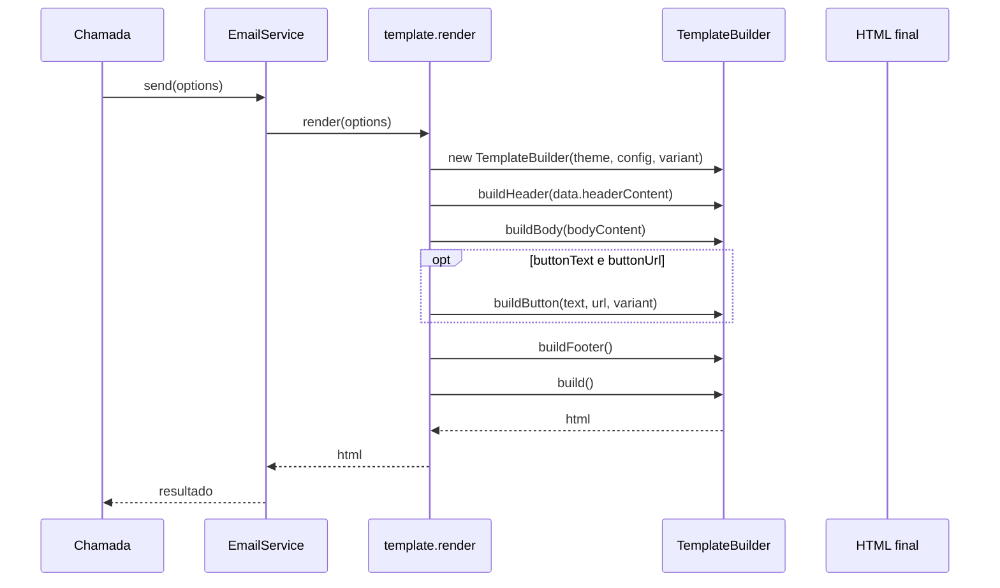
```mermaid
sequenceDiagram
    participant C as Chamada
    participant ES as EmailService
    participant RT as template.render
    participant TB as TemplateBuilder
    participant HT as HTML final

    C->>ES: send(options)
    ES->>RT: render(options)
    RT->>TB: new TemplateBuilder(theme, config, variant)
    RT->>TB: buildHeader(data.headerContent)
    RT->>TB: buildBody(bodyContent)
    opt buttonText e buttonUrl
        RT->>TB: buildButton(text, url, variant)
    end
    RT->>TB: buildFooter()
    RT->>TB: build()
    TB-->>RT: html
    RT-->>ES: html
    ES-->>C: resultado
```

### Fluxo de pré-visualização

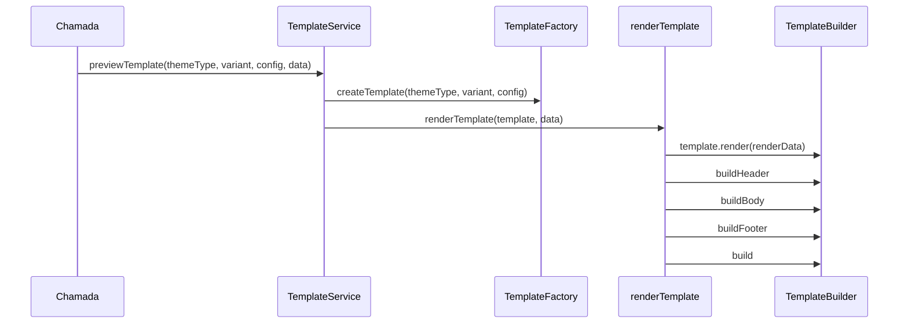
```mermaid
sequenceDiagram
    participant C as Chamada
    participant TS as TemplateService
    participant TF as TemplateFactory
    participant RT as renderTemplate
    participant TB as TemplateBuilder

    C->>TS: previewTemplate(themeType, variant, config, data)
    TS->>TF: createTemplate(themeType, variant, config)
    TS->>RT: renderTemplate(template, data)
    RT->>TB: template.render(renderData)
    RT->>TB: buildHeader
    RT->>TB: buildBody
    RT->>TB: buildFooter
    RT->>TB: build
```

## Gerenciamento de Estado e Montagem

> **Note:** `TemplateFactory.createTemplate` monta o `bodyContent` a partir de `data.template.config.body`, mas `TemplateService.previewTemplate` chama `renderTemplate(template, data)` sem adicionar a propriedade `template` em `renderData`. O caminho de preview, portanto, depende de `data` já conter `template` com `config.body`.

O estado interno do builder é totalmente acumulativo. Cada método público concatena fragmentos em `this.template` e retorna `this`, permitindo a composição encadeada até o HTML final ser embrulhado por `build()`.

| Campo | Papel |
| --- | --- |
| `template` | Acumula o HTML gerado pelos métodos de composição. |
| `theme` | Define a paleta e os tokens usados nas ramificações por tema. |
| `config` | Ativa ou desativa seções e fornece conteúdo de header, body e footer. |
| `variant` | Escolhe entre as paletas `light` e `dark`. |


Esse padrão é usado no render do template criado pela fábrica, que sempre instancia um `TemplateBuilder` novo para cada renderização, mantendo a montagem isolada por execução.

## Integração com TemplateFactory e TemplateService

O builder atua em conjunto com a fábrica e o serviço de templates:

- `TemplateFactory.createTemplate(...)` cria o objeto `ITemplate` e centraliza a montagem do `bodyContent`.
- `TemplateService.createTemplate(...)` valida a configuração antes de delegar à fábrica.
- `TemplateService.renderTemplate(...)` adiciona `_meta` ao payload e aplica minificação opcional no HTML final.
- `EmailService.send(...)` chama `options.template.render(options)` quando recebe um template, usando o HTML montado pelo builder como corpo da mensagem.

### Validações upstream que afetam o builder

`TemplateService.validateTemplateConfig(...)` verifica, antes da criação, pontos diretamente consumidos pela montagem:

- logo em imagem exige `imageUrl`;
- logo textual exige `text`;
- `footer.links` exige `text` e `url` em cada item;
- `layout`, `spacing` e `borderRadius` devem estar dentro dos valores válidos.

Essas validações reduzem a chance de o `TemplateBuilder` receber configurações inconsistentes.

## Tratamento de erros e validações de composição

O arquivo do builder trabalha mais com guard clauses e retornos vazios do que com exceções. Isso afeta diretamente o HTML gerado quando alguma parte não está configurada.

- `buildHeader()` e `buildFooter()` retornam `this` sem alterar o template quando `show` é falso.
- `buildLogo()` retorna string vazia quando `logo` não existe.
- `buildFooterLinks()` e `buildSocialLinks()` retornam string vazia quando não há itens.
- `getSocialIcon()` sempre retorna uma URL, usando fallback.

## Responsividade e wrappers HTML

> **Note:** Os estilos de `hover` em `buildButton()` e `buildFooterLinks()`/`buildSocialLinks()` são inseridos dentro de strings de `style` inline com sintaxe `&:hover { ... }`. Esse formato não é aplicado por atributos HTML inline, então os hovers descritos nessas strings não são efetivos no HTML final gerado por este arquivo. **Note:** O `@media only screen and (max-width: 600px)` definido em `build()` ajusta `.container` e `.button`, mas o HTML gerado por `buildButton()` não adiciona a classe `button` a nenhum elemento. O seletor responsivo para botão, portanto, não encontra alvo no markup produzido por este builder. **Note:** `IFooterConfig.socialLinks` restringe `platform` a `facebook`, `twitter`, `linkedin` e `github`, mas `getSocialIcon()` conhece várias outras plataformas, como `instagram`, `youtube`, `discord`, `reddit`, `pinterest`, `tiktok`, `gitlab`, `stackoverflow`, `medium`, `dribbble`, `behance` e `telegram`. Esses valores adicionais não podem ser expressos sem um desvio de tipo.

O wrapper final é construído para clientes de email, com estrutura simples e previsível:

- `body` com `margin: 0; padding: 0;`
- container centralizado com `max-width`
- `overflow: hidden` em `modern`
- borda e sombra ajustadas por tema
- media query para telas pequenas

### Detalhes da responsividade

- O container passa a `width: 100%` em telas até `600px`.
- O botão foi preparado para layout em bloco na mesma media query.
- O tema `minimal` usa `640px` de largura máxima, acima do limite dos demais temas.

### Wrapper HTML final

O HTML final sempre inclui:

- `<!DOCTYPE html>`
- `<html>`
- `<head>`
- `<meta charset="utf-8">`
- `<meta name="viewport" ...>`
- `<title>Email Template</title>`
- `<body>`
- `<div class="container">`
- o conteúdo acumulado em `this.template`

## Dependências

### Dependências diretas do arquivo

- `ITemplateConfig` de 
- `ITheme` de 
- `MonokaiTheme`, `ModernTheme`, `CorporateTheme`, `MinimalTheme` para ramificações visuais específicas

### Dependências funcionais relacionadas

- `TemplatePart` para semântica estrutural
- `TemplateFactory` para instanciar e usar o builder no fluxo normal de renderização
- `TemplateService` para validação, renderização, preview e minificação do HTML final
- `EmailService` para envio do HTML gerado

## Referência das Classes Principais

| Class | Responsibility |
| --- | --- |
| `template-builder.ts` | Monta o HTML estrutural do email em header, body, button, footer e wrapper final. |
| `template.interface.ts` | Define o contrato de template e as configurações estruturais consumidas pelo builder. |
| `template-part.enum.ts` | Nomeia semanticamente as partes do email: header, body, footer e button. |
| `theme.interface.ts` | Define os tokens base de tema usados para cores, tipografia e espaçamento. |
| `template-factory.ts` | Cria o template renderizável e coordena a instância do `TemplateBuilder`. |
| `template.service.ts` | Valida, renderiza, pré-visualiza e gerencia o ciclo de vida dos templates. |


---

## Gerenciamento de Templates/Cache, histórico, clonagem, importação e estatísticas

# Gerenciamento de Templates - Cache, histórico, clonagem, importação e estatísticas

## Visão geral

O `TemplateService` concentra o ciclo de vida dos templates de email depois da criação: ele valida configurações, gera um identificador determinístico, reaproveita instâncias em cache, mantém histórico de versões e expõe operações de cópia, exportação e importação. Na prática, isso permite reutilizar templates em escala sem recriar a mesma estrutura a cada solicitação.

Esse serviço é o ponto de entrada para cenários de manutenção e automação: pré-carregamento de templates, restauração de versões anteriores, geração de exemplos para demonstração e leitura de estatísticas de uso. Ele opera em conjunto com `TemplateFactory` para materializar o template executável e com a estrutura interna de cache e histórico para controlar reuso e expiração.

## Arquitetura do gerenciamento de templates

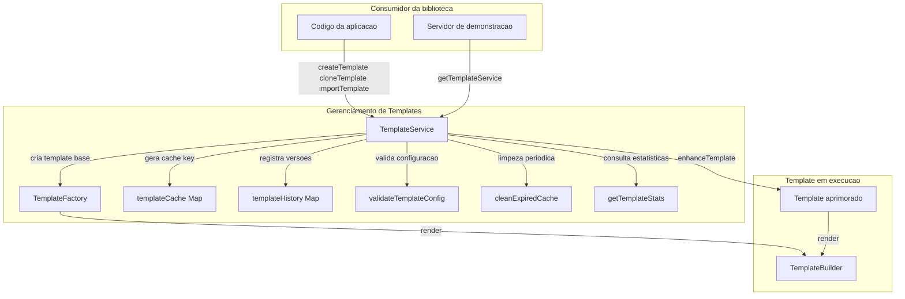
```mermaid
flowchart TB
    subgraph Consumidor [Consumidor da biblioteca]
        App[Codigo da aplicacao]
        Demo[Servidor de demonstracao]
    end

    subgraph TemplateManagement [Gerenciamento de Templates]
        Service[TemplateService]
        Factory[TemplateFactory]
        Cache[templateCache Map]
        History[templateHistory Map]
        Validator[validateTemplateConfig]
        Cleaner[cleanExpiredCache]
        Stats[getTemplateStats]
    end

    subgraph RuntimeTemplate [Template em execucao]
        Enhanced[Template aprimorado]
        Builder[TemplateBuilder]
    end

    App -->|createTemplate cloneTemplate importTemplate| Service
    Demo -->|getTemplateService| Service

    Service -->|valida configuracao| Validator
    Service -->|gera cache key| Cache
    Service -->|registra versoes| History
    Service -->|cria template base| Factory
    Service -->|limpeza periodica| Cleaner
    Service -->|consulta estatisticas| Stats

    Factory -->|render| Builder
    Service -->|enhanceTemplate| Enhanced
    Enhanced -->|render| Builder
```

## Estrutura do componente

### TemplateService

*`src/services/template.service.ts`*

O `TemplateService` é a fachada principal desta seção. Ele recebe opções de comportamento no construtor, mantém dois mapas internos (`templateCache` e `templateHistory`) e expõe a API pública para criação, clonagem, importação, exportação, estatísticas e inspeção detalhada.

#### Propriedades

| Propriedade | Tipo | Descrição |
| --- | --- | --- |
| `templateCache` | `Map<string, TemplateCache>` | Cache em memória indexado por ID determinístico do template. |
| `defaultTTL` | `number` | TTL padrão em segundos usado quando nenhuma configuração explícita é fornecida. Valor inicial: `3600`. |
| `templateHistory` | `Map<string, ITemplate[]>` | Histórico por ID do template, preservando versões anteriores. |
| `options` | `TemplateOptions` | Configuração mesclada no construtor com os defaults do serviço. |


#### Dependências do construtor

| Type | Description |
| --- | --- |
| `TemplateOptions` | Define cache, TTL, validação, minificação e modo de preview. |


#### Métodos públicos

| Method | Description |
| --- | --- |
| `createTemplate` | Cria um template a partir de `themeType`, `variant` e `config`. Valida a configuração, calcula o ID determinístico, reutiliza o cache quando disponível, registra histórico e retorna um `ITemplate` aprimorado. |
| `cloneTemplate` | Cria um novo template com base em outro template existente. Faz mesclagem rasa entre `template.config` e `modifications` e delega para `createTemplate`. Retorna `ITemplate`. |
| `renderTemplate` | Renderiza um `ITemplate` com os dados informados, injeta `_meta`, aplica minificação quando habilitada e retorna `Promise<string>`. |
| `previewTemplate` | Gera uma pré-visualização sem poluir o cache. Internamente chama `createTemplate` com `cache: false` e depois `renderTemplate` com `preview: true`. Retorna `Promise<string>`. |
| `getThemeInfo` | Combina metadados do tema com variantes disponíveis e configuração padrão por tema. Retorna nome, descrição, features, variantes e `defaultConfig`. |
| `listThemes` | Retorna a lista de temas disponíveis via `TemplateFactory`. Resultado: `ThemeType[]`. |
| `getTemplateStats` | Consolida métricas de uso: total de templates no histórico, templates em cache, total de hits, agrupamento por tema e taxa de acerto do cache. |
| `clearCache` | Remove entradas do cache inteiro ou apenas do tema informado. Retorna a quantidade de itens removidos. |
| `getTemplateHistory` | Retorna o histórico de versões de um `templateId` ou um array vazio. |
| `restoreTemplateVersion` | Recria uma versão anterior a partir do histórico. Se o índice for inválido, retorna `null`. |
| `preloadTemplates` | Pré-carrega vários templates em paralelo usando `Promise.all`. Cada item é processado por `createTemplate`. Retorna `Promise<void>`. |
| `exportTemplate` | Serializa um template para JSON com `name`, `theme`, `variant`, `config`, `exportedAt` e `version`. Retorna `string`. |
| `importTemplate` | Lê JSON, valida presença de `theme`, `variant` e `config`, e recria o template por `createTemplate`. Retorna `ITemplate`. |
| `generateExampleTemplate` | Gera um template de demonstração com configuração pronta, usando `ThemeType.MODERN` e `light` por padrão. Retorna `ITemplate`. |
| `isValidTemplate` | Valida a forma estrutural de um template arbitrário: objeto, `name`, `theme`, `variant`, `config` e `render`. Retorna `boolean`. |
| `getTemplateDetails` | Retorna o template atual, o histórico, o `cacheInfo` e o `usageCount` do `templateId`. |


#### Métodos privados de suporte

| Method | Description |
| --- | --- |
| `validateTemplateConfig` | Valida `header`, `footer`, `layout`, `spacing` e `borderRadius`, acumulando erros e lançando exceção ao final. |
| `generateTemplateId` | Gera o ID determinístico com base em `themeType`, `variant` e `config` serializados em JSON. |
| `enhanceTemplate` | Adiciona os métodos dinâmicos `getVersion`, `getId` e `clone` ao template retornado. |
| `addToHistory` | Insere o template no histórico e mantém apenas as últimas 10 versões. |
| `cleanExpiredCache` | Remove entradas cujo `expiresAt` já passou. Executado periodicamente pelo `setInterval` do construtor. |
| `minifyHtml` | Remove excesso de espaços, comentários e espaçamento entre tags para reduzir o HTML final. |
| `getDefaultConfigForTheme` | Monta a configuração padrão por tema com ajustes específicos de `borderRadius` e `spacing`. |


#### Métodos dinâmicos adicionados ao template retornado

Os objetos retornados por `createTemplate` e pelos fluxos que passam por ele recebem métodos anexados em runtime:

| Method | Description |
| --- | --- |
| `getVersion` | Retorna a quantidade de versões armazenadas no histórico do `templateId`. |
| `getId` | Retorna o ID determinístico calculado para o template. |
| `clone` | Cria uma cópia do template com modificações parciais em `ITemplateConfig`. |


### TemplateCache

cloneTemplate faz mesclagem rasa de template.config com modifications. Campos aninhados, como header.logo ou footer.links, não são combinados profundamente; o valor fornecido em modifications substitui o bloco correspondente.

*`src/services/template.service.ts`*

Estrutura interna usada por `templateCache` para armazenar metadados de expiração e uso por template.

#### Propriedades

| Propriedade | Tipo | Descrição |
| --- | --- | --- |
| `template` | `ITemplate` | Instância do template armazenado no cache. |
| `createdAt` | `Date` | Momento de criação do item em cache. |
| `expiresAt` | `Date` | Data e hora em que o item deixa de ser válido. |
| `hits` | `number` | Número de reutilizações do item em cache. |


### TemplateOptions

*`src/services/template.service.ts`*

Opções aplicadas no nível do serviço e mescladas com os defaults no construtor.

#### Propriedades

| Propriedade | Tipo | Default | Descrição |
| --- | --- | --- | --- |
| `cache` | `boolean` | `true` | Habilita ou desabilita o uso de cache. |
| `cacheTTL` | `number` | `3600` | TTL em segundos usado ao armazenar templates no cache. |
| `validateConfig` | `boolean` | `true` | Ativa a validação de `ITemplateConfig` antes da criação. |
| `minify` | `boolean` | `true` | Aplica minificação no HTML retornado por `renderTemplate`. |
| `preview` | `boolean` | `false` | Marca o render como pré-visualização no metadado `_meta`. |


### TemplateFactory

*`src/factories/template-factory.ts`*

A `TemplateFactory` é a dependência direta usada pelo `TemplateService` para materializar a instância concreta de `ITemplate`. Ela mantém o catálogo de temas em memória e produz a estrutura que depois será enriquecida pelo serviço.

#### Propriedades

| Propriedade | Tipo | Descrição |
| --- | --- | --- |
| `themes` | `Map<ThemeType, ITheme>` | Repositório estático dos temas disponíveis: `system`, `monokai`, `modern`, `corporate` e `minimal`. |


#### Métodos públicos

| Method | Description |
| --- | --- |
| `createTemplate` | Cria o objeto `ITemplate` com `name`, `theme`, `variant`, `config` e função `render`. A renderização interna monta a saída HTML por meio de `TemplateBuilder`. |
| `getTheme` | Retorna a instância de tema associada ao `ThemeType`, ou `undefined` se não existir. |
| `listThemes` | Retorna os `ThemeType` disponíveis no mapa interno. |
| `getThemeInfo` | Retorna metadados estáticos do tema: nome, descrição e lista de features. |


## Fluxos principais

### Criação e reaproveitamento via cache

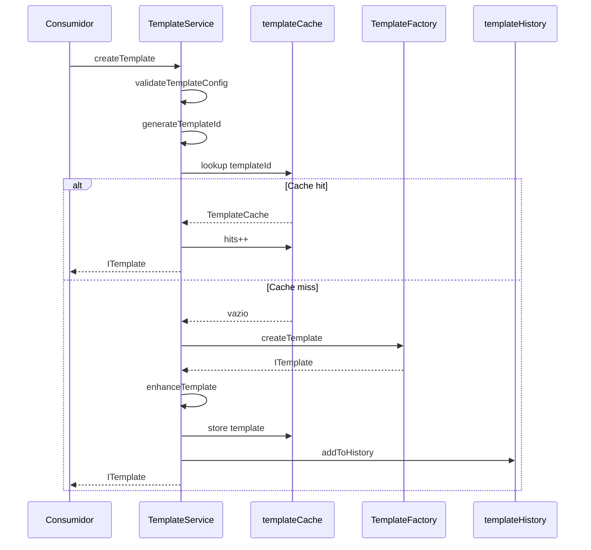
```mermaid
sequenceDiagram
    participant C as Consumidor
    participant S as TemplateService
    participant M as templateCache
    participant F as TemplateFactory
    participant H as templateHistory

    C->>S: createTemplate
    S->>S: validateTemplateConfig
    S->>S: generateTemplateId
    S->>M: lookup templateId

    alt Cache hit
        M-->>S: TemplateCache
        S->>M: hits++
        S-->>C: ITemplate
    else Cache miss
        M-->>S: vazio
        S->>F: createTemplate
        F-->>S: ITemplate
        S->>S: enhanceTemplate
        S->>M: store template
        S->>H: addToHistory
        S-->>C: ITemplate
    end
```

O fluxo começa com a validação opcional da configuração e a geração do `templateId`. Se o ID já existir no cache e o cache estiver habilitado, o serviço retorna a instância existente e incrementa `hits`. Caso contrário, cria um novo template por `TemplateFactory`, adiciona os métodos dinâmicos, armazena no cache com TTL e registra a versão no histórico.

### Clonagem, histórico e restauração de versões

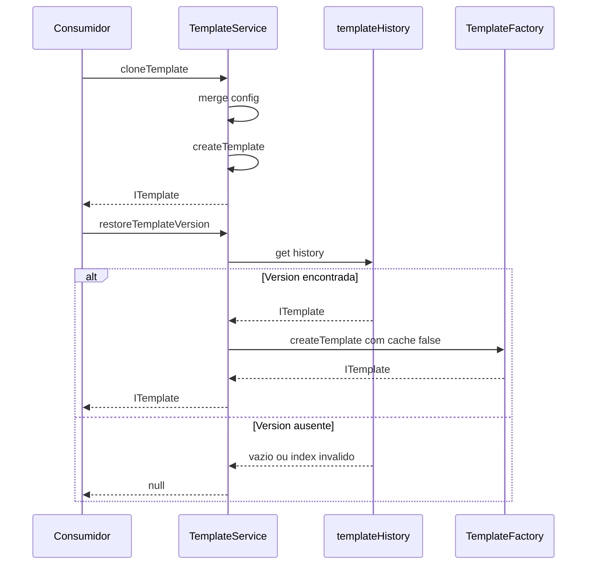
```mermaid
sequenceDiagram
    participant C as Consumidor
    participant S as TemplateService
    participant H as templateHistory
    participant F as TemplateFactory

    C->>S: cloneTemplate
    S->>S: merge config
    S->>S: createTemplate
    S-->>C: ITemplate

    C->>S: restoreTemplateVersion
    S->>H: get history

    alt Version encontrada
        H-->>S: ITemplate
        S->>F: createTemplate com cache false
        F-->>S: ITemplate
        S-->>C: ITemplate
    else Version ausente
        H-->>S: vazio ou index invalido
        S-->>C: null
    end
```

`cloneTemplate` reaproveita o tema e a variante originais do template de origem e só altera o bloco configurado em `modifications`. Já `restoreTemplateVersion` reconstrói uma versão histórica sem gravá-la novamente em cache, usando `cache: false`.

### Importação, exportação e pré-carregamento

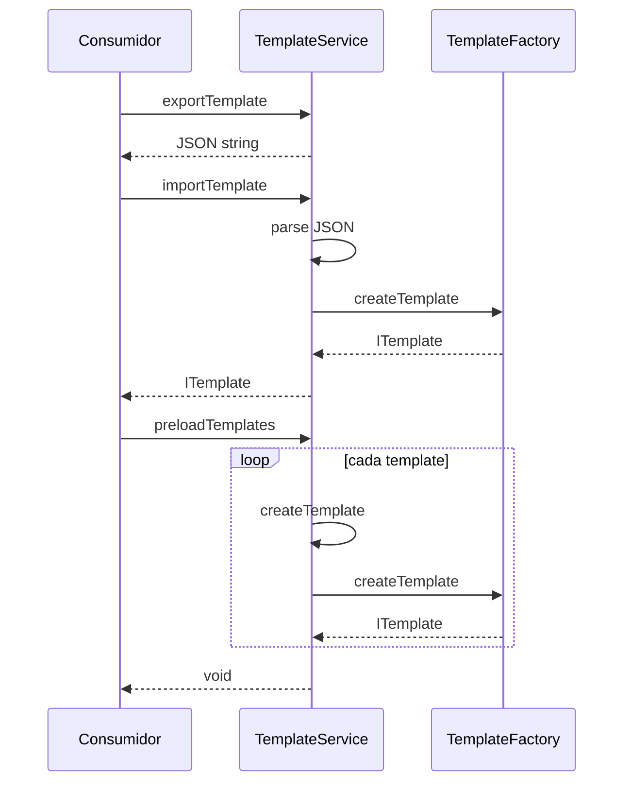
```mermaid
sequenceDiagram
    participant C as Consumidor
    participant S as TemplateService
    participant F as TemplateFactory

    C->>S: exportTemplate
    S-->>C: JSON string

    C->>S: importTemplate
    S->>S: parse JSON
    S->>F: createTemplate
    F-->>S: ITemplate
    S-->>C: ITemplate

    C->>S: preloadTemplates
    loop cada template
        S->>S: createTemplate
        S->>F: createTemplate
        F-->>S: ITemplate
    end
    S-->>C: void
```

`exportTemplate` serializa apenas os dados essenciais do template e um `version` derivado do método dinâmico `getVersion`, quando presente. `importTemplate` ignora metadados exportados como `exportedAt` e recria uma nova instância gerenciada pelo serviço. `preloadTemplates` funciona como aquecimento de cache e também preenche histórico para cada combinação processada.

### Geração de exemplos e renderização com metadados

- `generateExampleTemplate` monta uma configuração pronta para demonstração, com:- `header.logo.type` igual a `text` e `text` igual a `ExampleApp`
- `footer.links` com `Privacy Policy`, `Terms of Service` e `Contact`
- `footer.socialLinks` com `twitter`, `github` e `linkedin`
- `layout: 'full'`, `spacing: 'normal'`
- `borderRadius` igual a `none` apenas quando o tema é `ThemeType.MINIMAL`
- `renderTemplate` injeta `_meta` com:- `isPreview`
- `renderDate`
- `templateName`
- `theme`
- `variant`
- Quando `minify` está ativo, o HTML final passa por redução de espaços e remoção de comentários.

## Gestão de estado

### Estados internos do template

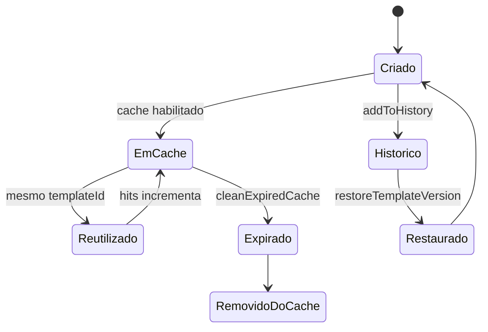
```mermaid
stateDiagram-v2
    [*] --> Criado
    Criado --> EmCache: cache habilitado
    EmCache --> Reutilizado: mesmo templateId
    Reutilizado --> EmCache: hits incrementa
    EmCache --> Expirado: cleanExpiredCache
    Expirado --> RemovidoDoCache
    Criado --> Historico: addToHistory
    Historico --> Restaurado: restoreTemplateVersion
    Restaurado --> Criado
```

TemplateFactory.createTemplate lê data.template.config.body, mas TemplateService.renderTemplate só adiciona _meta ao payload. Isso faz com que previewTemplate e qualquer renderização direta sem data.template dependam de o chamador já fornecer essa estrutura. Impacto: o fluxo de preview não é autossuficiente e pode falhar antes de gerar HTML.

O estado do serviço é mantido em memória por dois mapas: `templateCache` e `templateHistory`. O cache controla expiração por `expiresAt` e contagem de acesso por `hits`; o histórico preserva as últimas 10 versões por `templateId`. A restauração produz uma nova instância funcional, em vez de reativar o objeto antigo do histórico.

### Regras de estado por operação

| Operação | Efeito no cache | Efeito no histórico |
| --- | --- | --- |
| `createTemplate` | Armazena ou reaproveita por `templateId`. | Adiciona a nova versão quando há criação nova. |
| `cloneTemplate` | Segue a lógica de `createTemplate`. | Gera novo registro para a variação clonada. |
| `previewTemplate` | Não grava no cache quando cria o template base. | Registra a criação da instância temporária. |
| `restoreTemplateVersion` | Cria a nova instância com `cache: false`. | Não altera o histórico original. |
| `clearCache` | Remove entradas do cache total ou por tema. | Não apaga o histórico. |
| `cleanExpiredCache` | Remove apenas itens cujo `expiresAt` já venceu. | Não altera o histórico. |


## Estratégia de cache

### Chave determinística

O ID de cache é gerado por `generateTemplateId` com base em uma serialização JSON do triplo:

```ts
{
  theme: themeType,
  variant,
  config
}
```

O hash simples percorre a string serializada e produz um ID no formato:

```ts
`${themeType}_${variant}_${Math.abs(hash)}`
```

Isso garante que a mesma combinação de tema, variante e configuração produza o mesmo identificador dentro do processo. A consequência prática é o reaproveitamento direto em `createTemplate`, `importTemplate`, `preloadTemplates` e `restoreTemplateVersion` quando os dados são equivalentes.

### TTL e limpeza periódica

- `cacheTTL` é lido em segundos e convertido para milissegundos na hora de armazenar o item.
- `defaultTTL` do serviço também é `3600`, usado quando nenhuma outra opção define TTL.
- O construtor agenda `cleanExpiredCache` com `setInterval` a cada `3600000` ms.
- `cleanExpiredCache` remove apenas entradas vencidas; o histórico permanece intacto.

### Invalidação e remoção

| Método | Estratégia |
| --- | --- |
| `clearCache()` | Limpa todo o cache imediatamente. |
| `clearCache(themeType)` | Remove apenas entradas cujo `template.theme` corresponde ao tema informado. |
| `cleanExpiredCache()` | Remove entradas vencidas com base em `expiresAt`. |
| `restoreTemplateVersion()` | Não reutiliza o item antigo do cache; recria nova instância. |


### Hits e reutilização

- Cada cache hit incrementa `hits`.
- `getTemplateDetails` usa `cacheInfo?.hits` como `usageCount`.
- `getTemplateStats` soma os `hits` de todas as entradas em cache para produzir `totalHits`.

### Estatísticas expostas

| Campo | Origem | Observação |
| --- | --- | --- |
| `totalTemplates` | `templateHistory.size` | Conta IDs com histórico, não cada versão individual. |
| `cachedTemplates` | `templateCache.size` | Conta apenas itens atualmente em cache. |
| `totalHits` | Soma de `cache.hits` | Agrega todos os hits das entradas cacheadas. |
| `templatesByTheme` | Cache atual agrupado por `template.theme` | Não considera histórico fora do cache. |
| `cacheHitRate` | `totalHits / totalCached * 100` | Usa a quantidade de itens em cache como denominador. |


## Tratamento de erros

O serviço usa exceções para problemas de configuração e importação, e retornos sentinela para restauração e consulta de histórico.

### Erros lançados

```ts
throw new Error(`Template configuration validation failed:\n${errors.join('\n')}`);
throw new Error(`Failed to import template: ${error}`);
throw new Error(`Theme ${themeType} not found`);
throw new Error('EmailFactory not initialized. Call initialize() first.');
```

### Comportamento por método

| Método | Comportamento em erro |
| --- | --- |
| `validateTemplateConfig` | Acumula múltiplos erros e lança uma única exceção consolidada. |
| `importTemplate` | Captura falhas de JSON ou validação e relança com prefixo `Failed to import template`. |
| `restoreTemplateVersion` | Retorna `null` quando o histórico não existe ou o índice é inválido. |
| `getTemplateHistory` | Retorna `[]` quando não há entrada para o `templateId`. |
| `isValidTemplate` | Retorna `false` em qualquer exceção ou forma inválida. |


### Regras de validação explícitas

- `header.logo.type === 'image'` exige `imageUrl`.
- `header.logo.type === 'text'` exige `text`.
- `footer.links` exige pares `text` e `url` em cada item.
- `layout` aceita apenas `full` e `minimal`.
- `spacing` aceita apenas `compact`, `normal` e `relaxed`.
- `borderRadius` aceita apenas `none`, `small`, `medium` e `large`.

## Integrações e dependências

### Integrações internas

getDefaultConfigForTheme(themeType, theme?) recebe theme, mas o corpo atual decide o resultado apenas por themeType. O parâmetro adicional não altera a configuração retornada.

- `TemplateFactory`: criação do template base que depois é enriquecido pelo serviço.
- `TemplateBuilder`: usado indiretamente dentro da função `render` gerada por `TemplateFactory`.
- `EmailFactory.getTemplateService()`: expõe este serviço para consumidores da biblioteca.
- : usa o serviço na demonstração local para criar templates temáticos de exemplo.

### Tipos e enums utilizados

- `ThemeType`: `system`, `monokai`, `modern`, `corporate`, `minimal`
- `ITemplate`: contrato retornado por criação, clonagem, importação e restauração
- `ITemplateConfig`: configuração de entrada para construção e clone
- `ITheme`: usado por `getDefaultConfigForTheme` e `TemplateFactory`

### Dependências de plataforma

- `Map` para armazenamento em memória.
- `Date` para TTL, criação e metadados.
- `JSON.stringify` e `JSON.parse` para ID determinístico e importação/exportação.
- `setInterval` para limpeza periódica do cache.
- `console.log` dentro de `renderTemplate` para rastreio de renderização.

## Considerações de teste

| Cenário | O que verificar |
| --- | --- |
| Cache hit em `createTemplate` | Mesmo `themeType`, `variant` e `config` retornam o mesmo `ITemplate` e incrementam `hits`. |
| Cache miss em `createTemplate` | Nova instância é criada, cache é preenchido e histórico recebe a versão. |
| Expiração por TTL | `cleanExpiredCache` remove apenas a entrada vencida. |
| `clearCache(themeType)` | Remove somente templates daquele tema. |
| Histórico limitado | Após mais de 10 versões, a versão mais antiga é descartada. |
| `cloneTemplate` | A cópia preserva tema e variante e aplica apenas as modificações recebidas. |
| `restoreTemplateVersion` | Índice inválido retorna `null`; índice válido recria uma nova instância. |
| `exportTemplate` e `importTemplate` | O JSON exportado contém os campos esperados e a importação recria um template funcional. |
| `generateExampleTemplate` | O template gerado usa os defaults esperados do tema e da variante. |
| `isValidTemplate` | Objetos sem `render`, `theme` ou `config` retornam `false`. |
| `getTemplateDetails` | O retorno combina `template`, `history`, `cacheInfo` e `usageCount` corretamente. |


## Key Classes Reference

| Class | Location | Responsibility |
| --- | --- | --- |
| `TemplateService` | `template.service.ts` | Gerencia criação, cache, histórico, clonagem, importação, exportação e estatísticas de templates. |
| `TemplateFactory` | `template-factory.ts` | Cria a instância executável do template e fornece metadados dos temas disponíveis. |


---

## Gerenciamento de Templates/Criação, validação, renderização e preview de templates

# Gerenciamento de Templates - Criação, validação, renderização e preview de templates

## Overview

Este núcleo organiza a criação de templates de email a partir de `ThemeType`, `variant` e `ITemplateConfig`, transformando configurações estruturais em HTML pronto para envio ou visualização. No fluxo da biblioteca, `TemplateService` coordena validação, cache, histórico e renderização; `TemplateFactory` materializa o objeto `ITemplate`; e `TemplateBuilder` converte a combinação de tema e configuração em markup HTML.

Para quem consome a biblioteca, isso significa poder montar templates temáticos com cabeçalho, corpo, botão e rodapé, gerar prévias sem enviar email e reaproveitar configurações com rastreio de versões. O resultado final é um pipeline de composição que separa a intenção do template da geração do HTML.

## Architecture Overview

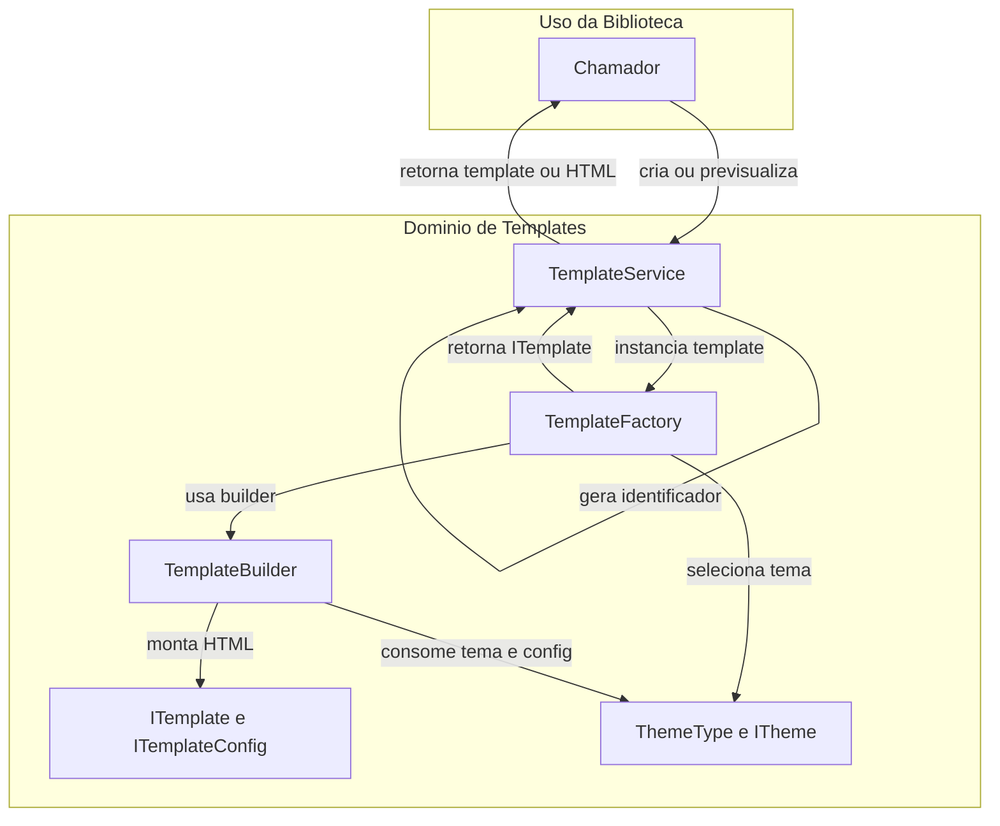
```mermaid
flowchart TB
    subgraph UsoDaBiblioteca[Uso da Biblioteca]
        Chamador[Chamador]
    end

    subgraph DominioDeTemplates[Dominio de Templates]
        TemplateService[TemplateService]
        TemplateFactory[TemplateFactory]
        TemplateBuilder[TemplateBuilder]
        TemplateInterface[ITemplate e ITemplateConfig]
        ThemeCatalog[ThemeType e ITheme]
    end

    Chamador -->|cria ou previsualiza| TemplateService
    TemplateService -->|valida configuracao| TemplateService
    TemplateService -->|gera identificador| TemplateService
    TemplateService -->|instancia template| TemplateFactory
    TemplateFactory -->|seleciona tema| ThemeCatalog
    TemplateFactory -->|retorna ITemplate| TemplateService
    TemplateFactory -->|usa builder| TemplateBuilder
    TemplateBuilder -->|consome tema e config| ThemeCatalog
    TemplateBuilder -->|monta HTML| TemplateInterface
    TemplateService -->|retorna template ou HTML| Chamador
```

```mermaid
classDiagram
class TemplateService
class TemplateFactory
class TemplateBuilder
class ITemplate
class ITemplateConfig
class ITheme
class ThemeType

TemplateService --> TemplateFactory
TemplateService --> ITemplate
TemplateService --> ITemplateConfig
TemplateFactory --> TemplateBuilder
TemplateFactory --> ITheme
TemplateFactory --> ThemeType
TemplateBuilder --> ITheme
TemplateBuilder --> ITemplateConfig
ITemplate --> ThemeType
ITemplate --> ITemplateConfig
```

## Component Structure

### Modelo de domínio de templates

#### `ThemeType`

*Arquivo:* 

Valores: `SYSTEM`, `MONOKAI`, `MODERN`, `CORPORATE`, `MINIMAL`.

Esse enum é a chave de seleção usada por `TemplateFactory` e `TemplateService` para localizar o tema concreto e para gerar metadados de tema.

#### `ITemplate`

*Arquivo:* 

| Propriedade | Tipo | Descrição |
| --- | --- | --- |
| `name` | `string` | Nome do template gerado, montado como `${themeType}_${variant}`. |
| `theme` | `ThemeType` | Tema associado ao template. |
| `variant` | `'light'` `'dark'` | Variante visual aplicada ao tema. |
| `config` | `ITemplateConfig` | Configuração estrutural usada na composição do email. |
| `render` | `(data: any) => Promise<string>` | Função assíncrona que gera o HTML final. |


#### `ITemplateConfig`

*Arquivo:* 

| Propriedade | Tipo | Descrição |
| --- | --- | --- |
| `header?` | `IHeaderConfig` | Configuração opcional do cabeçalho. |
| `body?` | `IBodyConfig` | Configuração opcional do conteúdo principal. |
| `footer?` | `IFooterConfig` | Configuração opcional do rodapé. |
| `layout?` | `'full'` `'minimal'` | Define a estrutura geral do template. |
| `spacing?` | `'compact'` `'normal'` `'relaxed'` | Ajusta a densidade de espaçamento do layout. |
| `borderRadius?` | `'none'` `'small'` `'medium'` `'large'` | Controla o arredondamento dos blocos. |


#### `IHeaderConfig`

*Arquivo:* 

| Propriedade | Tipo | Descrição |
| --- | --- | --- |
| `show` | `boolean` | Define se o cabeçalho será renderizado. |
| `logo?` | `{ type: 'text' 'image'; text?: string; imageUrl?: string; alt?: string; size?: 'small' 'medium' 'large' }` | Define o conteúdo e a apresentação do logo. |
| `backgroundColor?` | `string` | Cor de fundo do cabeçalho. |
| `textColor?` | `string` | Cor do texto do cabeçalho. |


#### Estrutura de `logo`

| Propriedade | Tipo | Descrição |
| --- | --- | --- |
| `type` | `'text'`  `'image'` | Tipo do logo. |
| `text?` | `string` | Texto exibido quando `type` é `text`. |
| `imageUrl?` | `string` | URL da imagem quando `type` é `image`. |
| `alt?` | `string` | Texto alternativo da imagem. |
| `size?` | `'small'` `'medium'` `'large'` | Tamanho visual do logo. |


#### `IBodyConfig`

*Arquivo:* 

| Propriedade | Tipo | Descrição |
| --- | --- | --- |
| `title?` | `string` | Título principal do corpo do email. |
| `message?` | `string` | Mensagem principal. |
| `content?` | `string` | Conteúdo HTML completo que substitui o bloco padrão. |
| `buttonText?` | `string` | Texto do botão de chamada para ação. |
| `buttonUrl?` | `string` | URL de destino do botão. |
| `buttonVariant?` | `'primary'` `'secondary'` `'success'`  `'danger'` | Variante declarada para o botão. |
| `alignment?` | `'left'` `'center'` `'right'` | Alinhamento do conteúdo. |
| `backgroundColor?` | `string` | Cor de fundo do corpo. |
| `textColor?` | `string` | Cor do texto do corpo. |
| `fontSize?` | `number` | Tamanho base da fonte em pixels. |


#### `IFooterConfig`

*Arquivo:* 

| Propriedade | Tipo | Descrição |
| --- | --- | --- |
| `show` | `boolean` | Define se o rodapé será renderizado. |
| `links?` | `Array<{ text: string; url: string }>` | Lista de links textuais do rodapé. |
| `socialLinks?` | `Array<{ platform: 'facebook' 'twitter' 'linkedin' 'github'; url: string }>` | Lista de links sociais. |
| `copyrightText?` | `string` | Texto de copyright. |
| `unsubscribeText?` | `string` | Texto do link de descadastro. |
| `backgroundColor?` | `string` | Cor de fundo do rodapé. |
| `textColor?` | `string` | Cor do texto do rodapé. |


#### Item de `links`

| Propriedade | Tipo | Descrição |
| --- | --- | --- |
| `text` | `string` | Texto exibido no link. |
| `url` | `string` | Destino do link. |


#### Item de `socialLinks`

| Propriedade | Tipo | Descrição |
| --- | --- | --- |
| `platform` | `'facebook'` `'twitter'`  `'linkedin'`  `'github'` | Plataforma social usada para escolher o ícone. |
| `url` | `string` | Destino do link social. |


#### `TemplateOptions`

*Arquivo:* 

| Propriedade | Tipo | Descrição |
| --- | --- | --- |
| `cache?` | `boolean` | Habilita ou desabilita o uso de cache. |
| `cacheTTL?` | `number` | Tempo de vida do cache em segundos. |
| `validateConfig?` | `boolean` | Ativa a validação do `ITemplateConfig`. |
| `minify?` | `boolean` | Controla a minificação do HTML renderizado. |
| `preview?` | `boolean` | Marca a renderização como prévia. |


#### `TemplateCache`

*Arquivo:* 

| Propriedade | Tipo | Descrição |
| --- | --- | --- |
| `template` | `ITemplate` | Template enriquecido e armazenado em cache. |
| `createdAt` | `Date` | Momento de criação do cache. |
| `expiresAt` | `Date` | Momento de expiração do cache. |
| `hits` | `number` | Quantidade de acessos ao item em cache. |


### Núcleo de criação e renderização

#### `TemplateService`

*Arquivo:* 

`TemplateService` concentra o ciclo de vida do template: cria, valida, renderiza, pré-visualiza, exporta, importa, lista temas, coleta estatísticas e mantém histórico. Ele também mantém cache em memória, limpa entradas expiradas em intervalos regulares e injeta metadados de renderização no payload passado ao template.

**Inicialização**

| Tipo | Descrição |
| --- | --- |
| `TemplateOptions` | Opções mescladas com os defaults internos: `cache: true`, `cacheTTL: 3600`, `validateConfig: true`, `minify: true`, `preview: false`. |


**Propriedades**

| Propriedade | Tipo | Descrição |
| --- | --- | --- |
| `templateCache` | `Map<string, TemplateCache>` | Armazena templates por identificador calculado. |
| `defaultTTL` | `number` | TTL padrão em segundos. |
| `templateHistory` | `Map<string, ITemplate[]>` | Histórico de versões por identificador. |
| `options` | `TemplateOptions` | Configuração efetiva da instância. |


**Métodos públicos**

| Method | Description |
| --- | --- |
| `createTemplate` | Cria um `ITemplate`, valida `ITemplateConfig` quando habilitado, calcula ID, reutiliza cache e registra histórico. |
| `cloneTemplate` | Cria um novo template a partir de um existente aplicando modificações rasas em `config`. |
| `renderTemplate` | Renderiza um template com metadados `_meta` e aplica minificação quando configurada. |
| `previewTemplate` | Cria um template sem cache e o renderiza em modo de prévia. |
| `getThemeInfo` | Retorna metadados do tema, variantes disponíveis e configuração padrão. |
| `listThemes` | Lista todos os `ThemeType` registrados no factory. |
| `getTemplateStats` | Calcula estatísticas do cache, histórico e hits por tema. |
| `clearCache` | Remove entradas do cache, opcionalmente filtrando por `ThemeType`. |
| `getTemplateHistory` | Retorna as versões armazenadas para um `templateId`. |
| `restoreTemplateVersion` | Restaura uma versão anterior a partir do histórico. |
| `preloadTemplates` | Pré-carrega uma lista de templates no cache. |
| `exportTemplate` | Serializa um template para JSON. |
| `importTemplate` | Desserializa JSON e recria o template. |
| `generateExampleTemplate` | Cria um template de demonstração com configuração padrão. |
| `isValidTemplate` | Verifica a forma estrutural de um objeto de template. |
| `getTemplateDetails` | Retorna template, histórico, cache e contador de uso de um ID. |


**Métodos internos**

| Method | Description |
| --- | --- |
| `validateTemplateConfig` | Valida regras de `header`, `footer`, `layout`, `spacing` e `borderRadius`. |
| `generateTemplateId` | Gera o identificador com hash de `themeType`, `variant` e `config`. |
| `enhanceTemplate` | Anexa `getVersion`, `getId` e `clone` ao objeto do template. |
| `addToHistory` | Adiciona a versão atual ao histórico e mantém no máximo 10 entradas. |
| `cleanExpiredCache` | Remove templates cuja data de expiração já passou. |
| `minifyHtml` | Reduz espaços e comentários do HTML renderizado. |
| `getDefaultConfigForTheme` | Monta a configuração padrão base e aplica ajustes por tema. |


**Regras de validação aplicadas por ****`validateTemplateConfig`**

- `header.logo.type === 'image'` exige `imageUrl`.
- `header.logo.type === 'text'` exige `text`.
- `footer.links` exige `text` e `url` em cada item.
- `layout` aceita apenas `full` e `minimal`.
- `spacing` aceita apenas `compact`, `normal` e `relaxed`.
- `borderRadius` aceita apenas `none`, `small`, `medium` e `large`.

**Comportamento de cache e histórico**

- O ID do template é derivado de `themeType`, `variant` e `config`.
- O cache guarda o template enriquecido com `hits`.
- O histórico preserva as últimas 10 versões por ID.
- `clearCache(themeType)` remove apenas os templates daquele tema.
- `previewTemplate` chama `createTemplate(..., { cache: false })`, evitando poluir o cache com prévias.

#### `TemplateFactory`

*Arquivo:* 

`TemplateFactory` é o ponto de materialização do domínio. Ele resolve o `ThemeType` para uma instância de tema, cria o objeto `ITemplate` e entrega a função `render` que delega a composição do HTML para `TemplateBuilder`.

**Propriedades**

| Propriedade | Tipo | Descrição |
| --- | --- | --- |
| `themes` | `Map<ThemeType, ITheme>` | Registro estático dos temas disponíveis e suas implementações. |


**Métodos públicos**

| Method | Description |
| --- | --- |
| `createTemplate` | Cria o `ITemplate` com `name`, `theme`, `variant`, `config` e `render`. |
| `getTheme` | Retorna a implementação de tema associada ao `ThemeType`. |
| `listThemes` | Retorna a lista de `ThemeType` registrados no mapa. |
| `getThemeInfo` | Retorna `name`, `description` e `features` do tema. |


**Temas registrados no mapa**

| ThemeType | Nome | Descrição | Features |
| --- | --- | --- | --- |
| `SYSTEM` | `System` | Tema limpo e profissional com cores adaptativas | Design minimalista, alta acessibilidade, compatibilidade total |
| `MONOKAI` | `Monokai` | Inspirado no tema de código, voltado a conteúdo técnico | Cores vibrantes, destaque de sintaxe, efeitos glow |
| `MODERN` | `Modern` | Design contemporâneo com gradientes e efeitos modernos | Gradientes elegantes, glassmorphism, animações suaves |
| `CORPORATE` | `Corporate` | Design profissional e elegante para empresas | Tipografia serifada, detalhes em dourado, layout estruturado |
| `MINIMAL` | `Minimal` | Design clean e focado no conteúdo | Sem distrações, espaçamento generoso, tipografia limpa |


**Comportamento do ****`render`**** retornado por ****`createTemplate`**

- Instancia `TemplateBuilder` com `theme`, `config` e `variant`.
- Lê `data.template.config.body` para construir o conteúdo base.
- Usa `data.headerContent` como conteúdo opcional do cabeçalho.
- Só adiciona botão quando `body.buttonText` e `body.buttonUrl` existem.
- Finaliza com `buildFooter().build()`.

#### `TemplateBuilder`

TemplateFactory.createTemplate e TemplateService.renderTemplate não compartilham o mesmo formato de payload. O render gerado por TemplateFactory lê data.template.config.body, mas TemplateService.renderTemplate passa renderData sem a propriedade template. Já o caminho via EmailService.send funciona porque IEmailOptions inclui template e o objeto é repassado ao render. [!NOTE] IBodyConfig.buttonVariant aceita success e danger, mas TemplateBuilder.buildButton só tipa e trata primary e secondary. Na prática, qualquer valor diferente de primary cai no ramo de secondary.

*Arquivo:* 

`TemplateBuilder` acumula fragmentos HTML em `template` e aplica variações visuais com base no tema e na variante. Ele é o responsável direto por transformar configurações de header, body, botão e footer em markup final.

**Construtor**

| Tipo | Descrição |
| --- | --- |
| `ITheme` | Tema concreto usado para cores, tipografia, espaçamento e recursos específicos. |
| `ITemplateConfig` | Configuração estrutural do template. |
| `'light'` `'dark'` | Variante visual aplicada ao tema. |


**Propriedades**

| Propriedade | Tipo | Descrição |
| --- | --- | --- |
| `template` | `string` | Buffer interno com o HTML parcial em construção. |
| `theme` | `ITheme` | Tema efetivo do template. |
| `config` | `ITemplateConfig` | Configuração usada para decidir quais blocos renderizar. |
| `variant` | `'light'` `'dark'` | Variante corrente para escolher a paleta apropriada. |


**Métodos públicos**

| Method | Description |
| --- | --- |
| `buildHeader` | Renderiza o cabeçalho e o logo, opcionalmente com conteúdo adicional. |
| `buildBody` | Renderiza o corpo principal e aplica formatação específica de tema. |
| `buildButton` | Renderiza o botão de CTA com estilos dependentes do tema e da variante. |
| `buildFooter` | Renderiza o rodapé com links, redes sociais e textos finais. |
| `build` | Finaliza o documento HTML completo com `doctype`, `head`, `body` e container. |


**Métodos internos**

| Method | Description |
| --- | --- |
| `buildLogo` | Monta o logo textual ou em imagem. |
| `formatCorporateContent` | Formata `<blockquote>` e `<highlight>` para o estilo Corporate. |
| `formatMinimalContent` | Reescreve títulos e parágrafos para o estilo Minimal. |
| `highlightCode` | Transforma blocos `<code>` em `<pre>` com destaque de código. |
| `applySyntaxHighlighting` | Aplica coloração simplificada para keywords, strings, números e funções. |
| `buildFooterLinks` | Gera a área de links textuais do rodapé. |
| `buildSocialLinks` | Gera a área de links sociais com ícones. |
| `getSocialIcon` | Resolve a URL do ícone para cada plataforma suportada. |


**Comportamentos de composição HTML**

- `buildHeader` usa `config.header.show` para decidir se renderiza o bloco.
- `buildLogo` aceita `type: 'text'` e `type: 'image'`.
- `buildBody` aplica estilos por tema:- `Corporate`: borda dourada, sombra e formatação de citações.
- `Minimal`: largura de conteúdo, tipografia leve e limpeza de markup.
- `Monokai`: destaque de código quando há `<code>`.
- `Modern`: raio, glassmorphism e gradientes.
- `buildButton` usa `buttonVariant` como `primary` ou `secondary`.
- `buildFooter` só renderiza links, redes e textos quando `config.footer.show` está ativo.
- `build()` encerra o HTML com container centralizado e media query para telas até `600px`.

**Ícones sociais aceitos por ****`getSocialIcon`**

`facebook`, `twitter`, `github`, `instagram`, `youtube`, `discord`, `reddit`, `pinterest`, `tiktok`, `gitlab`, `stackoverflow`, `medium`, `dribbble`, `behance`, `telegram`.

### Catálogo e seleção de temas

`TemplateFactory` e `TemplateService` usam `ThemeType` como chave para descobrir o tema concreto e sua configuração padrão. `getThemeInfo` devolve o nome amigável, a descrição e as features do tema, além de `availableVariants` e `defaultConfig` em `TemplateService`.

#### `getDefaultConfigForTheme`

A configuração base retornada por `TemplateService` inclui:

- `header.show = true`
- `header.logo.type = 'text'`
- `header.logo.text = 'MyApp'`
- `footer.show = true`
- `footer.copyrightText` com o ano corrente
- `layout = 'full'`
- `spacing = 'normal'`
- `borderRadius = 'medium'`

Ajustes específicos por tema:

- `MONOKAI`: `borderRadius = 'small'`
- `MODERN`: `borderRadius = 'large'` e `spacing = 'relaxed'`
- `CORPORATE`: `borderRadius = 'small'`
- `MINIMAL`: `borderRadius = 'none'` e `spacing = 'relaxed'`

## Feature Flows

### Criação de template e geração de HTML

```mermaid
sequenceDiagram
    participant C as Chamador
    participant TS as TemplateService
    participant TF as TemplateFactory
    participant TB as TemplateBuilder
    participant T as ITemplate

    C->>TS: createTemplate
    TS->>TS: validateTemplateConfig
    TS->>TS: generateTemplateId
    alt cache habilitado e id existente
        TS-->>C: template em cache
    else cache miss
        TS->>TF: createTemplate
        TF-->>TS: ITemplate
        TS->>TS: enhanceTemplate
        TS->>TS: addToHistory
        TS-->>C: template enriquecido
    end

    C->>TS: renderTemplate
    TS->>T: render renderData
    T->>TB: new TemplateBuilder
    T->>TB: buildHeader buildBody buildButton buildFooter build
    TB-->>T: HTML
    T-->>TS: HTML
    TS-->>C: HTML minificado
```

### Preview de template

```mermaid
sequenceDiagram
    participant C as Chamador
    participant TS as TemplateService
    participant TF as TemplateFactory
    participant T as ITemplate
    participant TB as TemplateBuilder

    C->>TS: previewTemplate
    TS->>TS: createTemplate cache false
    TS->>TF: createTemplate
    TF-->>TS: ITemplate
    TS->>TS: renderTemplate preview true
    TS->>T: render renderData com _meta
    T->>TB: new TemplateBuilder
    T->>TB: buildHeader buildBody buildButton buildFooter build
    TB-->>T: HTML
    T-->>TS: HTML
    TS-->>C: HTML minificado
```

### Exportação, importação e restauração de versões

`TemplateService` também manipula o ciclo de vida de configuração fora da renderização:

- `exportTemplate` serializa `name`, `theme`, `variant`, `config`, `exportedAt` e `version`.
- `importTemplate` valida a presença de `theme`, `variant` e `config` antes de recriar o template.
- `restoreTemplateVersion` lê o histórico pelo `templateId` e recria a versão escolhida com `cache: false`.

## State Management

### Cache e histórico de templates

| Estado | Origem | Uso |
| --- | --- | --- |
| `templateCache` | `Map<string, TemplateCache>` | Reaproveita templates por hash de configuração. |
| `templateHistory` | `Map<string, ITemplate[]>` | Guarda as últimas 10 versões por `templateId`. |
| `options.preview` | `TemplateOptions` | Marca a renderização como prévia em `_meta.isPreview`. |
| `_meta.renderDate` | `renderTemplate` | Carimba a hora da renderização. |
| `_meta.templateName` | `renderTemplate` | Registra o nome do template renderizado. |
| `_meta.theme` | `renderTemplate` | Registra o tema usado. |
| `_meta.variant` | `renderTemplate` | Registra a variante usada. |


### Regras operacionais

- `cacheTTL` é definido em segundos e convertido para milissegundos na inserção em cache.
- `cleanExpiredCache` roda a cada `3600000` ms.
- `clearCache(themeType)` remove apenas entradas do tema informado.
- `generateTemplateId` usa `JSON.stringify` do trio `themeType`, `variant` e `config`.
- `addToHistory` limita o histórico às 10 versões mais recentes.
- `enhanceTemplate` adiciona métodos dinâmicos `getVersion`, `getId` e `clone` ao objeto retornado.

## Error Handling

| Contexto | Comportamento | Impacto |
| --- | --- | --- |
| `TemplateFactory.createTemplate` | Lança `Error` quando o tema não existe no mapa. | A criação é interrompida antes da composição HTML. |
| `TemplateService.validateTemplateConfig` | Acumula mensagens e lança um `Error` único com todas as violações. | O chamador recebe uma lista agregada de problemas de configuração. |
| `TemplateService.renderTemplate` | Envolve qualquer falha em `Failed to render template: ...`. | Padroniza o erro de renderização para o consumidor. |
| `TemplateService.importTemplate` | Lança `Failed to import template: ...` quando JSON é inválido ou campos obrigatórios faltam. | Bloqueia importações inconsistentes. |
| `TemplateService.restoreTemplateVersion` | Retorna `null` quando o histórico não existe ou o índice é inválido. | O fluxo pode tratar ausência de versão sem exceção. |
| `TemplateService.isValidTemplate` | Retorna `false` para qualquer estrutura fora do contrato esperado. | Permite validação booleana sem exceções. |


## Dependencies

### Dependências internas diretas

- 
- 
- 
- 
- 
- 
- 
- 
- 
- 

### Integração com o fluxo de envio

`ITemplate` é consumido no contrato de email via `IEmailOptions.template`, e o método `EmailService.send` chama `template.render(options)` quando `html` não é fornecido. Isso conecta o núcleo de templates ao pipeline de envio sem acoplar o template ao transporte SMTP.

## Key Classes Reference

| Class | Responsibility |
| --- | --- |
| `template.service.ts` | Orquestra criação, validação, renderização, cache, histórico, exportação e importação de templates. |
| `template-factory.ts` | Materializa `ITemplate` a partir de `ThemeType`, `variant` e `ITemplateConfig`. |
| `template-builder.ts` | Constrói o HTML final do email por composição de header, body, footer e botão. |
| `template.interface.ts` | Define `ITemplate`, `ITemplateConfig` e os contratos de configuração do template. |
| `theme.enum.ts` | Define os valores de seleção de tema usados pelo factory e pelo service. |
| `theme.interface.ts` | Define o contrato estrutural dos temas consumidos pelo builder. |


---
